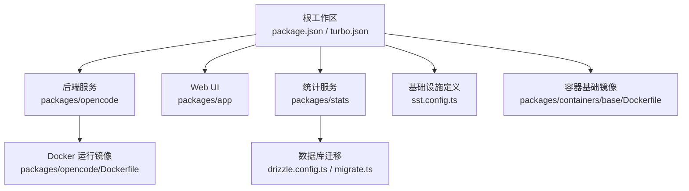
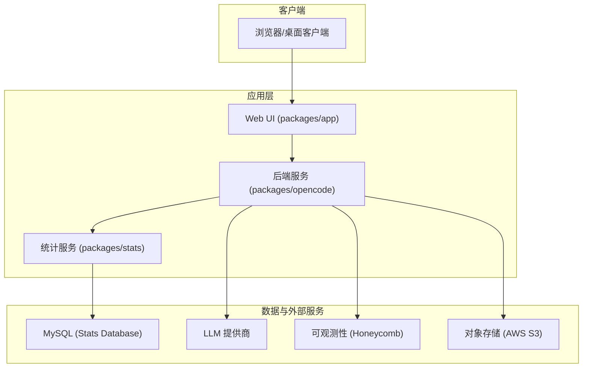
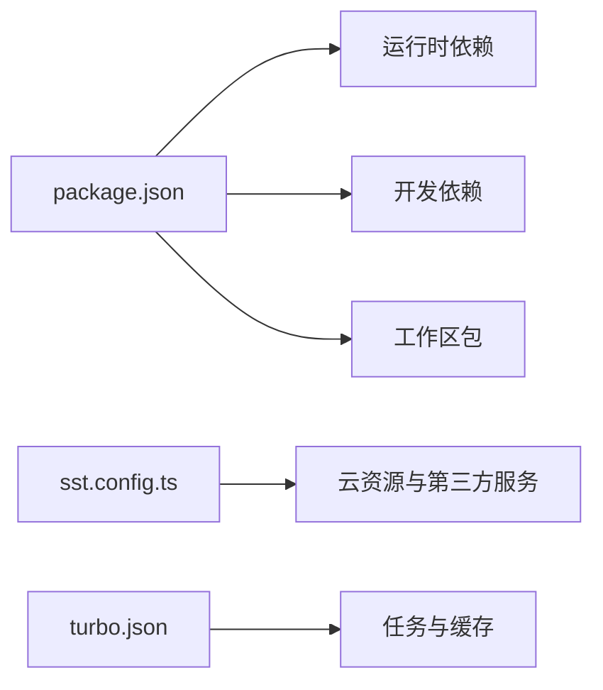

# 部署运维

<cite>
**本文引用的文件**   
- [README.md](file://README.md)
- [package.json](file://package.json)
- [turbo.json](file://turbo.json)
- [sst.config.ts](file://sst.config.ts)
- [packages/opencode/Dockerfile](file://packages/opencode/Dockerfile)
- [packages/containers/base/Dockerfile](file://packages/containers/base/Dockerfile)
- [packages/stats/core/drizzle.config.ts](file://packages/stats/core/drizzle.config.ts)
- [packages/stats/core/src/migrate.ts](file://packages/stats/core/src/migrate.ts)
- [packages/web/src/content/docs/zh-cn/network.mdx](file://packages/web/src/content/docs/zh-cn/network.mdx)
- [packages/core/src/database/migration/20260511000411_data_migration_state.ts](file://packages/core/src/database/migration/20260511000411_data_migration_state.ts)
</cite>

## 目录
1. [简介](#简介)
2. [项目结构](#项目结构)
3. [核心组件](#核心组件)
4. [架构总览](#架构总览)
5. [详细组件分析](#详细组件分析)
6. [依赖关系分析](#依赖关系分析)
7. [性能考虑](#性能考虑)
8. [故障排除指南](#故障排除指南)
9. [结论](#结论)
10. [附录](#附录)

## 简介
本文件面向 openNovel 的部署与运维，覆盖环境配置、容器化与编排、监控与日志、备份恢复与数据迁移、安全与访问控制、CI/CD 流水线以及故障排除与性能调优。openNovel 是一个基于 Bun 的 monorepo，包含后端服务、Web UI、统计系统与基础设施定义等模块。

## 项目结构
- 根级脚本与工作区：通过 package.json 的 workspaces 管理多包；turbo.json 统一任务与缓存；scripts 提供开发、发布与工具脚本。
- 应用与服务：
  - packages/opencode：后端服务与 CLI（Dockerfile 定义了运行镜像）。
  - packages/app：SolidJS Web UI。
  - packages/stats：统计服务（Drizzle 配置与迁移入口）。
  - packages/web：文档与网络配置说明（代理与证书）。
- 基础设施：sst.config.ts 使用 SST 定义云资源与阶段变量。
- 容器基础镜像：packages/containers/base/Dockerfile 提供通用构建环境。

**图表来源** 
- [package.json:1-162](file://package.json#L1-L162)
- [turbo.json:1-34](file://turbo.json#L1-L34)
- [sst.config.ts:1-54](file://sst.config.ts#L1-L54)
- [packages/opencode/Dockerfile:1-19](file://packages/opencode/Dockerfile#L1-L19)
- [packages/containers/base/Dockerfile:1-19](file://packages/containers/base/Dockerfile#L1-L19)
- [packages/stats/core/drizzle.config.ts:1-21](file://packages/stats/core/drizzle.config.ts#L1-L21)
- [packages/stats/core/src/migrate.ts:1-4](file://packages/stats/core/src/migrate.ts#L1-L4)

**章节来源**
- [README.md:1-77](file://README.md#L1-L77)
- [package.json:1-162](file://package.json#L1-L162)
- [turbo.json:1-34](file://turbo.json#L1-L34)

## 核心组件
- 后端服务（opencode）：Bun 运行时，提供 API 与 CLI，支持端口与主机名配置。
- Web UI（app）：SolidJS 前端，用于书架、工作台与审批流程。
- 统计服务（stats）：基于 Drizzle ORM 的 MySQL 统计系统，提供指标采集与查询。
- 基础设施（SST）：AWS、Stripe、Honeycomb、Planetscale 等第三方集成与阶段变量输出。
- 容器镜像：Alpine 基础镜像 + 预编译二进制，支持 amd64/arm64 多架构。

**章节来源**
- [README.md:60-77](file://README.md#L60-L77)
- [package.json:1-162](file://package.json#L1-L162)
- [sst.config.ts:1-54](file://sst.config.ts#L1-L54)
- [packages/opencode/Dockerfile:1-19](file://packages/opencode/Dockerfile#L1-L19)

## 架构总览
下图展示了 openNovel 在部署时的主要组件交互：Web 客户端访问后端服务，后端服务调用 LLM 提供商与存储，统计服务收集并持久化指标到 MySQL，SST 负责云资源与密钥注入。

**图表来源** 
- [sst.config.ts:1-54](file://sst.config.ts#L1-L54)
- [packages/stats/core/drizzle.config.ts:1-21](file://packages/stats/core/drizzle.config.ts#L1-L21)
- [packages/opencode/Dockerfile:1-19](file://packages/opencode/Dockerfile#L1-L19)

## 详细组件分析

### 环境与变量配置
- 全局环境变量：turbo.json 声明了 CI 与 OPENCODE_DISABLE_SHARE 为全局传递的环境变量，便于在多包任务中共享。
- 代理与证书：packages/web 文档说明了标准代理环境变量（HTTP_PROXY、HTTPS_PROXY、NO_PROXY）与自定义 CA 证书（NODE_EXTRA_CA_CERTS）的使用方式，适用于企业网络。
- 运行时开关：根脚本与包脚本中涉及端口与运行条件（如 dev:all、serve --port），可在容器或宿主环境中通过环境变量或命令行参数调整。

建议实践
- 将敏感信息（数据库密码、API Key）放入平台密钥管理（如 AWS Secrets Manager、SST Secret），避免硬编码。
- 在生产环境启用只保留策略（sst.config.ts 中的 removal: retain 与 protect），防止误删资源。

**章节来源**
- [turbo.json:1-34](file://turbo.json#L1-L34)
- [packages/web/src/content/docs/zh-cn/network.mdx:1-57](file://packages/web/src/content/docs/zh-cn/network.mdx#L1-L57)
- [sst.config.ts:1-54](file://sst.config.ts#L1-L54)

### 数据库配置与迁移
- 统计服务数据库：Drizzle 配置指向 MySQL，包含 host、port、username、password、database 与 SSL 选项（rejectUnauthorized: false 用于兼容某些托管数据库）。
- 迁移执行：migrate.ts 通过 Effect 运行迁移，确保 schema 与数据一致性。
- 数据迁移表：core 包中包含 data_migration 表定义，用于记录迁移完成时间，保障幂等与顺序。

建议实践
- 生产环境开启严格 SSL 校验，使用受信任的 CA 或私有 CA 链。
- 迁移前进行全量备份，并在回滚策略中保留旧版本 schema 快照。

**章节来源**
- [packages/stats/core/drizzle.config.ts:1-21](file://packages/stats/core/drizzle.config.ts#L1-L21)
- [packages/stats/core/src/migrate.ts:1-4](file://packages/stats/core/src/migrate.ts#L1-L4)
- [packages/core/src/database/migration/20260511000411_data_migration_state.ts:1-16](file://packages/core/src/database/migration/20260511000411_data_migration_state.ts#L1-L16)

### Docker 容器化部署
- 后端镜像：基于 Alpine，安装必要库，复制预编译二进制 opennovel，设置 ENTRYPOINT 直接运行。
- 多架构支持：build-amd64 与 build-arm64 两个阶段，根据 TARGETARCH 选择对应二进制。
- 基础镜像：ubuntu:24.04 作为通用构建环境，安装构建工具与常用依赖。

建议实践
- 使用多阶段构建减少镜像体积。
- 在容器中禁用不必要的缓存路径（BUN_RUNTIME_TRANSPILER_CACHE_PATH=0），提升冷启动速度。
- 通过环境变量注入端口与主机名，避免硬编码。

**章节来源**
- [packages/opencode/Dockerfile:1-19](file://packages/opencode/Dockerfile#L1-L19)
- [packages/containers/base/Dockerfile:1-19](file://packages/containers/base/Dockerfile#L1-L19)

### Kubernetes 编排配置
- 当前仓库未提供 k8s manifests 或 Helm Chart。建议在部署时基于 Docker 镜像创建 Deployment、Service 与 Ingress。
- 推荐配置：
  - Deployment：副本数按负载设定，资源限制 CPU/Memory，健康检查探针就绪与存活。
  - Service：ClusterIP 暴露内部服务，Ingress 暴露 HTTPS 入口。
  - ConfigMap/Secret：集中管理环境变量与敏感信息。
  - HorizontalPodAutoscaler：基于 CPU/内存或自定义指标自动扩缩容。

[本节为概念性指导，不直接分析具体文件]

### 监控系统搭建
- 可观测性：SST 配置引入 Honeycomb，用于分布式追踪与指标上报。
- 统计服务：stats 服务聚合请求、延迟、成本与错误计数，写入 MySQL 供查询与报表。
- 日志规范：控制台日志以 _metric: 前缀输出结构化指标，便于日志采集器解析。

建议实践
- 接入 OpenTelemetry 与 Sentry（包依赖可见），实现端到端追踪与错误告警。
- 对关键接口设置 SLI/SLO，结合 Honeycomb 做异常检测与告警。

**章节来源**
- [sst.config.ts:1-54](file://sst.config.ts#L1-L54)
- [packages/stats/core/drizzle.config.ts:1-21](file://packages/stats/core/drizzle.config.ts#L1-L21)
- [packages/console/app/src/routes/zen/util/logger.ts:1-12](file://packages/console/app/src/routes/zen/util/logger.ts#L1-L12)

### 备份恢复策略与数据迁移
- 备份范围：MySQL（统计服务）、对象存储（S3）、配置文件与密钥。
- 备份策略：定期全量 + 增量，保留周期按合规要求设定；跨地域复制提高可用性。
- 恢复演练：定期演练恢复流程，验证 RTO/RPO 目标。
- 数据迁移：使用 Drizzle 迁移与 data_migration 表保证幂等；迁移前冻结写操作或采用灰度切换。

**章节来源**
- [packages/stats/core/drizzle.config.ts:1-21](file://packages/stats/core/drizzle.config.ts#L1-L21)
- [packages/core/src/database/migration/20260511000411_data_migration_state.ts:1-16](file://packages/core/src/database/migration/20260511000411_data_migration_state.ts#L1-L16)

### 安全配置、SSL 证书管理与访问控制
- 网络安全：遵循 HTTP_PROXY/HTTPS_PROXY/NO_PROXY 环境变量，企业内网需绕过本地通信以避免路由循环。
- 证书管理：通过 NODE_EXTRA_CA_CERTS 引入企业 CA，确保 HTTPS 连接可信。
- 访问控制：结合 SST 与云平台 IAM，最小权限原则；对敏感凭据使用密钥管理服务。
- 传输加密：全站 HTTPS，证书由受信任 CA 签发，定期轮换。

**章节来源**
- [packages/web/src/content/docs/zh-cn/network.mdx:1-57](file://packages/web/src/content/docs/zh-cn/network.mdx#L1-L57)
- [sst.config.ts:1-54](file://sst.config.ts#L1-L54)

### CI/CD 流水线与自动化部署
- 工作流：GitHub Actions 提供测试、类型检查与生成任务（workflows/test.yml、typecheck.yml、generate.yml）。
- 构建与发布：root scripts 与 package.json 脚本驱动多包构建与发布；turbo 缓存加速。
- 部署：SST 定义基础设施，按 stage 区分开发与生产；生产阶段保护与保留策略。

建议实践
- 在 CI 中执行 lint、typecheck、单元测试与打包。
- 使用工件上传与签名，确保制品完整性。
- 部署阶段进行蓝绿或金丝雀发布，降低风险。

**章节来源**
- [package.json:1-162](file://package.json#L1-L162)
- [turbo.json:1-34](file://turbo.json#L1-L34)
- [sst.config.ts:1-54](file://sst.config.ts#L1-L54)

## 依赖关系分析
- 运行时依赖：Bun、Effect、Hono、Drizzle、OpenTelemetry、Sentry、AWS SDK 等。
- 构建依赖：Turbo、TypeScript、Vite、Tailwind、Storybook 等。
- 基础设施依赖：AWS、Stripe、Honeycomb、Planetscale。

**图表来源** 
- [package.json:1-162](file://package.json#L1-L162)
- [sst.config.ts:1-54](file://sst.config.ts#L1-L54)
- [turbo.json:1-34](file://turbo.json#L1-L34)

**章节来源**
- [package.json:1-162](file://package.json#L1-L162)
- [sst.config.ts:1-54](file://sst.config.ts#L1-L54)
- [turbo.json:1-34](file://turbo.json#L1-L34)

## 性能考虑
- 运行时优化：禁用不必要的转译缓存路径，减少冷启动开销；合理设置进程线程与事件循环参数。
- 数据库优化：索引设计、慢查询分析与连接池调优；读写分离与分库分表按需评估。
- 缓存策略：热点数据缓存（Redis/Memcached），缩短响应时间。
- 前端优化：静态资源压缩与 CDN 分发，懒加载与虚拟滚动。
- 可观测性：通过 Honeycomb 与 OpenTelemetry 定位瓶颈，结合 SLO 制定容量规划。

[本节为通用指导，不直接分析具体文件]

## 故障排除指南
- 网络连接问题：检查代理环境变量与 NO_PROXY 配置，确认本地通信未被代理拦截。
- 证书错误：验证 NODE_EXTRA_CA_CERTS 指向正确的 CA 文件，确保证书链完整。
- 数据库迁移失败：查看 Drizzle 日志与 MySQL 错误，确认权限与连接参数；必要时回滚迁移。
- 服务不可用：检查容器状态、健康探针与日志；确认资源配额与限流策略。
- 指标缺失：确认统计服务正常运行，Honeycomb 与 Sentry 接入正确。

**章节来源**
- [packages/web/src/content/docs/zh-cn/network.mdx:1-57](file://packages/web/src/content/docs/zh-cn/network.mdx#L1-L57)
- [packages/stats/core/drizzle.config.ts:1-21](file://packages/stats/core/drizzle.config.ts#L1-L21)

## 结论
openNovel 的部署与运维围绕 Bun monorepo、SST 基础设施与多包协作展开。通过标准化的环境变量、容器镜像与迁移机制，结合可观测性与安全策略，可实现稳定高效的交付与运行。建议在生产环境强化备份恢复演练、容量规划与变更管控，持续优化性能与可靠性。

[本节为总结，不直接分析具体文件]

## 附录
- 快速启动：参考 README 中的 dev:all 命令，同时启动后端与 Web UI。
- 端口与主机：通过 CLI 参数与环境变量配置服务监听地址。
- 多语言界面：UI 支持英文、简体中文与繁体中文。

**章节来源**
- [README.md:34-58](file://README.md#L34-L58)