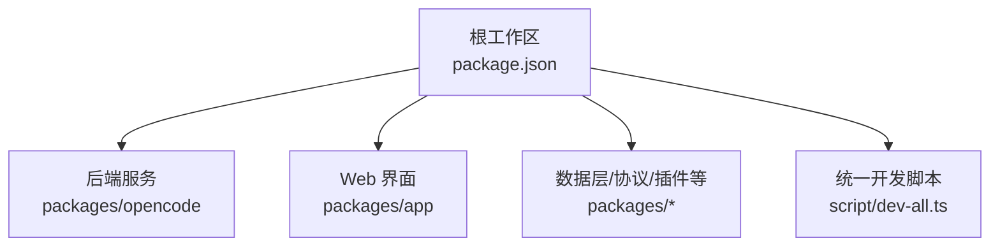
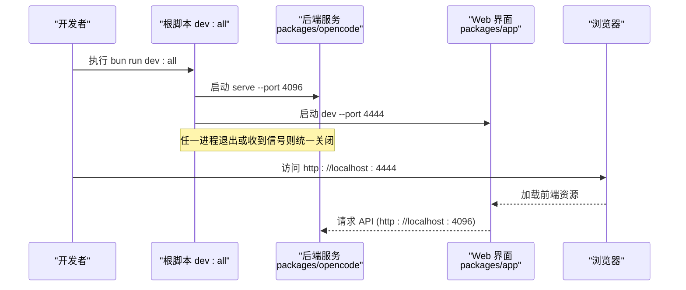
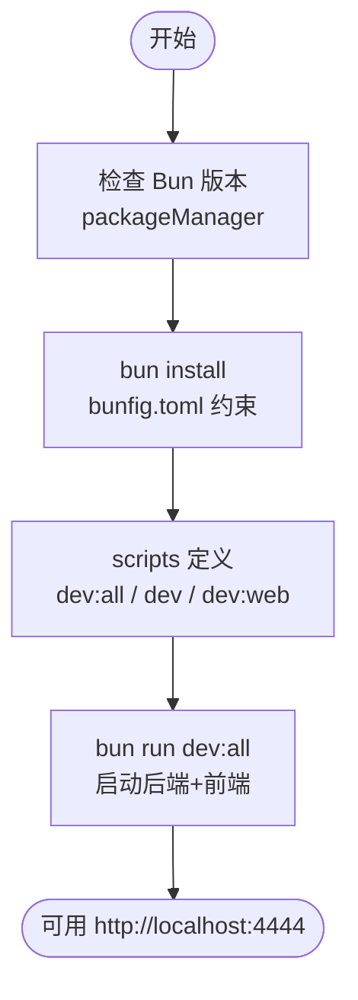

# 快速开始

<cite>
**本文引用的文件**   
- [README.md](file://README.md)
- [README.zh.md](file://README.zh.md)
- [package.json](file://package.json)
- [bunfig.toml](file://bunfig.toml)
- [tsconfig.json](file://tsconfig.json)
- [script/dev-all.ts](file://script/dev-all.ts)
- [packages/opencode/test/lib/cli-process.ts](file://packages/opencode/test/lib/cli-process.ts)
</cite>

## 目录
1. [简介](#简介)
2. [项目结构](#项目结构)
3. [核心组件](#核心组件)
4. [架构总览](#架构总览)
5. [详细组件分析](#详细组件分析)
6. [依赖分析](#依赖分析)
7. [性能注意事项](#性能注意事项)
8. [故障排除指南](#故障排除指南)
9. [结论](#结论)
10. [附录：首次使用流程](#附录首次使用流程)

## 简介
openNovel 是一个 AI 驱动的小说创作工作台，提供从大纲到修订的完整写作流水线与连续性审计能力。本快速开始指南将帮助你从零开始准备环境、安装依赖、启动开发服务，并在最短时间内完成首次体验（打开界面、添加项目文件夹、创建第一部小说）。

## 项目结构
openNovel 采用 Bun monorepo 组织方式，核心模块包括数据层、前后端服务与 Web 界面等。根目录通过 packageManager 指定包管理器版本，并提供统一的脚本入口来管理多包开发。

图表来源 
- [package.json:1-162](file://package.json#L1-L162)
- [script/dev-all.ts:1-61](file://script/dev-all.ts#L1-L61)

章节来源
- [README.md:60-77](file://README.md#L60-L77)
- [README.zh.md:56-73](file://README.zh.md#L56-L73)
- [package.json:1-162](file://package.json#L1-L162)

## 核心组件
- 包管理器与环境要求
  - 包管理器：Bun（根 package.json 指定了精确版本）
  - TypeScript 配置基于 @tsconfig/bun，确保与 Bun 运行环境一致
- 开发脚本
  - 单命令启动：bun run dev:all（同时启动后端与前端）
  - 分终端启动：分别在后端与前端目录下执行对应命令
- 端口约定
  - 后端默认端口：4096
  - Web 界面默认端口：4444

章节来源
- [package.json:7-24](file://package.json#L7-L24)
- [tsconfig.json:1-8](file://tsconfig.json#L1-L8)
- [README.md:34-58](file://README.md#L34-L58)
- [README.zh.md:34-54](file://README.zh.md#L34-L54)
- [script/dev-all.ts:1-61](file://script/dev-all.ts#L1-L61)

## 架构总览
下图展示了“一条命令启动”和“分终端启动”两种方式的进程关系与端口分配。

图表来源 
- [script/dev-all.ts:1-61](file://script/dev-all.ts#L1-L61)
- [README.md:34-58](file://README.md#L34-L58)

章节来源
- [script/dev-all.ts:1-61](file://script/dev-all.ts#L1-L61)
- [README.md:34-58](file://README.md#L34-L58)

## 详细组件分析

### 环境准备与安装
- 安装 Bun
  - 请根据官方文档安装与升级 Bun，确保满足根 package.json 指定的版本范围
- 克隆仓库并安装依赖
  - git clone 仓库后进入目录执行 bun install
  - 安装过程会触发 postinstall 钩子以修复某些原生依赖
- 验证安装
  - 可通过运行类型检查或 lint 命令确认环境正常

章节来源
- [package.json:7-24](file://package.json#L7-L24)
- [package.json:19](file://package.json#L19)
- [CONTRIBUTING.md:8-24](file://CONTRIBUTING.md#L8-L24)

### 启动开发服务器
- 单命令启动（推荐）
  - 在仓库根目录执行 bun run dev:all
  - 该脚本会同时启动后端（端口 4096）与前端（端口 4444），并监听 Ctrl+C/SIGTERM 统一关闭
  - 端口可通过环境变量覆盖：OPENNOVEL_SERVER_PORT、OPENNOVEL_WEB_PORT
- 分终端启动
  - 终端 1（后端）：进入 packages/opencode，执行 bun run --conditions=browser ./src/index.ts serve --port 4096
  - 终端 2（前端）：进入 packages/app，执行 bun dev -- --port 4444

章节来源
- [README.md:34-58](file://README.md#L34-L58)
- [README.zh.md:34-54](file://README.zh.md#L34-L54)
- [script/dev-all.ts:1-61](file://script/dev-all.ts#L1-L61)
- [packages/opencode/test/lib/cli-process.ts:277-344](file://packages/opencode/test/lib/cli-process.ts#L277-L344)

### 首次使用基本流程
- 打开浏览器访问 http://localhost:4444
- 在界面中添加你的项目文件夹（本地小说工程目录）
- 从书架创建你的第一部小说，按向导设置类型、世界观、角色与分卷结构
- 在工作台进行章节树管理、阅读、角色/大纲/节奏面板操作与全文搜索

章节来源
- [README.md:56-58](file://README.md#L56-L58)
- [README.zh.md:52-54](file://README.zh.md#L52-L54)

## 依赖分析
- 包管理器与版本锁定
  - packageManager 字段声明了使用的 Bun 版本
  - bunfig.toml 对安装行为进行了约束（如 exact 与 minimumReleaseAge）
- 工作区与脚本
  - 根 package.json 定义了 workspaces 与 scripts，统一管理多包开发与构建
- 类型系统
  - tsconfig.json 继承自 @tsconfig/bun，保证与 Bun 运行时一致

图表来源 
- [package.json:1-24](file://package.json#L1-L24)
- [bunfig.toml:1-9](file://bunfig.toml#L1-L9)
- [tsconfig.json:1-8](file://tsconfig.json#L1-L8)

章节来源
- [package.json:1-24](file://package.json#L1-L24)
- [bunfig.toml:1-9](file://bunfig.toml#L1-L9)
- [tsconfig.json:1-8](file://tsconfig.json#L1-L8)

## 性能注意事项
- 使用 Bun 作为包管理器与运行时，可获得更快的安装与启动速度
- 开发时建议保持两个进程（后端与前端）独立运行，便于定位问题与观察日志
- 若遇到端口占用，优先更换端口而非重复尝试默认端口

[本节为通用指导，不直接分析具体文件]

## 故障排除指南
- 无法启动或端口冲突
  - 检查 4096 与 4444 是否被占用；可通过环境变量 OPENNOVEL_SERVER_PORT / OPENNOVEL_WEB_PORT 修改端口
  - 使用分终端方式单独启动后端或前端，观察各自日志
- 依赖安装失败或原生模块编译错误
  - 确认已安装最新稳定版 Bun，且符合 packageManager 指定版本
  - 清理 node_modules 后重新执行 bun install
- 后端服务未响应
  - 确认后端进程仍在运行，查看其标准输出与错误输出
  - 检查网络与防火墙设置，确保本地回环地址可访问
- 前端页面无法连接后端
  - 确认前端 dev 模式指向的后端地址与端口正确
  - 检查跨域配置（如有自定义前端域名）

章节来源
- [script/dev-all.ts:1-61](file://script/dev-all.ts#L1-L61)
- [packages/opencode/test/lib/cli-process.ts:277-344](file://packages/opencode/test/lib/cli-process.ts#L277-L344)
- [README.md:34-58](file://README.md#L34-L58)

## 结论
通过本指南，你可以在最短时间内完成 openNovel 的环境准备、依赖安装与服务启动，并以单命令或分终端两种方式快速进入开发状态。遇到问题时，可参考故障排除部分逐步排查。

[本节为总结性内容，不直接分析具体文件]

## 附录：首次使用流程
- 步骤一：准备环境
  - 安装 Bun（满足 packageManager 指定版本）
  - 克隆仓库并执行 bun install
- 步骤二：启动服务
  - 单命令：bun run dev:all
  - 或分终端：分别启动后端与前端
- 步骤三：打开界面
  - 浏览器访问 http://localhost:4444
- 步骤四：添加项目与创建小说
  - 在界面中添加本地项目文件夹
  - 从书架创建第一部小说并按向导完成基础设定
- 步骤五：开始写作
  - 在工作台进行章节编辑、阅读、角色与大纲管理等操作

章节来源
- [README.md:34-58](file://README.md#L34-L58)
- [README.zh.md:34-54](file://README.zh.md#L34-L54)
- [package.json:7-24](file://package.json#L7-L24)