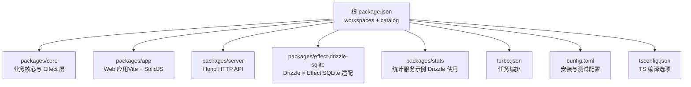
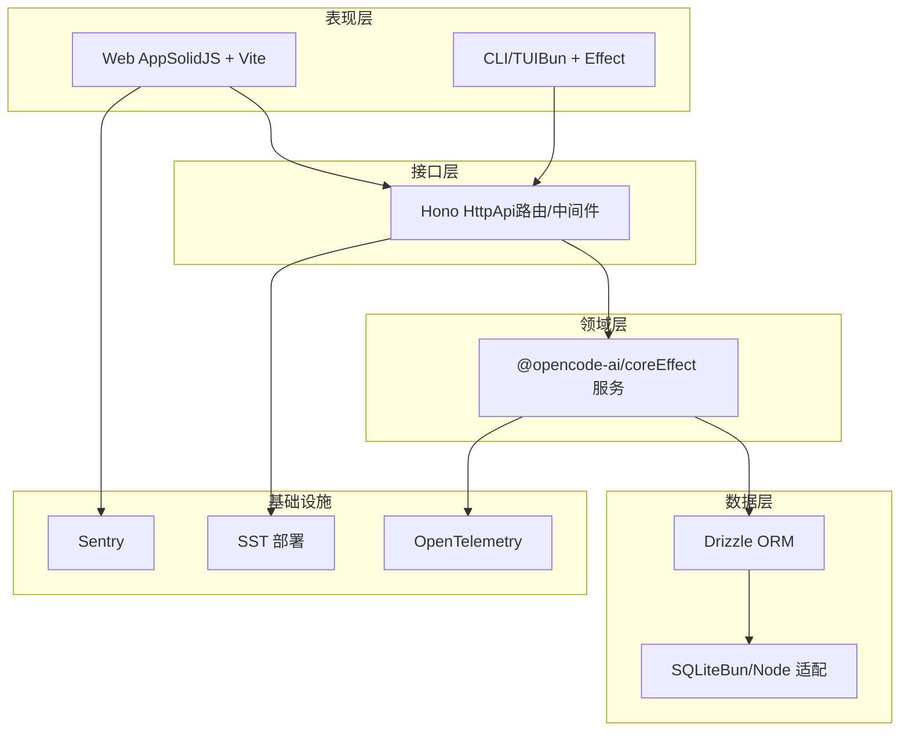
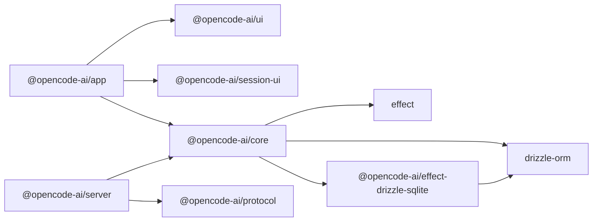

# 技术栈

<cite>
**本文引用的文件**   
- [package.json](file://package.json)
- [bunfig.toml](file://bunfig.toml)
- [turbo.json](file://turbo.json)
- [tsconfig.json](file://tsconfig.json)
- [packages/core/package.json](file://packages/core/package.json)
- [packages/app/package.json](file://packages/app/package.json)
- [packages/server/package.json](file://packages/server/package.json)
- [packages/effect-drizzle-sqlite/package.json](file://packages/effect-drizzle-sqlite/package.json)
- [packages/server/src/api.ts](file://packages/server/src/api.ts)
- [packages/server/AGENTS.md](file://packages/server/AGENTS.md)
- [specs/storage/effect-sqlite-package.md](file://specs/storage/effect-sqlite-package.md)
- [packages/stats/core/src/database.ts](file://packages/stats/core/src/database.ts)
- [packages/effect-drizzle-sqlite/src/sqlite-core/effect/session.ts](file://packages/effect-drizzle-sqlite/src/sqlite-core/effect/session.ts)
- [packages/app/e2e/reproduction/timeline-suspense/vite.config.ts](file://packages/app/e2e/reproduction/timeline-suspense/vite.config.ts)
</cite>

## 目录
1. [简介](#简介)
2. [项目结构](#项目结构)
3. [核心组件](#核心组件)
4. [架构总览](#架构总览)
5. [详细组件分析](#详细组件分析)
6. [依赖关系分析](#依赖关系分析)
7. [性能考量](#性能考量)
8. [故障排查指南](#故障排查指南)
9. [结论](#结论)
10. [附录：学习路径与参考资料](#附录学习路径与参考资料)

## 简介
本文件为 openNovel 项目的技术栈概览，聚焦于运行时、前端框架、函数式编程、Web 框架、数据库 ORM、Monorepo 架构与构建工具链。通过仓库中的配置与包定义，可清晰看到项目以 Bun 为统一运行时，SolidJS 作为前端 UI 框架，Effect 作为函数式编程与副作用管理核心，Hono 作为 Web API 框架，Drizzle ORM 进行数据库建模与迁移，并使用 Turbo 进行多包任务编排，Vite 驱动前端构建与开发体验。

## 项目结构
openNovel 采用 Monorepo 组织方式，根 package.json 通过 workspaces 和 catalog 统一管理版本与依赖；各功能域以 packages/* 划分，如 core、app、server、effect-drizzle-sqlite、stats 等。构建与类型检查由 Turbo 协调，TypeScript 配置在根 tsconfig.json 中继承 @tsconfig/bun，确保一致的编译目标与模块解析策略。Bun 的配置文件 bunfig.toml 控制安装行为（精确版本、最小发布年龄）与测试根目录。

图表来源 
- [package.json:1-162](file://package.json#L1-L162)
- [turbo.json:1-34](file://turbo.json#L1-L34)
- [bunfig.toml:1-9](file://bunfig.toml#L1-L9)
- [tsconfig.json:1-8](file://tsconfig.json#L1-L8)

章节来源
- [package.json:1-162](file://package.json#L1-L162)
- [turbo.json:1-34](file://turbo.json#L1-L34)
- [bunfig.toml:1-9](file://bunfig.toml#L1-L9)
- [tsconfig.json:1-8](file://tsconfig.json#L1-L8)

## 核心组件
- 运行时与环境：Bun（包管理器、运行时、原生扩展），配合 .npmrc 支持私有源。
- 前端框架：SolidJS（响应式 UI），Vite 构建与插件生态（vite-plugin-solid、Tailwind）。
- 函数式编程：Effect（Effect 系统、Layer、Service、并发与错误处理）。
- Web 框架：Hono（轻量 HTTP API，OpenAPI 集成）。
- 数据库操作：Drizzle ORM（Schema、迁移、SQLite 适配），Effect 适配封装。
- 构建与协作：Turbo（任务编排）、TSGO（类型检查）、Playwright（端到端测试）。

章节来源
- [package.json:1-162](file://package.json#L1-L162)
- [packages/core/package.json:1-133](file://packages/core/package.json#L1-L133)
- [packages/app/package.json:1-97](file://packages/app/package.json#L1-L97)
- [packages/server/package.json:1-28](file://packages/server/package.json#L1-L28)
- [packages/effect-drizzle-sqlite/package.json:1-29](file://packages/effect-drizzle-sqlite/package.json#L1-L29)

## 架构总览
整体架构分层清晰：
- 表现层：Web App（SolidJS + Vite）与 TUI/控制台（基于 Effect + Bun）。
- 接口层：Hono HttpApi，暴露 RESTful 路由，承载认证、CORS、位置解析等中间件。
- 领域层：Core 提供业务逻辑与服务组合（Effect Layer），对外暴露 Session Runner、System Context 等能力。
- 数据层：Drizzle ORM + SQLite（通过 effect-drizzle-sqlite 适配），统一迁移与事务语义。
- 基础设施：SST 部署、OpenTelemetry 观测、Sentry 监控。

图表来源 
- [packages/server/src/api.ts:1-9](file://packages/server/src/api.ts#L1-L9)
- [packages/core/package.json:1-133](file://packages/core/package.json#L1-L133)
- [packages/effect-drizzle-sqlite/package.json:1-29](file://packages/effect-drizzle-sqlite/package.json#L1-L29)

## 详细组件分析

### Bun 运行时环境
- 包管理与运行：根 package.json 指定 packageManager 为 bun@1.3.14，scripts 统一通过 bun 执行跨平台命令。
- 安装策略：bunfig.toml 启用 exact 与 minimumReleaseAge，保障依赖稳定性与安全性；trustedDependencies 声明需要原生编译的依赖。
- 条件导入：core 包通过 imports 字段区分 bun/node 实现（sqlite、pty、fff），提升跨平台兼容性。

章节来源
- [package.json:1-162](file://package.json#L1-L162)
- [bunfig.toml:1-9](file://bunfig.toml#L1-L9)
- [packages/core/package.json:1-133](file://packages/core/package.json#L1-L133)

### SolidJS 前端框架
- 构建与插件：Vite + vite-plugin-solid，jsxImportSource 指向 solid-js，统一 JSX 编译。
- 状态与网络：@tanstack/solid-query 用于服务端数据获取与缓存；@solid-primitives 系列提供常用原语（storage、event-listener、websocket 等）。
- 样式与渲染：TailwindCSS 4.x，Shiki 代码高亮，Ghostty Web 终端集成。

章节来源
- [packages/app/package.json:1-97](file://packages/app/package.json#L1-L97)
- [tsconfig.json:1-8](file://tsconfig.json#L1-L8)
- [packages/app/e2e/reproduction/timeline-suspense/vite.config.ts:1-7](file://packages/app/e2e/reproduction/timeline-suspense/vite.config.ts#L1-L7)

### Effect 函数式编程框架
- 服务与层：通过 Effect.Layer 组合服务，避免全局单例，便于测试与替换实现。
- 并发与资源：Effect.acquireRelease 管理子进程生命周期，结合 Duration 与 timeoutOrElse 表达超时与优雅关闭。
- 日志与追踪：OpenTelemetry 集成，结构化日志与链路追踪。

章节来源
- [packages/core/package.json:1-133](file://packages/core/package.json#L1-L133)
- [packages/stats/core/src/database.ts:34-94](file://packages/stats/core/src/database.ts#L34-L94)

### Hono Web 框架
- API 组装：makeDefaultApi 注入 Location 与 SessionLocation 中间件，形成统一的 HttpApi。
- 中间件约定：路由处理器保持薄层，仅做参数解析与 Core 调用；认证、CORS、位置解析在中间件完成。
- OpenAPI：hono-openapi 生成文档与校验。

章节来源
- [packages/server/src/api.ts:1-9](file://packages/server/src/api.ts#L1-L9)
- [packages/server/AGENTS.md:1-36](file://packages/server/AGENTS.md#L1-L36)

### Drizzle ORM 数据库操作
- 适配层：effect-drizzle-sqlite 将 Drizzle 的 Effect SQLite 实现 vendored，保证上游版本节奏可控。
- 迁移与事务：migrate 函数与 EffectTransactionRollbackError 提供一致的事务语义与错误模型。
- 使用示例：stats 服务展示 DrizzleClient 与 Layer 的组合方式，以及迁移流程的错误包装。

章节来源
- [packages/effect-drizzle-sqlite/package.json:1-29](file://packages/effect-drizzle-sqlite/package.json#L1-L29)
- [specs/storage/effect-sqlite-package.md:1-33](file://specs/storage/effect-sqlite-package.md#L1-L33)
- [packages/effect-drizzle-sqlite/src/sqlite-core/effect/session.ts:413-459](file://packages/effect-drizzle-sqlite/src/sqlite-core/effect/session.ts#L413-L459)
- [packages/stats/core/src/database.ts:34-94](file://packages/stats/core/src/database.ts#L34-L94)

### Monorepo 架构与包管理策略
- Workspaces：根 package.json 的 workspaces 聚合 packages/* 及 console/stats/sdk/slack 等子包。
- Catalog：集中声明依赖版本，避免重复与冲突，overrides/patchedDependencies 用于补丁与覆盖。
- 任务编排：turbo.json 定义 typecheck/build/test 任务与依赖顺序，支持并行执行与缓存。

章节来源
- [package.json:1-162](file://package.json#L1-L162)
- [turbo.json:1-34](file://turbo.json#L1-L34)

### 构建与开发工具链
- TypeScript：根 tsconfig.json 继承 @tsconfig/bun，各子包按场景选择 node22/bundler/lib 等配置。
- Vite：前端应用与 Storybook 均通过 Vite 启动与构建，插件生态丰富。
- 测试：Bun test 用于单元与浏览器测试，Playwright 负责端到端测试。

章节来源
- [tsconfig.json:1-8](file://tsconfig.json#L1-L8)
- [packages/app/package.json:1-97](file://packages/app/package.json#L1-L97)
- [packages/app/e2e/reproduction/timeline-suspense/vite.config.ts:1-7](file://packages/app/e2e/reproduction/timeline-suspense/vite.config.ts#L1-L7)

## 依赖关系分析
下图展示了关键包之间的依赖流向：server 依赖 protocol 与 core，core 依赖 effect 与 drizzle-orm，effect-drizzle-sqlite 桥接 Drizzle 与 Effect，app 依赖 ui/session-ui 与 core。

图表来源 
- [packages/app/package.json:1-97](file://packages/app/package.json#L1-L97)
- [packages/server/package.json:1-28](file://packages/server/package.json#L1-L28)
- [packages/core/package.json:1-133](file://packages/core/package.json#L1-L133)
- [packages/effect-drizzle-sqlite/package.json:1-29](file://packages/effect-drizzle-sqlite/package.json#L1-L29)

章节来源
- [packages/app/package.json:1-97](file://packages/app/package.json#L1-L97)
- [packages/server/package.json:1-28](file://packages/server/package.json#L1-L28)
- [packages/core/package.json:1-133](file://packages/core/package.json#L1-L133)
- [packages/effect-drizzle-sqlite/package.json:1-29](file://packages/effect-drizzle-sqlite/package.json#L1-L29)

## 性能考量
- 运行时：Bun 原生性能优势明显，适合 CLI、I/O 密集与高并发场景。
- 构建：Vite 增量构建与 HMR 提升开发效率；Turbo 并行化任务与缓存减少重复工作。
- 前端：SolidJS 细粒度更新与无虚拟 DOM 开销，配合 TanStack Query 优化数据流。
- 数据库：Drizzle 类型安全与轻量查询，SQLite 本地存储低延迟；Effect 事务与错误模型降低复杂分支带来的性能损耗。

[本节为通用指导，不直接分析具体文件]

## 故障排查指南
- 依赖安装失败：检查 bunfig.toml 的 minimumReleaseAge 与 trustedDependencies，确认私有源认证与网络可达。
- 类型检查问题：确认各包的 tsconfig 继承正确，jsxImportSource 与 moduleResolution 设置一致。
- 数据库迁移异常：查看 stats 服务的迁移错误包装与 effect-drizzle-sqlite 的迁移实现，定位 exitCode 与 SQL 错误。
- 中间件与 CORS：参考 server AGENTS.md 的约定，确保预检请求与允许头配置正确。

章节来源
- [bunfig.toml:1-9](file://bunfig.toml#L1-L9)
- [packages/stats/core/src/database.ts:34-94](file://packages/stats/core/src/database.ts#L34-L94)
- [packages/effect-drizzle-sqlite/src/sqlite-core/effect/session.ts:413-459](file://packages/effect-drizzle-sqlite/src/sqlite-core/effect/session.ts#L413-L459)
- [packages/server/AGENTS.md:1-36](file://packages/server/AGENTS.md#L1-L36)

## 结论
openNovel 的技术栈以 Bun 为核心运行时，SolidJS 构建高性能前端，Effect 提供稳健的函数式编程模型，Hono 打造简洁可靠的 Web API，Drizzle ORM 确保类型安全的数据库访问。Monorepo 与 Turbo/Vite 的组合提升了开发与交付效率。该架构兼顾了可扩展性、可维护性与性能，适合大型 AI 驱动的写作工具与多端应用的持续演进。

[本节为总结，不直接分析具体文件]

## 附录：学习路径与参考资料
- 入门建议
  - 了解 Bun 的安装与脚本、条件导入与信任依赖配置。
  - 掌握 SolidJS 基础与 Vite 插件生态（vite-plugin-solid、Tailwind）。
  - 学习 Effect 的核心概念：Effect、Layer、Service、并发与错误处理。
  - 熟悉 Hono 的路由与中间件模式，结合 OpenAPI 生成文档。
  - 使用 Drizzle ORM 定义 Schema、执行迁移，并通过 effect-drizzle-sqlite 接入 Effect。
- 实践步骤
  - 在根目录运行 dev 脚本，观察各子包如何被串联。
  - 阅读 server 的 api.ts 与 AGENTS.md，理解中间件与处理器职责边界。
  - 在 stats 服务中复现 Drizzle 与 Layer 的使用模式。
  - 通过 Vite 配置与 Playwright 测试用例，完善前端与端到端验证。
- 参考资料
  - 根 package.json 的 catalog 与 scripts，了解依赖与命令规范。
  - turbo.json 的任务编排规则，学习并行构建与缓存策略。
  - specs/storage/effect-sqlite-package.md 对 effect-drizzle-sqlite 的设计说明。

[本节为学习指引，不直接分析具体文件]