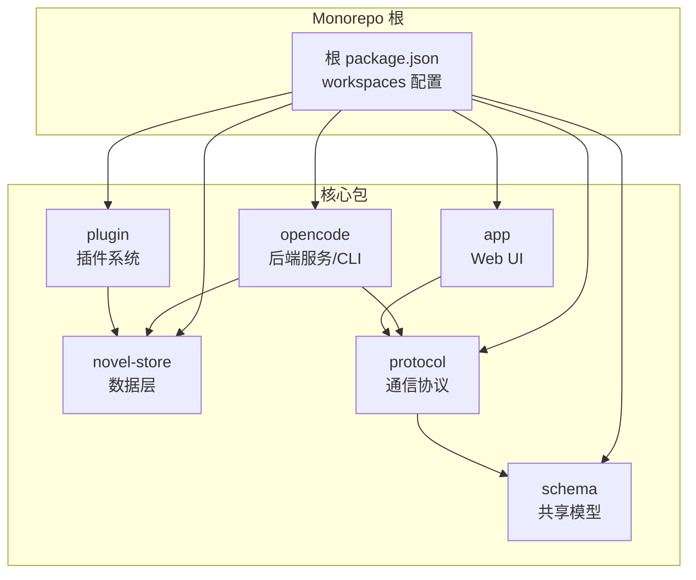
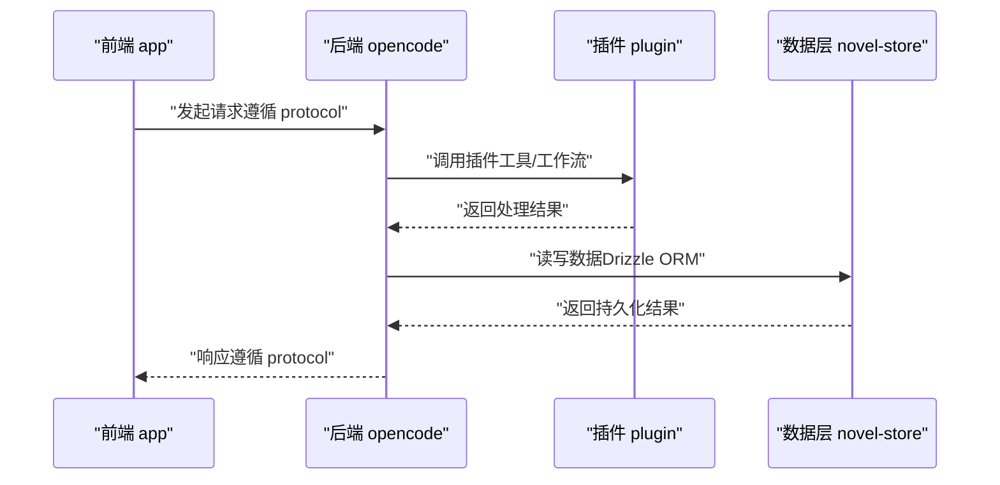
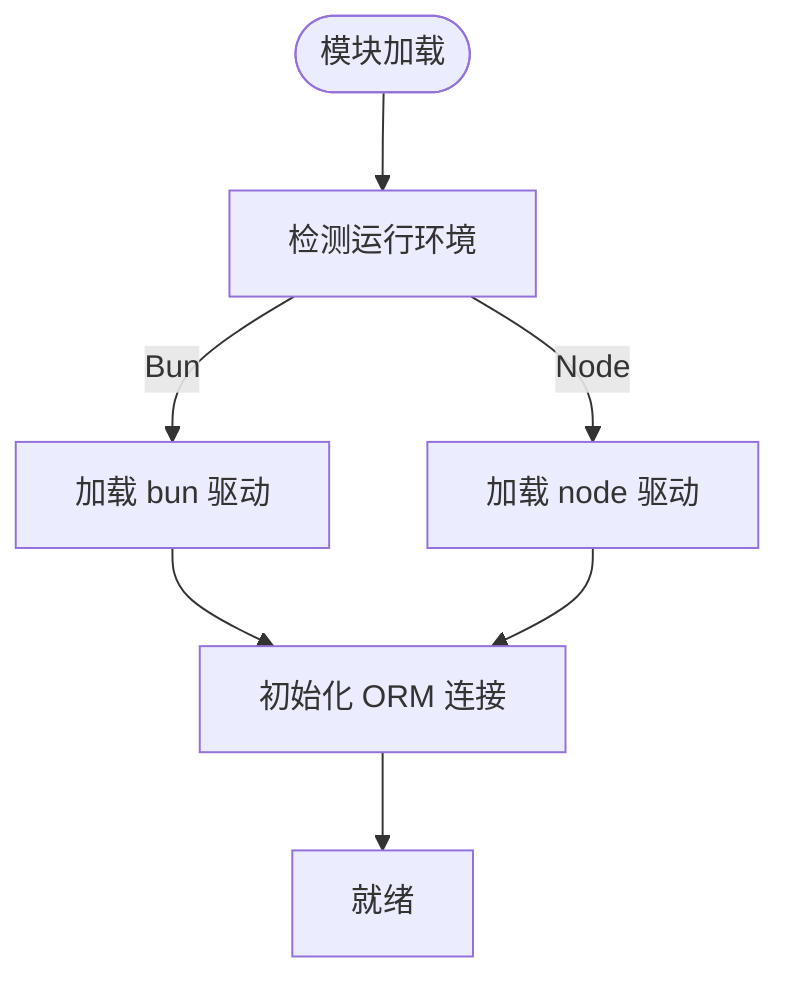
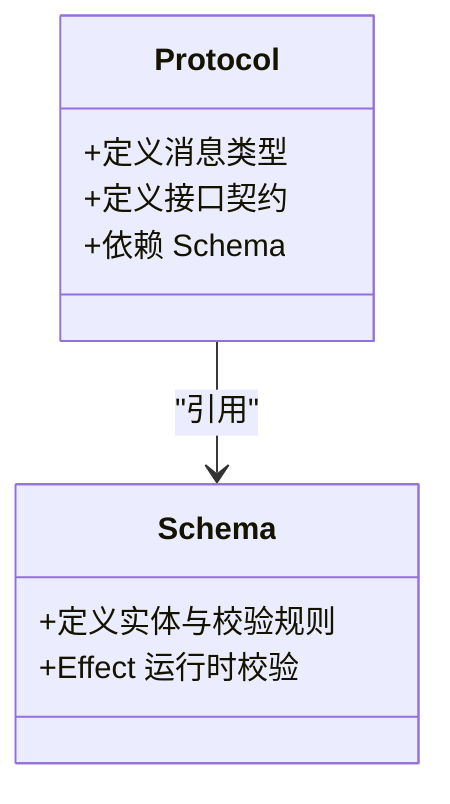
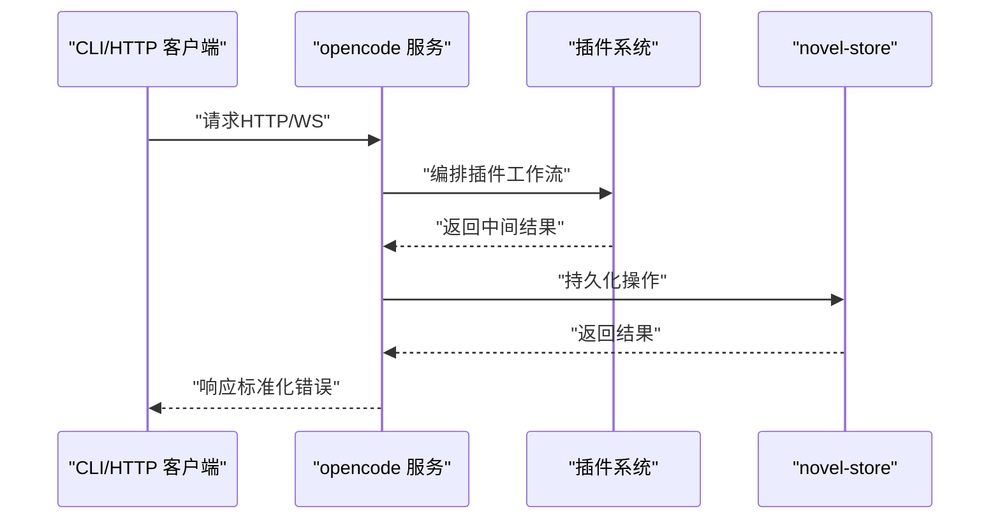
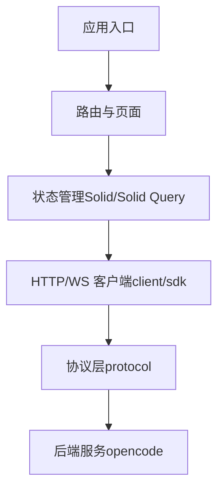
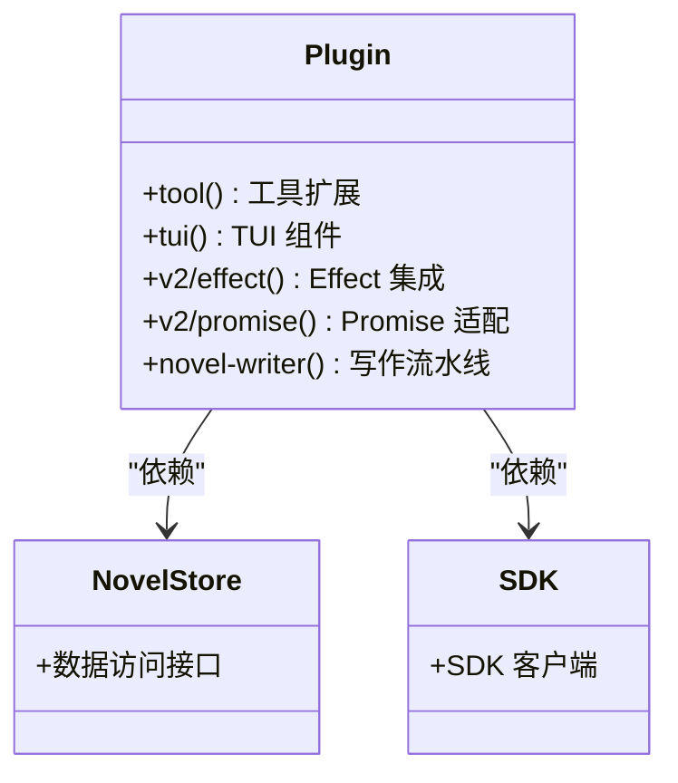
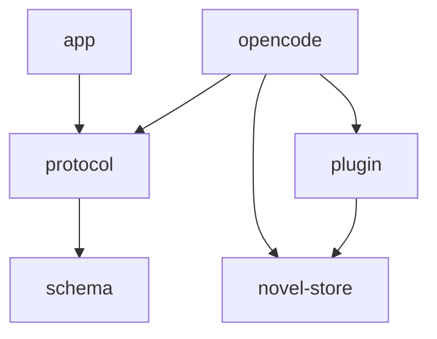

# 架构概览

<cite>
**本文引用的文件**   
- [package.json](file://package.json)
- [README.md](file://README.md)
- [packages/novel-store/package.json](file://packages/novel-store/package.json)
- [packages/schema/package.json](file://packages/schema/package.json)
- [packages/protocol/package.json](file://packages/protocol/package.json)
- [packages/opencode/package.json](file://packages/opencode/package.json)
- [packages/app/package.json](file://packages/app/package.json)
- [packages/plugin/package.json](file://packages/plugin/package.json)
</cite>

## 目录
1. [简介](#简介)
2. [项目结构](#项目结构)
3. [核心组件](#核心组件)
4. [架构总览](#架构总览)
5. [详细组件分析](#详细组件分析)
6. [依赖关系分析](#依赖关系分析)
7. [性能考量](#性能考量)
8. [故障排查指南](#故障排查指南)
9. [结论](#结论)
10. [附录](#附录)

## 简介
openNovel 是一个基于 Bun 的 Monorepo 项目，提供 AI 驱动的小说创作工作台。其架构围绕“数据层—API 契约—后端服务—前端界面—插件系统”分层设计，强调前后端分离与清晰的职责边界。通过 schema + protocol 定义稳定的 API 契约，novel-store 作为权威数据层，opencode 承载后端服务与 CLI，app 提供 Web 桌面化体验，plugin 封装写作流水线工具（草稿、连续性审计、审阅提交等）。

## 项目结构
Monorepo 根包通过 workspaces 管理多个子包，关键目录如下：
- packages/novel-store：权威数据层，使用 Drizzle ORM，按运行环境选择驱动（Bun/Node）
- packages/schema：共享类型与校验模型（Effect 生态）
- packages/protocol：前后端通信协议与消息类型（依赖 schema）
- packages/opencode：后端服务与 CLI，集成 LLM、插件、存储、HTTP API
- packages/app：SolidJS 前端应用，包含路由、状态、UI 组件与测试
- packages/plugin：插件系统与写作流水线工具，暴露 tool/tui/v2/effect/promise 等扩展点

图表来源
- [package.json:26-33](file://package.json#L26-L33)
- [packages/novel-store/package.json:1-34](file://packages/novel-store/package.json#L1-L34)
- [packages/schema/package.json:1-23](file://packages/schema/package.json#L1-L23)
- [packages/protocol/package.json:1-23](file://packages/protocol/package.json#L1-L23)
- [packages/opencode/package.json:1-159](file://packages/opencode/package.json#L1-L159)
- [packages/app/package.json:1-97](file://packages/app/package.json#L1-L97)
- [packages/plugin/package.json:1-61](file://packages/plugin/package.json#L1-L61)

章节来源
- [package.json:26-33](file://package.json#L26-L33)
- [README.md:60-68](file://README.md#L60-L68)

## 核心组件
- novel-store（数据层）
  - 职责：定义小说、章节、角色、审阅等实体与持久化访问；按运行环境选择驱动（Bun/Node）
  - 关键点：exports 入口统一，imports 条件映射驱动，依赖 drizzle-orm
- schema（共享模型）
  - 职责：定义跨层的数据结构与校验规则，使用 Effect 进行运行时校验
  - 关键点：exports 支持通配导出，便于按需引用
- protocol（通信协议）
  - 职责：定义前后端交互的消息类型与接口契约，依赖 schema
  - 关键点：exports 通配导出，保持契约稳定
- opencode（后端服务）
  - 职责：HTTP API、CLI、LLM 集成、插件编排、存储访问、WebSocket/事件总线
  - 关键点：bin 暴露命令行，imports 条件映射数据库驱动，依赖 protocol/schema/plugin/server
- app（前端界面）
  - 职责：SolidJS 应用，路由、状态、UI 组件、测试（单元/浏览器/E2E）
  - 关键点：依赖 client/core/schema/sdk/session-ui/ui，构建与开发脚本完善
- plugin（插件系统）
  - 职责：写作流水线工具（草稿、连续性审计、审阅提交），暴露 tool/tui/v2/effect/promise 等扩展点
  - 关键点：peerDependencies 可选 UI 框架，依赖 SDK 与 novel-store

章节来源
- [packages/novel-store/package.json:1-34](file://packages/novel-store/package.json#L1-L34)
- [packages/schema/package.json:1-23](file://packages/schema/package.json#L1-L23)
- [packages/protocol/package.json:1-23](file://packages/protocol/package.json#L1-L23)
- [packages/opencode/package.json:1-159](file://packages/opencode/package.json#L1-L159)
- [packages/app/package.json:1-97](file://packages/app/package.json#L1-L97)
- [packages/plugin/package.json:1-61](file://packages/plugin/package.json#L1-L61)

## 架构总览
openNovel 采用前后端分离与清晰的分层架构：
- 前端（app）通过 protocol 定义的契约调用后端（opencode）
- 后端（opencode）负责业务编排、LLM 调用、插件执行与数据持久化（novel-store）
- 数据层（novel-store）屏蔽底层存储差异，对外提供一致的访问接口
- 契约层（schema + protocol）确保前后端类型一致与运行时校验

图表来源
- [packages/app/package.json:49-95](file://packages/app/package.json#L49-L95)
- [packages/opencode/package.json:87-153](file://packages/opencode/package.json#L87-L153)
- [packages/plugin/package.json:27-34](file://packages/plugin/package.json#L27-L34)
- [packages/novel-store/package.json:24-26](file://packages/novel-store/package.json#L24-L26)

## 详细组件分析

### novel-store（数据层）
- 设计要点
  - 统一的 exports 入口，简化上层依赖
  - imports 条件映射驱动（bun/node），实现跨环境兼容
  - 依赖 drizzle-orm，提供类型安全的 SQL 抽象
- 复杂度与优化
  - 驱动切换在模块加载时完成，避免运行时分支判断
  - 建议对高频查询建立索引，结合事务保证一致性
- 错误处理
  - 建议统一错误码与异常包装，便于上层重试与降级

图表来源
- [packages/novel-store/package.json:14-19](file://packages/novel-store/package.json#L14-L19)
- [packages/novel-store/package.json:24-26](file://packages/novel-store/package.json#L24-L26)

章节来源
- [packages/novel-store/package.json:1-34](file://packages/novel-store/package.json#L1-L34)

### schema + protocol（API 契约）
- 设计要点
  - schema 定义数据结构与校验规则，使用 Effect 进行运行时校验
  - protocol 定义前后端消息类型与接口契约，依赖 schema 保证一致性
- 扩展机制
  - 通配导出便于按需引入，降低耦合
  - 新增字段需同步更新 schema 与 protocol，保持双向一致
- 性能考量
  - 建议在边界处进行最小化校验，避免重复验证

图表来源
- [packages/schema/package.json:14-16](file://packages/schema/package.json#L14-L16)
- [packages/protocol/package.json:14-16](file://packages/protocol/package.json#L14-L16)

章节来源
- [packages/schema/package.json:1-23](file://packages/schema/package.json#L1-L23)
- [packages/protocol/package.json:1-23](file://packages/protocol/package.json#L1-L23)

### opencode（后端服务）
- 设计要点
  - bin 暴露命令行入口，支持 serve/dev 模式
  - imports 条件映射数据库驱动，适配不同环境
  - 依赖 protocol/schema/plugin/server，形成完整的服务栈
- 功能范围
  - HTTP API、CLI、LLM 集成、插件编排、存储访问、事件总线
- 错误处理
  - 建议统一中间件捕获异常，返回标准化错误响应

图表来源
- [packages/opencode/package.json:18-20](file://packages/opencode/package.json#L18-L20)
- [packages/opencode/package.json:24-30](file://packages/opencode/package.json#L24-L30)
- [packages/opencode/package.json:87-153](file://packages/opencode/package.json#L87-L153)

章节来源
- [packages/opencode/package.json:1-159](file://packages/opencode/package.json#L1-L159)

### app（前端界面）
- 设计要点
  - SolidJS 应用，Vite 构建，支持 dev/build/serve
  - 依赖 client/core/schema/sdk/session-ui/ui，形成完整的前端栈
  - 完善的测试脚本（单元/浏览器/E2E）
- 交互模式
  - 通过 client/sdk 调用后端 API，遵循 protocol 契约
  - 使用 event-bus/scheduled 等 primitives 管理状态与异步任务
- 性能优化
  - 虚拟列表、懒加载、缓存策略提升渲染性能

图表来源
- [packages/app/package.json:14-31](file://packages/app/package.json#L14-L31)
- [packages/app/package.json:49-95](file://packages/app/package.json#L49-L95)

章节来源
- [packages/app/package.json:1-97](file://packages/app/package.json#L1-L97)

### plugin（插件系统）
- 设计要点
  - 暴露 tool/tui/v2/effect/promise 等扩展点，支持多种集成方式
  - peerDependencies 可选 UI 框架，降低耦合
  - 依赖 SDK 与 novel-store，直接访问数据层
- 扩展机制
  - 插件可注册工具函数、TUI 组件、Effect/Promise 适配器
  - 写作流水线（草稿、连续性审计、审阅提交）通过插件编排
- 错误处理
  - 建议插件内部捕获异常并返回结构化错误，便于上层重试

图表来源
- [packages/plugin/package.json:11-23](file://packages/plugin/package.json#L11-L23)
- [packages/plugin/package.json:27-34](file://packages/plugin/package.json#L27-L34)
- [packages/plugin/package.json:35-50](file://packages/plugin/package.json#L35-L50)

章节来源
- [packages/plugin/package.json:1-61](file://packages/plugin/package.json#L1-L61)

## 依赖关系分析
- 包间依赖
  - protocol 依赖 schema
  - opencode 依赖 protocol/schema/plugin/server
  - app 依赖 client/core/schema/sdk/session-ui/ui
  - plugin 依赖 SDK/novel-store
- 外部依赖
  - drizzle-orm（数据层）、effect（校验/副作用）、solid-js（前端）、hono/ws（HTTP/WebSocket）
- 潜在循环依赖
  - 当前结构无循环依赖，但需注意新增导入时的方向性

图表来源
- [packages/protocol/package.json:14-16](file://packages/protocol/package.json#L14-L16)
- [packages/opencode/package.json:87-153](file://packages/opencode/package.json#L87-L153)
- [packages/app/package.json:49-95](file://packages/app/package.json#L49-L95)
- [packages/plugin/package.json:27-34](file://packages/plugin/package.json#L27-L34)

章节来源
- [packages/protocol/package.json:1-23](file://packages/protocol/package.json#L1-L23)
- [packages/opencode/package.json:1-159](file://packages/opencode/package.json#L1-L159)
- [packages/app/package.json:1-97](file://packages/app/package.json#L1-L97)
- [packages/plugin/package.json:1-61](file://packages/plugin/package.json#L1-L61)

## 性能考量
- 数据层
  - 合理使用索引与事务，避免全表扫描
  - 批量操作减少往返次数
- 后端服务
  - 缓存热点数据，减少重复计算
  - 异步处理耗时任务（如 LLM 调用）
- 前端界面
  - 虚拟列表、懒加载、代码分割
  - 状态管理与网络请求去重

## 故障排查指南
- 启动问题
  - 检查环境变量与端口占用
  - 确认依赖安装与版本兼容性
- 数据层问题
  - 检查数据库连接与驱动选择
  - 查看 SQL 日志与错误堆栈
- 前后端通信
  - 核对 protocol 契约是否一致
  - 检查请求/响应格式与错误码
- 插件问题
  - 查看插件日志与异常信息
  - 确认依赖与 peerDependencies 版本匹配

## 结论
openNovel 的 Monorepo 架构通过清晰的分层与契约化设计，实现了高内聚、低耦合的系统结构。novel-store 作为权威数据层，schema + protocol 确保前后端一致性，opencode 提供强大的后端能力，app 提供友好的前端体验，plugin 系统支持灵活扩展。开发者可在正确层次进行开发与调试，快速定位问题并迭代功能。

## 附录
- 快速开始
  - 参考 README 中的命令与环境要求
- 贡献指南
  - 遵循代码规范与提交流程
- 许可证
  - MIT 许可，保留原始版权信息