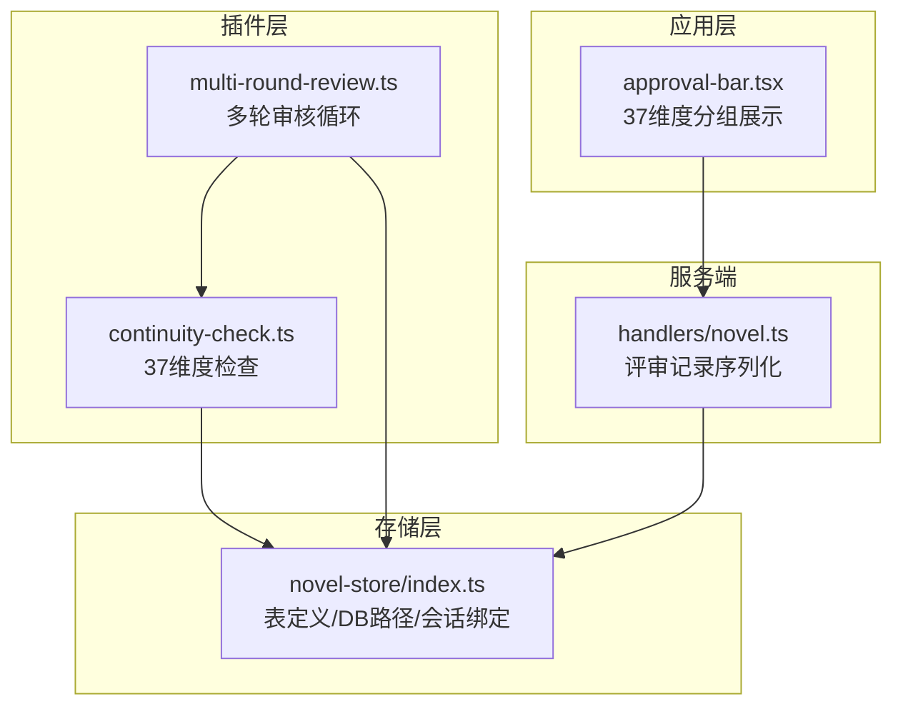
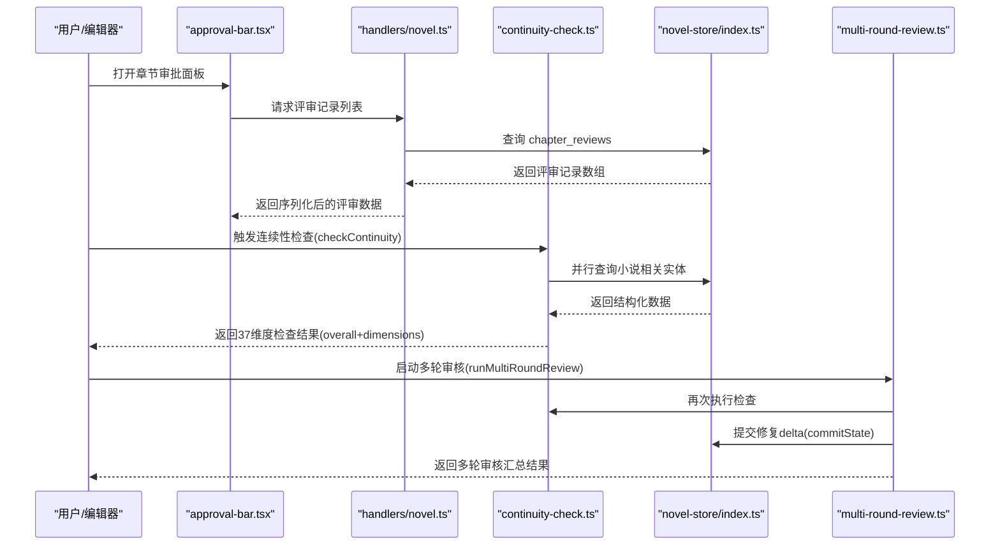
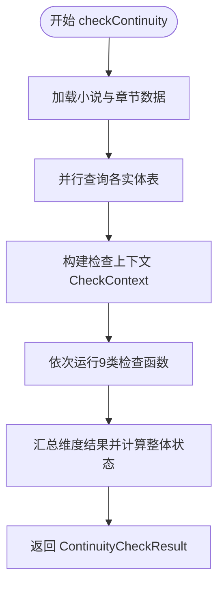
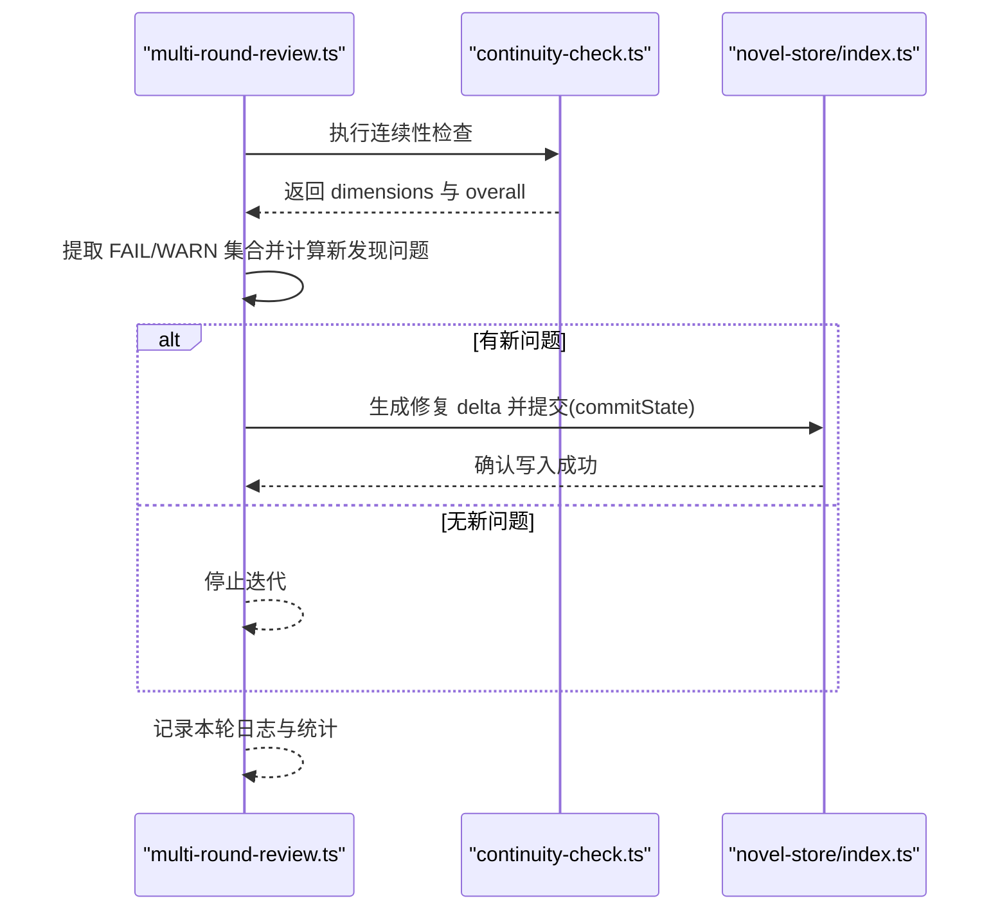
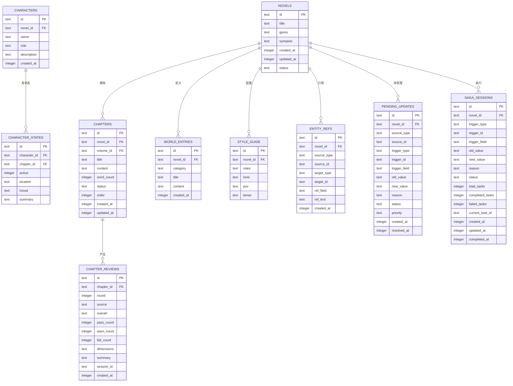
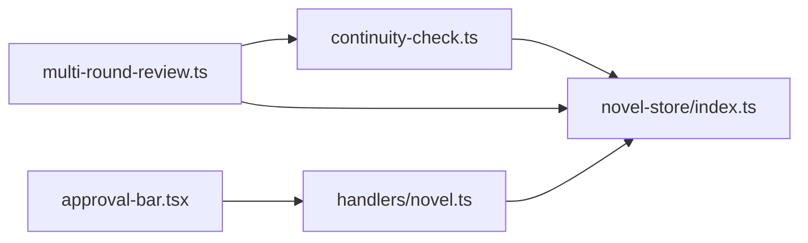

# 37维度连续性审查系统

<cite>
**本文引用的文件**
- [continuity-check.ts](file://packages/plugin/src/novel-writer/continuity-check.ts)
- [multi-round-review.ts](file://packages/plugin/src/novel-writer/multi-round-review.ts)
- [index.ts（novel-store）](file://packages/novel-store/src/index.ts)
- [session-store.ts（plugin 重导出）](file://packages/plugin/src/novel-writer/session-store.ts)
- [approval-bar.tsx](file://packages/app/src/pages/novel/approval-bar.tsx)
- [novel.ts（服务端处理器）](file://packages/server/src/handlers/novel.ts)
- [review.test.ts（插件测试）](file://packages/plugin/test/novel-writer/review.test.ts)
- [novel.test.ts（服务端测试）](file://packages/server/test/novel.test.ts)
- [cascade-consistency-design.md](file://docs/cascade-consistency-design.md)
</cite>

## 目录
1. [简介](#简介)
2. [项目结构](#项目结构)
3. [核心组件](#核心组件)
4. [架构总览](#架构总览)
5. [详细组件分析](#详细组件分析)
6. [依赖关系分析](#依赖关系分析)
7. [性能考量](#性能考量)
8. [故障排查指南](#故障排查指南)
9. [结论](#结论)
10. [附录：规则自定义与扩展](#附录：规则自定义与扩展)

## 简介
本文件系统化阐述 openNovel 的“37维度连续性审查系统”，覆盖角色一致性、时间线连贯性、情节逻辑性、设定统一性等维度的审查规则；说明审查算法的实现原理、证据收集机制、结果持久化存储；并提供规则自定义方法、结果分析与改进建议生成机制，以及实际案例与常见问题解决方案。该系统以确定性检查为主，结合多轮审核循环与级联一致性方案，确保长篇小说在写作过程中保持全局一致性与可追溯性。

## 项目结构
- 审查引擎位于 plugin 层，核心为连续性检查模块与多轮审核循环。
- 数据模型与持久化由 novel-store 提供，包含小说、章节、角色、关系、伏笔、世界设定、风格指南等表定义及会话绑定能力。
- 前端通过 approval-bar 展示37个维度的分组与状态，支持查看证据与详情。
- 服务端 handler 负责将评审记录序列化为 API 响应，并解析 dimensions JSON。
- 级联一致性设计文档定义了引用扫描、待统改任务、Saga 执行与门禁机制。

**图表来源**
- [continuity-check.ts:149-232](file://packages/plugin/src/novel-writer/continuity-check.ts#L149-L232)
- [multi-round-review.ts:170-307](file://packages/plugin/src/novel-writer/multi-round-review.ts#L170-L307)
- [index.ts（novel-store）:34-386](file://packages/novel-store/src/index.ts#L34-L386)
- [approval-bar.tsx:42-52](file://packages/app/src/pages/novel/approval-bar.tsx#L42-L52)
- [novel.ts:139-159](file://packages/server/src/handlers/novel.ts#L139-L159)

**章节来源**
- [continuity-check.ts:149-232](file://packages/plugin/src/novel-writer/continuity-check.ts#L149-L232)
- [index.ts（novel-store）:34-386](file://packages/novel-store/src/index.ts#L34-L386)
- [approval-bar.tsx:42-52](file://packages/app/src/pages/novel/approval-bar.tsx#L42-L52)
- [novel.ts:139-159](file://packages/server/src/handlers/novel.ts#L139-L159)

## 核心组件
- 连续性检查器（checkContinuity）：并行读取小说相关实体，按9大类37维度进行启发式检查，输出整体状态与维度明细。
- 多轮审核循环（runMultiRoundReview）：迭代执行审计→修复→同步→日志，直到无新问题或达到最大轮次。
- 数据存储（novel-store）：提供表结构、数据库路径解析、会话绑定、懒绑定与常用 CRUD。
- 前端展示（approval-bar）：将37维度按9大类分组渲染，显示 PASS/WARN/FAIL 状态、详情与证据。
- 服务端处理（handlers/novel）：将评审记录从 DB 行转换为 API 对象，解析 dimensions JSON。

**章节来源**
- [continuity-check.ts:149-232](file://packages/plugin/src/novel-writer/continuity-check.ts#L149-L232)
- [multi-round-review.ts:170-307](file://packages/plugin/src/novel-writer/multi-round-review.ts#L170-L307)
- [index.ts（novel-store）:34-386](file://packages/novel-store/src/index.ts#L34-L386)
- [approval-bar.tsx:42-52](file://packages/app/src/pages/novel/approval-bar.tsx#L42-L52)
- [novel.ts:139-159](file://packages/server/src/handlers/novel.ts#L139-L159)

## 架构总览
审查系统采用“确定性检查 + 多轮迭代”的双层架构：
- 第一层：基于 DB 结构化数据的确定性检查，覆盖角色、关系、时间线、地点、剧情、世界观、风格、逻辑、细节九大类共37维度。
- 第二层：多轮审核循环，自动提取 FAIL/WARN 维度，生成修复 delta 并通过 commitState 写回 DB 与 Markdown 摘要，直至收敛。

**图表来源**
- [approval-bar.tsx:42-52](file://packages/app/src/pages/novel/approval-bar.tsx#L42-L52)
- [novel.ts:139-159](file://packages/server/src/handlers/novel.ts#L139-L159)
- [continuity-check.ts:149-232](file://packages/plugin/src/novel-writer/continuity-check.ts#L149-L232)
- [multi-round-review.ts:170-307](file://packages/plugin/src/novel-writer/multi-round-review.ts#L170-L307)
- [index.ts（novel-store）:34-386](file://packages/novel-store/src/index.ts#L34-L386)

## 详细组件分析

### 连续性检查器（37维度）
- 输入：novelId、chapterNumber（可选 directory）。
- 过程：
  - 获取当前小说与章节，并行拉取 chapters、characters、character_states、relationships、plot_threads、foreshadowing、chapter_summaries、world_entries、style_guide。
  - 按9大类分别执行检查函数，汇总为37条维度结果。
  - 整体判定：存在 FAIL → FAIL；否则存在 WARN → WARN；否则 PASS。
- 输出：{ novelId, chapterNumber, chapterId, overall, dimensions[] }。

**图表来源**
- [continuity-check.ts:149-232](file://packages/plugin/src/novel-writer/continuity-check.ts#L149-L232)

**章节来源**
- [continuity-check.ts:149-232](file://packages/plugin/src/novel-writer/continuity-check.ts#L149-L232)
- [continuity-check.ts:236-359](file://packages/plugin/src/novel-writer/continuity-check.ts#L236-L359)
- [continuity-check.ts:363-512](file://packages/plugin/src/novel-writer/continuity-check.ts#L363-L512)
- [continuity-check.ts:516-629](file://packages/plugin/src/novel-writer/continuity-check.ts#L516-L629)
- [continuity-check.ts:633-721](file://packages/plugin/src/novel-writer/continuity-check.ts#L633-L721)
- [continuity-check.ts:725-852](file://packages/plugin/src/novel-writer/continuity-check.ts#L725-L852)
- [continuity-check.ts:856-974](file://packages/plugin/src/novel-writer/continuity-check.ts#L856-L974)
- [continuity-check.ts:978-1059](file://packages/plugin/src/novel-writer/continuity-check.ts#L978-L1059)
- [continuity-check.ts:1063-1132](file://packages/plugin/src/novel-writer/continuity-check.ts#L1063-L1132)
- [continuity-check.ts:1136-1200](file://packages/plugin/src/novel-writer/continuity-check.ts#L1136-L1200)

### 多轮审核循环
- 流程：每轮执行 checkContinuity，提取 FAIL/WARN 维度集合，计算新增问题集；若无新问题则停止；否则生成修复 delta（chapter_summary update），调用 commitState 同步到 DB 与 Markdown 摘要；记录本轮日志与统计。
- 终止条件：无新问题、达到 maxRounds、数据异常。
- 输出：MultiRoundResult，包含 rounds、累计问题数、最终状态与停止原因。

**图表来源**
- [multi-round-review.ts:170-307](file://packages/plugin/src/novel-writer/multi-round-review.ts#L170-L307)

**章节来源**
- [multi-round-review.ts:170-307](file://packages/plugin/src/novel-writer/multi-round-review.ts#L170-L307)

### 数据存储与表结构
- 关键表：novels、chapters、chapter_versions、chapter_reviews、characters、character_states、relationships、plot_threads、foreshadowing、chapter_summaries、world_entries、style_guide、volume_summaries、tension_log、hook_rotation、entity_refs、pending_updates、saga_sessions、description_history。
- 特性：
  - 每个小说独立数据库文件，路径优先级：环境变量 > 插件目录 > 进程工作目录。
  - 会话绑定：tagNovelSession / getNovelForSession / isNovelSession / resolveNovelForSession。
  - 索引优化：对 chapter_reviews(chapter_id, round)、entity_refs(target_type, target_id)、pending_updates(novel_id, status) 等建立索引。

**图表来源**
- [index.ts（novel-store）:34-386](file://packages/novel-store/src/index.ts#L34-L386)

**章节来源**
- [index.ts（novel-store）:34-386](file://packages/novel-store/src/index.ts#L34-L386)

### 前端展示与分组
- 37维度分为9大类：character、relationship、timeline、location、plot、worldview、style、logic、detail。
- 每个维度显示状态点（PASS/WARN/FAIL）、详情与证据（evidence）。

**章节来源**
- [approval-bar.tsx:42-52](file://packages/app/src/pages/novel/approval-bar.tsx#L42-L52)
- [approval-bar.tsx:179-209](file://packages/app/src/pages/novel/approval-bar.tsx#L179-L209)

### 服务端评审记录序列化
- toChapterReview 将 DB 行转换为 API 对象，解析 dimensions JSON 为结构化数组，包含 dimension、status、detail、evidence。

**章节来源**
- [novel.ts:139-159](file://packages/server/src/handlers/novel.ts#L139-L159)

## 依赖关系分析
- continuity-check.ts 依赖 novel-store 的表定义与 DB 访问。
- multi-round-review.ts 依赖 continuity-check 与 state-commit（通过 novel-store 暴露的接口）。
- approval-bar.tsx 依赖服务端 API 返回的评审数据结构。
- handlers/novel.ts 依赖 novel-store 的 chapter_reviews 表结构与 JSON 字段解析。

**图表来源**
- [continuity-check.ts:149-232](file://packages/plugin/src/novel-writer/continuity-check.ts#L149-L232)
- [multi-round-review.ts:170-307](file://packages/plugin/src/novel-writer/multi-round-review.ts#L170-L307)
- [index.ts（novel-store）:34-386](file://packages/novel-store/src/index.ts#L34-L386)
- [approval-bar.tsx:42-52](file://packages/app/src/pages/novel/approval-bar.tsx#L42-L52)
- [novel.ts:139-159](file://packages/server/src/handlers/novel.ts#L139-L159)

**章节来源**
- [continuity-check.ts:149-232](file://packages/plugin/src/novel-writer/continuity-check.ts#L149-L232)
- [multi-round-review.ts:170-307](file://packages/plugin/src/novel-writer/multi-round-review.ts#L170-L307)
- [index.ts（novel-store）:34-386](file://packages/novel-store/src/index.ts#L34-L386)
- [approval-bar.tsx:42-52](file://packages/app/src/pages/novel/approval-bar.tsx#L42-L52)
- [novel.ts:139-159](file://packages/server/src/handlers/novel.ts#L139-L159)

## 性能考量
- 并行查询：checkContinuity 使用 Promise.all 并行拉取多个表，减少 I/O 等待。
- 索引优化：chapter_reviews、entity_refs、pending_updates、saga_sessions 等关键查询列建立索引。
- 增量修复：多轮审核仅对新增问题生成 delta，避免全量重写。
- 数据库隔离：每个小说独立 .db 文件，避免跨项目锁竞争。

[本节为通用指导，不直接分析具体文件]

## 故障排查指南
- 章节不存在：createChapterReview 会抛出“未找到章节”错误。
- 内容变更后轮次：章节内容更新后，下一次评审应开启新 round。
- human 评审计数：当 human 评审未提供 dimensions 时，pass/warn/fail 计数均为 0。
- 评审排序：listChapterReviews 返回最新在前，便于快速定位最近审核。

**章节来源**
- [review.test.ts:67-133](file://packages/plugin/test/novel-writer/review.test.ts#L67-L133)
- [review.test.ts:135-151](file://packages/plugin/test/novel-writer/review.test.ts#L135-L151)
- [novel.test.ts:229-308](file://packages/server/test/novel.test.ts#L229-L308)

## 结论
37维度连续性审查系统以结构化数据为基础，通过确定性检查与多轮迭代，有效保障小说在角色、时间线、情节、世界观、风格、逻辑与细节等方面的全局一致性。配合级联一致性方案，系统在修改设定后能自动识别影响范围、生成统改任务并辅助人工或 LLM 完成改写，形成“审—改—验”闭环。

[本节为总结，不直接分析具体文件]

## 附录：规则自定义与扩展
- 维度扩展：在 CONTINUITY_DIMENSIONS 中新增维度名称，并在对应检查函数中添加判断逻辑。
- 阈值调整：如节奏一致性的字数偏离阈值、伏笔回收比例阈值等，可在相应函数中调整。
- 证据采集：在检查函数中为 FAIL/WARN 维度补充 evidence 字段，便于前端展示与追踪。
- 级联规则：参考 cascade-consistency-design.md，扩展 entity_refs 扫描与 pending_updates 优先级策略。

**章节来源**
- [continuity-check.ts:64-111](file://packages/plugin/src/novel-writer/continuity-check.ts#L64-L111)
- [cascade-consistency-design.md:209-220](file://docs/cascade-consistency-design.md#L209-L220)