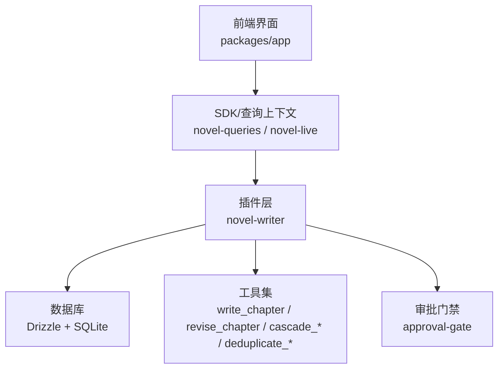
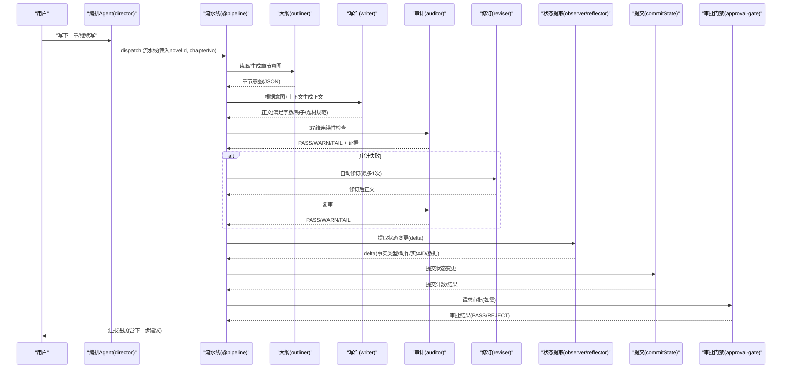
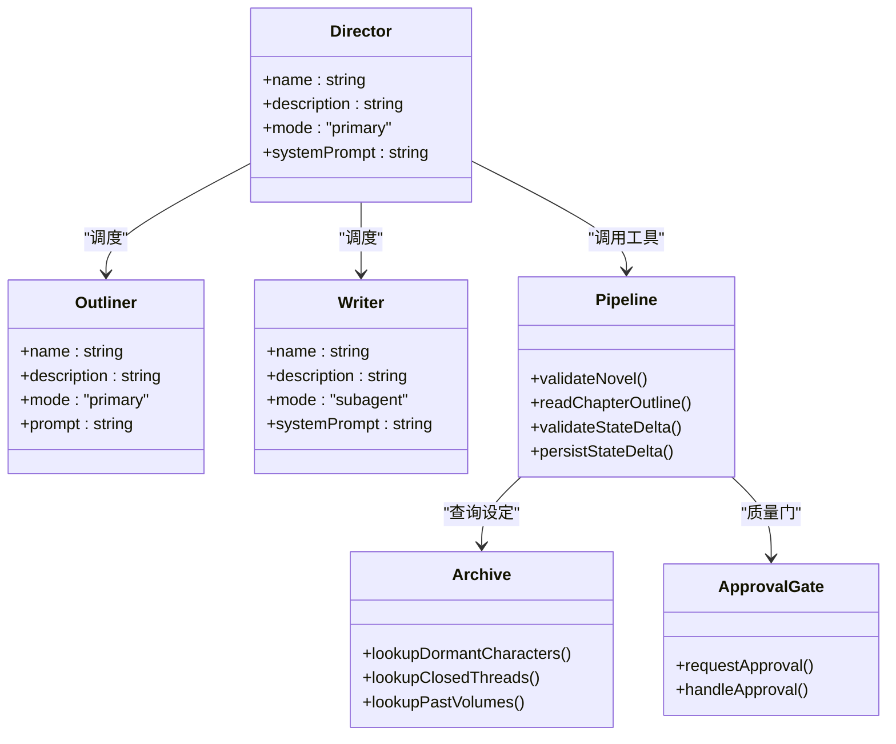
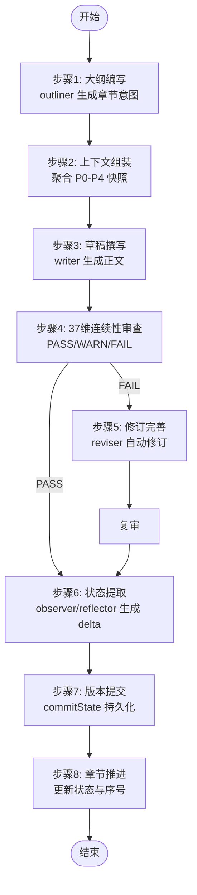

# 8步写作流水线

<cite>
**本文引用的文件**   
- [README.md](file://README.md)
- [pipeline.ts](file://packages/plugin/src/novel-writer/pipeline.ts)
- [director.ts](file://packages/plugin/src/novel-writer/agents/director.ts)
- [outliner.ts](file://packages/plugin/src/novel-writer/agents/outliner.ts)
- [writer.ts](file://packages/plugin/src/novel-writer/agents/writer.ts)
- [approval-gate.ts](file://packages/plugin/src/novel-writer/approval-gate.ts)
- [archive.ts](file://packages/plugin/src/novel-writer/archive.ts)
- [novel-live.ts](file://packages/app/src/context/novel-live.ts)
- [novel-queries.ts](file://packages/app/src/context/novel-queries.ts)
- [workspace-data.ts](file://packages/app/src/pages/novel/workspace-data.ts)
- [novel.test.ts](file://packages/server/test/novel.test.ts)
- [review.test.ts](file://packages/plugin/test/novel-writer/review.test.ts)
- [e2e.test.ts](file://packages/plugin/test/novel-writer/e2e.test.ts)
</cite>

## 目录
1. [简介](#简介)
2. [项目结构](#项目结构)
3. [核心组件](#核心组件)
4. [架构总览](#架构总览)
5. [详细组件分析](#详细组件分析)
6. [依赖关系分析](#依赖关系分析)
7. [性能考量](#性能考量)
8. [故障排查指南](#故障排查指南)
9. [结论](#结论)
10. [附录](#附录)

## 简介
openNovel 提供“AI 驱动的长篇创作工作台”，以 8 步写作流水线与 37 维度连续性审查为核心能力，覆盖从大纲到修订、版本提交与章节推进的全流程。该流水线由编排 Agent（director）统一调度子 Agent（如 writer、auditor、reviser、observer、reflector 等）与工具链完成，确保内容质量、设定一致性与可追溯的版本历史。

## 项目结构
- 前端应用（packages/app）：提供书架、工作区、审批流、阅读器与查询上下文（novel-queries、novel-live）。
- 插件层（packages/plugin）：实现 novel-writer 的 Agent 配置、流水线辅助函数、归档查询与审批门禁。
- 服务端测试（packages/server/test）：验证评审持久化、列表接口等行为。
- 端到端测试（packages/plugin/test）：覆盖大纲生成、章节撰写、上下文组装等关键路径。

图表来源
- [novel-queries.ts](file://packages/app/src/context/novel-queries.ts)
- [novel-live.ts](file://packages/app/src/context/novel-live.ts)
- [pipeline.ts](file://packages/plugin/src/novel-writer/pipeline.ts)
- [approval-gate.ts](file://packages/plugin/src/novel-writer/approval-gate.ts)

章节来源
- [README.md:1-58](file://README.md#L1-L58)

## 核心组件
- 编排 Agent（director）：理解用户意图，路由到正确的子 Agent 或工具；管理级联统改与门禁策略。
- 大纲 Agent（outliner）：基于上下文快照生成章节创作意图，规划场景、角色焦点与剧情推进。
- 写作 Agent（writer）：遵循 26 条写作规则与题材模板，产出符合字数与节奏要求的正文。
- 流水线辅助（pipeline）：确定性步骤工具（校验小说、读取大纲、状态变更校验与提交）。
- 归档查询（archive）：休眠角色、已关闭线索、历史卷摘要查询，辅助设定一致性。
- 审批门禁（approval-gate）：封装请求与处理审批结果，保障发布前质量门。

章节来源
- [director.ts:1-155](file://packages/plugin/src/novel-writer/agents/director.ts#L1-L155)
- [outliner.ts:1-95](file://packages/plugin/src/novel-writer/agents/outliner.ts#L1-L95)
- [writer.ts:1-136](file://packages/plugin/src/novel-writer/agents/writer.ts#L1-L136)
- [pipeline.ts:1-131](file://packages/plugin/src/novel-writer/pipeline.ts#L1-L131)
- [archive.ts:1-201](file://packages/plugin/src/novel-writer/archive.ts#L1-L201)
- [approval-gate.ts:1-3](file://packages/plugin/src/novel-writer/approval-gate.ts#L1-L3)

## 架构总览
8 步写作流水线由 director 统一调度 @pipeline 子 Agent 执行，顺序为：计划→上下文组装→草稿撰写→37 维连续性审查→修订完善→状态提取→版本提交→章节推进。每一步均有明确输入输出与错误处理策略，并通过审批门禁控制发布。

图表来源
- [director.ts:1-155](file://packages/plugin/src/novel-writer/agents/director.ts#L1-L155)
- [pipeline.ts:1-131](file://packages/plugin/src/novel-writer/pipeline.ts#L1-L131)
- [approval-gate.ts:1-3](file://packages/plugin/src/novel-writer/approval-gate.ts#L1-L3)

## 详细组件分析

### 步骤一：大纲编写（plan）
- 目标：基于上下文快照与三级大纲（整体/卷/章），生成章节创作意图（场景编排、角色焦点、剧情推进方向）。
- 输入：上下文快照（P0-P4）、作者意图、当前焦点、已有大纲。
- 处理：outliner 解析快照，结合题材规则与风格指南，输出 JSON 意图（章节标题建议、场景清单、角色焦点、伏笔回收/埋设计划、时间线说明）。
- 输出：结构化章节意图，供 writer 使用。
- 错误处理：若快照缺失关键层级，需先补齐设定或提示用户补充信息。

章节来源
- [outliner.ts:1-95](file://packages/plugin/src/novel-writer/agents/outliner.ts#L1-L95)
- [e2e.test.ts:419-449](file://packages/plugin/test/novel-writer/e2e.test.ts#L419-L449)

### 步骤二：上下文组装（compose）
- 目标：聚合角色状态、卷/章摘要、线索与伏笔、风格与规则，形成完整上下文快照。
- 输入：数据库中的角色、情节线索、卷摘要、章节摘要、风格指南。
- 处理：按 P0-P4 分层组织，确保 writer 能准确衔接上一章结尾并避免重复。
- 输出：ContextPacket（包含目标字数、钩子轮换统计、上一章结尾原文等）。

章节来源
- [writer.ts:124-136](file://packages/plugin/src/novel-writer/agents/writer.ts#L124-L136)
- [archive.ts:1-201](file://packages/plugin/src/novel-writer/archive.ts#L1-L201)

### 步骤三：草稿撰写（write）
- 目标：依据大纲意图与上下文快照，生成符合网文商业标准的章节正文。
- 输入：章节意图、上下文快照、题材模板、字数目标。
- 处理：writer 严格遵循 26 条写作规则（节奏、钩子、视角、描写克制、对话密度、打脸结构、力量体系、字数控制等），按四段式节拍结构输出。
- 输出：正文内容（满足字数区间与题材规范），调用 write_chapter 写入数据库。
- 错误处理：若字数不达标/超限或与前文重复，需重写补足后再提交。

章节来源
- [writer.ts:22-136](file://packages/plugin/src/novel-writer/agents/writer.ts#L22-L136)
- [e2e.test.ts:451-480](file://packages/plugin/test/novel-writer/e2e.test.ts#L451-L480)

### 步骤四：37维度连续性审查（audit）
- 目标：对章节进行 37 维度连续性检查（人物、时间线、情节、逻辑、设定等），输出 PASS/WARN/FAIL 及证据。
- 输入：章节正文、上下文快照、设定库。
- 处理：deterministic 审计器逐项校验，记录每个维度的状态与细节证据。
- 输出：评审记录（round、source、overall、dimensions、summary、sessionId）。
- 错误处理：若 FAIL，触发修订流程；WARN 可进入人工复核队列。

章节来源
- [review.test.ts:67-133](file://packages/plugin/test/novel-writer/review.test.ts#L67-L133)
- [novel.test.ts:229-266](file://packages/server/test/novel.test.ts#L229-L266)

### 步骤五：修订完善（revise）
- 目标：针对审计失败的维度，由 reviser 自动修订（最多一次），提升通过概率。
- 输入：审计结果（FAIL/WARN 维度与证据）、上下文快照、原正文。
- 处理：reviser 聚焦问题点修正（如动机缺失、性格不一致、伏笔未回收等），保持风格与节奏一致。
- 输出：修订后正文，再次进入审计环节。

章节来源
- [director.ts:66-78](file://packages/plugin/src/novel-writer/agents/director.ts#L66-L78)

### 步骤六：状态提取（reflect）
- 目标：从章节内容中提取 9 种事实类型（如 chapter_summary、character_state、plot_thread 等），构建状态变更 delta。
- 输入：章节正文、上下文快照。
- 处理：observer 抽取事实，reflector 校验 delta 格式与完整性。
- 输出：delta 列表（fact_type、action、entity_id、data）。

章节来源
- [pipeline.ts:104-116](file://packages/plugin/src/novel-writer/pipeline.ts#L104-L116)
- [director.ts:42-43](file://packages/plugin/src/novel-writer/agents/director.ts#L42-L43)

### 步骤七：版本提交（commit）
- 目标：将状态变更 delta 持久化到数据库，并记录提交日志。
- 输入：novelId、chapterId、delta。
- 处理：commitState 写入变更，返回提交计数。
- 错误处理：若章节不存在或内容为空，返回失败消息。

章节来源
- [pipeline.ts:90-130](file://packages/plugin/src/novel-writer/pipeline.ts#L90-L130)

### 步骤八：章节推进（next）
- 目标：更新章节状态（如 published）、推进序号，准备下一章创作。
- 输入：当前章节 ID、目标状态。
- 处理：更新数据库记录，刷新工作区视图。
- 错误处理：若前置门禁未解除（pending_updates），需先执行级联统改。

章节来源
- [pipeline.ts:23-27](file://packages/plugin/src/novel-writer/pipeline.ts#L23-L27)
- [director.ts:127-141](file://packages/plugin/src/novel-writer/agents/director.ts#L127-L141)

## 依赖关系分析
- director 依赖 outliner、writer、auditor、reviser、observer、reflector 以及工具集（write_chapter、revise_chapter、cascade_*、deduplicate_*）。
- pipeline 依赖 session-store（DB 访问）、commitState（状态提交）。
- approval-gate 封装审批请求与处理，贯穿发布前质量门。
- 前端通过 novel-queries、novel-live 与后端交互，展示审批状态与工作区数据。

图表来源
- [director.ts:1-155](file://packages/plugin/src/novel-writer/agents/director.ts#L1-L155)
- [outliner.ts:1-95](file://packages/plugin/src/novel-writer/agents/outliner.ts#L1-L95)
- [writer.ts:1-136](file://packages/plugin/src/novel-writer/agents/writer.ts#L1-L136)
- [pipeline.ts:1-131](file://packages/plugin/src/novel-writer/pipeline.ts#L1-L131)
- [archive.ts:1-201](file://packages/plugin/src/novel-writer/archive.ts#L1-L201)
- [approval-gate.ts:1-3](file://packages/plugin/src/novel-writer/approval-gate.ts#L1-L3)

章节来源
- [novel-queries.ts](file://packages/app/src/context/novel-queries.ts)
- [novel-live.ts](file://packages/app/src/context/novel-live.ts)
- [workspace-data.ts](file://packages/app/src/pages/novel/workspace-data.ts)

## 性能考量
- 上下文快照按需加载：仅加载 P0-P4 必要层级，减少 LLM 输入长度。
- 批量操作：级联统改使用 Saga 模式批量执行，降低往返开销。
- 缓存热点：角色/卷摘要缓存最近 N 条，避免重复查询。
- 异步编排：director 并行调度子 Agent，缩短端到端延迟。
- 审计优化：37 维检查采用确定性规则优先，LLM 仅用于复杂推理。

[本节为通用指导，无需特定文件引用]

## 故障排查指南
- 章节不存在：validateStateDelta 返回 fail，检查 chapterId 是否正确。
- 内容为空：无法提交状态变更，需先生成正文。
- 字数不达标/超限：writer 拒绝写入，需扩写或删减至目标区间。
- 与前文重复：writer 检测重复片段，需重写差异化内容。
- 审计 FAIL：触发 reviser 自动修订，若仍 FAIL，需人工介入调整设定或大纲。
- 门禁拦截：存在 pending_updates 时，write_chapter/revise_chapter 被拦截，需先执行 cascade_execute。

章节来源
- [pipeline.ts:58-78](file://packages/plugin/src/novel-writer/pipeline.ts#L58-L78)
- [writer.ts:124-136](file://packages/plugin/src/novel-writer/agents/writer.ts#L124-L136)
- [director.ts:127-141](file://packages/plugin/src/novel-writer/agents/director.ts#L127-L141)

## 结论
openNovel 的 8 步写作流水线通过编排 Agent 与子 Agent 协作，结合 37 维度连续性审查与审批门禁，实现了高质量、高一致性的长篇创作自动化。借助级联统改与版本提交机制，确保设定与内容的长期一致性，并提供可追溯的历史版本。

[本节为总结性内容，无需特定文件引用]

## 附录

### 配置选项与使用示例
- 启动开发环境：参考 README 快速开始命令，同时启动后端与 Web UI。
- 创建小说：通过书架向导选择题材、填写书名与简介，初始化故事圣经与规则书。
- 写下一章：在对话中告知“写下一章”或“继续写”，director 自动调度 @pipeline 执行 8 步流程。
- 生成大纲：使用 generate_master_outline/volume_outline/chapter_outline 工具，先由 AI 生成实际内容再持久化。
- 级联统改：修改设定后，调用 cascade_check/cascade_create_tasks/cascade_execute 处理影响范围。
- 去重清理：先 dry_run=true 检查重复角色/关系，必要时合并描述后再执行清理。

章节来源
- [README.md:34-58](file://README.md#L34-L58)
- [director.ts:86-119](file://packages/plugin/src/novel-writer/agents/director.ts#L86-L119)

### 数据流转图（章节撰写）

图表来源
- [director.ts:66-78](file://packages/plugin/src/novel-writer/agents/director.ts#L66-L78)
- [pipeline.ts:104-130](file://packages/plugin/src/novel-writer/pipeline.ts#L104-L130)