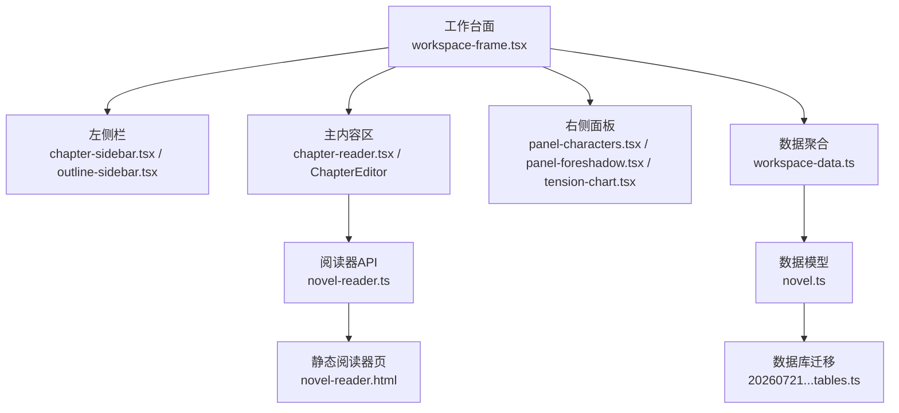
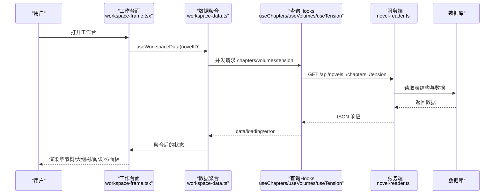
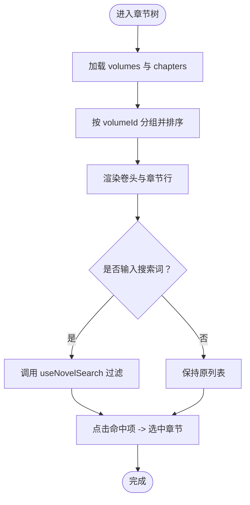
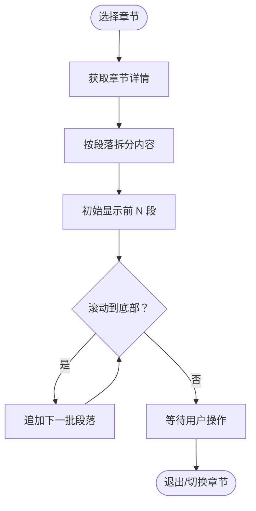
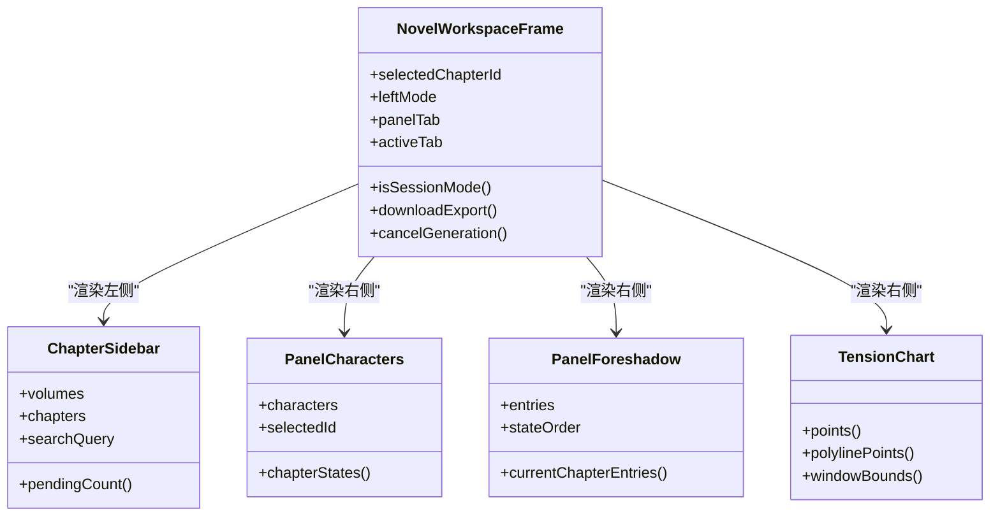
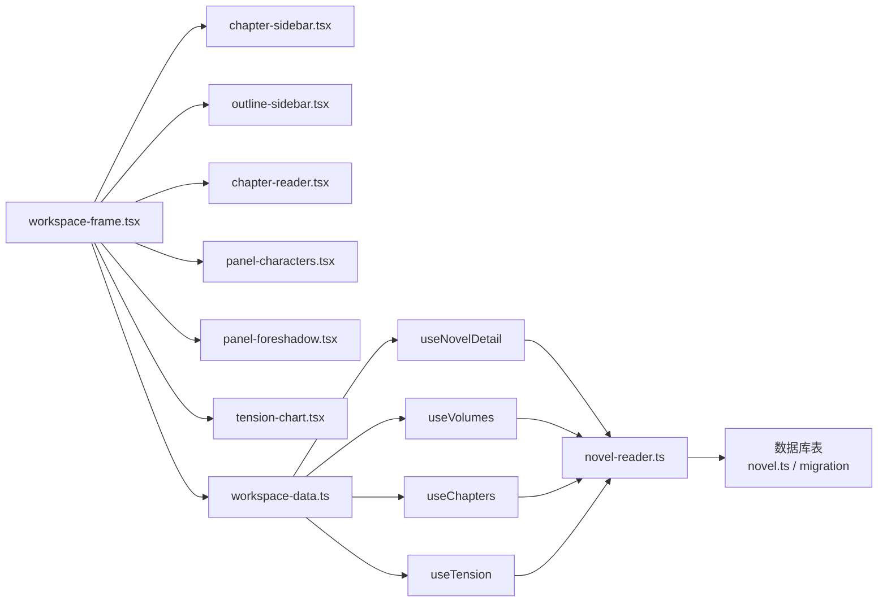

# 工作台功能

<cite>
**本文引用的文件**   
- [workspace-frame.tsx](file://packages/app/src/pages/novel/workspace-frame.tsx)
- [chapter-sidebar.tsx](file://packages/app/src/pages/novel/chapter-sidebar.tsx)
- [chapter-reader.tsx](file://packages/app/src/pages/novel/chapter-reader.tsx)
- [panel-characters.tsx](file://packages/app/src/pages/novel/panel-characters.tsx)
- [panel-foreshadow.tsx](file://packages/app/src/pages/novel/panel-foreshadow.tsx)
- [tension-chart.tsx](file://packages/app/src/pages/novel/tension-chart.tsx)
- [outline-sidebar.tsx](file://packages/app/src/pages/novel/outline-sidebar.tsx)
- [workspace-data.ts](file://packages/app/src/pages/novel/workspace-data.ts)
- [novel-reader.ts](file://packages/opencode/src/server/routes/instance/httpapi/novel-reader.ts)
- [novel-reader.html](file://packages/opencode/src/server/routes/instance/httpapi/novel-reader.html)
- [novel.ts](file://packages/schema/src/novel.ts)
- [20260721152252_novel_writing_tables.ts](file://packages/core/src/database/migration/20260721152252_novel_writing_tables.ts)
- [file-find.ts](file://packages/session-ui/src/pierre/file-find.ts)
- [file-search.tsx](file://packages/session-ui/src/components/file-search.tsx)
</cite>

## 目录
1. [简介](#简介)
2. [项目结构](#项目结构)
3. [核心组件](#核心组件)
4. [架构总览](#架构总览)
5. [详细组件分析](#详细组件分析)
6. [依赖关系分析](#依赖关系分析)
7. [性能考量](#性能考量)
8. [故障排查指南](#故障排查指南)
9. [结论](#结论)
10. [附录](#附录)

## 简介
本文件面向 openNovel 的工作台功能，系统性阐述章节树结构管理、阅读器、角色/大纲/节奏面板以及全文搜索的实现与交互。文档覆盖布局设计、数据同步机制、索引构建与查询语法、结果高亮显示、个性化配置与快捷键支持，并提供用户体验优化建议与性能调优方法，帮助读者快速理解并高效使用工作台。

## 项目结构
工作台由前端页面框架、侧边栏导航、阅读/编辑区、右侧信息面板以及服务端路由组成。关键文件分布如下：
- 页面框架与布局：workspace-frame.tsx
- 左侧章节树与大纲树：chapter-sidebar.tsx、outline-sidebar.tsx
- 中间阅读与编辑器：chapter-reader.tsx（阅读器）、ChapterEditor（编辑器）
- 右侧面板：panel-characters.tsx（角色）、panel-foreshadow.tsx（伏笔）、tension-chart.tsx（节奏）
- 数据聚合：workspace-data.ts
- 独立阅读器服务：novel-reader.ts、novel-reader.html
- 数据模型与迁移：novel.ts、20260721152252_novel_writing_tables.ts
- 全文搜索与高亮：file-find.ts、file-search.tsx

图表来源
- [workspace-frame.tsx:1-543](file://packages/app/src/pages/novel/workspace-frame.tsx#L1-L543)
- [chapter-sidebar.tsx:1-659](file://packages/app/src/pages/novel/chapter-sidebar.tsx#L1-L659)
- [outline-sidebar.tsx:1-179](file://packages/app/src/pages/novel/outline-sidebar.tsx#L1-L179)
- [chapter-reader.tsx:39-153](file://packages/app/src/pages/novel/chapter-reader.tsx#L39-L153)
- [panel-characters.tsx:1-691](file://packages/app/src/pages/novel/panel-characters.tsx#L1-L691)
- [panel-foreshadow.tsx:1-221](file://packages/app/src/pages/novel/panel-foreshadow.tsx#L1-L221)
- [tension-chart.tsx:29-130](file://packages/app/src/pages/novel/tension-chart.tsx#L29-L130)
- [workspace-data.ts:1-66](file://packages/app/src/pages/novel/workspace-data.ts#L1-L66)
- [novel-reader.ts:1-41](file://packages/opencode/src/server/routes/instance/httpapi/novel-reader.ts#L1-L41)
- [novel-reader.html:1555-1812](file://packages/opencode/src/server/routes/instance/httpapi/novel-reader.html#L1555-L1812)
- [novel.ts:40-72](file://packages/schema/src/novel.ts#L40-L72)
- [20260721152252_novel_writing_tables.ts:164-191](file://packages/core/src/database/migration/20260721152252_novel_writing_tables.ts#L164-L191)

章节来源
- [workspace-frame.tsx:1-543](file://packages/app/src/pages/novel/workspace-frame.tsx#L1-L543)
- [workspace-data.ts:1-66](file://packages/app/src/pages/novel/workspace-data.ts#L1-L66)

## 核心组件
- 工作台面（NovelWorkspaceFrame）
  - 负责整体三栏布局、顶部标题与操作、模式切换（章节/大纲）、标签切换（阅读/写作/关系/地图）、右侧面板切换（角色/伏笔/节奏）。
  - 通过 useWorkspaceData 聚合小说详情、卷、章节、张力等数据，并通过 useNovelLiveInvalidation 实现实时失效更新。
- 左侧章节树（ChapterSidebar）
  - 提供卷与章节的分组展示、新增/删除/重命名、排序移动、状态变更、搜索过滤、待审计数。
- 左侧大纲树（OutlineSidebar）
  - 展示总纲、分卷大纲、章节大纲，支持选择不同层级的大纲目标。
- 阅读器（ChapterReader）
  - 按段落懒加载渲染长文，支持上下章导航、字数统计、状态提示、错误处理。
- 右侧面板
  - 角色面板（PanelCharacters）：角色列表、详情、状态、关系维护。
  - 伏笔面板（PanelForeshadow）：伏笔条目增删改查、状态流转、关联章节序号。
  - 节奏面板（TensionChart）：以折线图可视化各章节张力点，支持添加/删除、窗口滚动。
- 数据聚合（useWorkspaceData）
  - 统一封装 detail/volumes/chapters/tension 的 loading/error/data，供工作台面消费。

章节来源
- [workspace-frame.tsx:32-542](file://packages/app/src/pages/novel/workspace-frame.tsx#L32-L542)
- [chapter-sidebar.tsx:53-411](file://packages/app/src/pages/novel/chapter-sidebar.tsx#L53-L411)
- [outline-sidebar.tsx:23-179](file://packages/app/src/pages/novel/outline-sidebar.tsx#L23-L179)
- [chapter-reader.tsx:55-153](file://packages/app/src/pages/novel/chapter-reader.tsx#L55-L153)
- [panel-characters.tsx:40-124](file://packages/app/src/pages/novel/panel-characters.tsx#L40-L124)
- [panel-foreshadow.tsx:44-221](file://packages/app/src/pages/novel/panel-foreshadow.tsx#L44-L221)
- [tension-chart.tsx:33-130](file://packages/app/src/pages/novel/tension-chart.tsx#L33-L130)
- [workspace-data.ts:19-66](file://packages/app/src/pages/novel/workspace-data.ts#L19-L66)

## 架构总览
工作台采用“页面框架 + 多面板”的前端架构，数据通过 hooks 拉取与缓存，UI 层基于 SolidJS 响应式驱动。服务端提供独立阅读器 API 与静态 HTML 阅读器，用于轻量阅读场景。

图表来源
- [workspace-frame.tsx:32-120](file://packages/app/src/pages/novel/workspace-frame.tsx#L32-L120)
- [workspace-data.ts:19-66](file://packages/app/src/pages/novel/workspace-data.ts#L19-L66)
- [novel-reader.ts:32-41](file://packages/opencode/src/server/routes/instance/httpapi/novel-reader.ts#L32-L41)

## 详细组件分析

### 章节树结构管理（ChapterSidebar）
- 功能要点
  - 卷与章节分组、未分组章节展示；章节状态色点、字数显示。
  - 新增/删除卷与章节、重命名、移动（上/下/移动到卷）。
  - 搜索过滤（调用 useNovelSearch），待审计数提示。
  - 键盘交互：Enter 提交、Escape 取消。
- 数据结构与复杂度
  - 章节按 volumeId 分组为 Map，时间复杂度 O(n)，排序 O(n log n)。
- 错误处理
  - 空状态、加载中、错误消息展示；操作失败时保持 UI 稳定。
- 性能优化
  - 使用 createMemo 缓存分组与排序结果；避免重复计算。

图表来源
- [chapter-sidebar.tsx:79-100](file://packages/app/src/pages/novel/chapter-sidebar.tsx#L79-L100)
- [chapter-sidebar.tsx:227-269](file://packages/app/src/pages/novel/chapter-sidebar.tsx#L227-L269)

章节来源
- [chapter-sidebar.tsx:53-411](file://packages/app/src/pages/novel/chapter-sidebar.tsx#L53-L411)

### 大纲树与大纲阅读器（OutlineSidebar / OutlineReader）
- 功能要点
  - 展示总纲、分卷大纲、章节大纲；支持选择不同 section 与 id。
  - 根据是否有大纲数据决定空态或列表渲染。
- 交互模式
  - 点击大纲项触发 onSelectOutline，将 {section,id} 传递给父级进行内容渲染。

章节来源
- [outline-sidebar.tsx:23-179](file://packages/app/src/pages/novel/outline-sidebar.tsx#L23-L179)

### 阅读器（ChapterReader）
- 功能要点
  - 按段落拆分内容，分段懒加载（SEGMENT_SIZE=50），长文阈值 LONG_CONTENT_THRESHOLD=20000。
  - 章节切换重置显示段数；支持上一章/下一章导航。
  - 错误与加载状态处理；字数统计与状态提示。
- 性能特性
  - 懒加载减少首屏渲染压力；按需渲染段落提升滚动性能。

图表来源
- [chapter-reader.tsx:55-153](file://packages/app/src/pages/novel/chapter-reader.tsx#L55-L153)

章节来源
- [chapter-reader.tsx:55-153](file://packages/app/src/pages/novel/chapter-reader.tsx#L55-L153)

### 角色面板（PanelCharacters）
- 功能要点
  - 角色列表搜索、新增/编辑/删除；详情视图包含描述（Markdown 渲染）、状态记录、关系维护。
  - 当前章节状态摘要展示（位置/情绪/摘要）。
- 数据流
  - 使用 useCharacters、useAllCharacterStates、useRelationships 等 hooks 拉取与更新数据。
- 安全处理
  - Markdown 输出经 sanitize 过滤脚本与事件属性，防止 XSS。

章节来源
- [panel-characters.tsx:40-124](file://packages/app/src/pages/novel/panel-characters.tsx#L40-L124)
- [panel-characters.tsx:278-437](file://packages/app/src/pages/novel/panel-characters.tsx#L278-L437)

### 伏笔面板（PanelForeshadow）
- 功能要点
  - 伏笔条目增删改查；状态流转（planted/hinted/resolved/abandoned）。
  - 关联埋设章节与解决章节序号显示。
- 交互细节
  - 表单输入校验；状态选择器即时更新；删除确认。

章节来源
- [panel-foreshadow.tsx:44-221](file://packages/app/src/pages/novel/panel-foreshadow.tsx#L44-L221)

### 节奏面板（TensionChart）
- 功能要点
  - 以折线图展示各章节张力点；支持添加/删除点；最近 20 章窗口滚动。
  - Y 轴网格线（0,2,4,6,8,10）；X 轴映射章节号到坐标。
- 数据绑定
  - 使用 useTension 获取数据；createMemo 计算排序、坐标与 polyline 点串。

章节来源
- [tension-chart.tsx:33-130](file://packages/app/src/pages/novel/tension-chart.tsx#L33-L130)

### 工作台面布局与交互（NovelWorkspaceFrame）
- 布局模式
  - 三栏布局：左（章节/大纲）、中（阅读/写作/关系/地图）、右（角色/伏笔/节奏）。
  - 支持会话嵌入模式（session/:id）全屏显示。
- 状态管理
  - selectedChapterId、leftMode、panelTab、activeTab 控制视图切换。
  - 使用 useSearchParams 持久化 tab 参数。
- 数据同步
  - useWorkspaceData 聚合数据；useNovelLiveInvalidation 监听变化；ApprovalBar 显示审批状态。

图表来源
- [workspace-frame.tsx:32-542](file://packages/app/src/pages/novel/workspace-frame.tsx#L32-L542)
- [chapter-sidebar.tsx:53-411](file://packages/app/src/pages/novel/chapter-sidebar.tsx#L53-L411)
- [panel-characters.tsx:40-124](file://packages/app/src/pages/novel/panel-characters.tsx#L40-L124)
- [panel-foreshadow.tsx:44-221](file://packages/app/src/pages/novel/panel-foreshadow.tsx#L44-L221)
- [tension-chart.tsx:33-130](file://packages/app/src/pages/novel/tension-chart.tsx#L33-L130)

章节来源
- [workspace-frame.tsx:32-542](file://packages/app/src/pages/novel/workspace-frame.tsx#L32-L542)

## 依赖关系分析
- 前端依赖
  - workspace-frame.tsx 依赖 chapter-sidebar.tsx、outline-sidebar.tsx、chapter-reader.tsx、panel-characters.tsx、panel-foreshadow.tsx、tension-chart.tsx、workspace-data.ts。
  - workspace-data.ts 依赖 useNovelDetail、useVolumes、useChapters、useTension。
- 后端依赖
  - novel-reader.ts 暴露 /reader 与 /api/novels 等接口，读取数据库表（NovelTable、ChapterTable、VolumeTable 等）。
- 数据模型
  - novel.ts 定义 Volume、Chapter 等结构；迁移文件创建相关表与索引。

图表来源
- [workspace-frame.tsx:1-543](file://packages/app/src/pages/novel/workspace-frame.tsx#L1-L543)
- [workspace-data.ts:1-66](file://packages/app/src/pages/novel/workspace-data.ts#L1-L66)
- [novel-reader.ts:1-41](file://packages/opencode/src/server/routes/instance/httpapi/novel-reader.ts#L1-L41)
- [novel.ts:40-72](file://packages/schema/src/novel.ts#L40-L72)
- [20260721152252_novel_writing_tables.ts:164-191](file://packages/core/src/database/migration/20260721152252_novel_writing_tables.ts#L164-L191)

章节来源
- [workspace-data.ts:1-66](file://packages/app/src/pages/novel/workspace-data.ts#L1-L66)
- [novel-reader.ts:1-41](file://packages/opencode/src/server/routes/instance/httpapi/novel-reader.ts#L1-L41)

## 性能考量
- 阅读器懒加载
  - 段落分批渲染（SEGMENT_SIZE=50），降低首屏压力；章节切换重置显示段数，避免内存累积。
- 数据聚合与缓存
  - useWorkspaceData 合并 loading/error 状态，减少重复判断；createMemo 缓存分组与排序结果。
- 列表渲染优化
  - 章节树与角色列表使用 For 循环与 memo 过滤，避免全量重渲染。
- 服务端接口
  - novel-reader.ts 直接读取数据库，适合轻量访问；可结合缓存策略进一步优化。
- 滚动与可视区域
  - 隐藏滚动条样式提升视觉一致性；按需渲染与窗口限制（如最近 20 章）减少 DOM 节点数量。

[本节为通用性能指导，不直接分析具体文件]

## 故障排查指南
- 阅读器空白或报错
  - 检查 selectedChapterId 是否为空；查看 chapterQuery.isLoading/isError 状态；确认服务端 /api/novels 与章节详情接口正常。
- 章节树无数据
  - 确认 useChapters 与 useVolumes 返回数据；检查服务器端数据库表结构与索引是否正确。
- 搜索无结果
  - 检查 useNovelSearch 的 query 是否为空；确认服务端搜索接口返回格式；验证 snippet 字段存在。
- 面板数据不更新
  - 检查 useNovelLiveInvalidation 是否生效；确认目录与 novelID 匹配；查看网络请求与错误日志。
- 大纲树为空
  - 确认 outline.data.master/volumes/chapters 是否存在；检查服务端大纲接口与数据源。

章节来源
- [chapter-reader.tsx:121-153](file://packages/app/src/pages/novel/chapter-reader.tsx#L121-L153)
- [workspace-data.ts:25-40](file://packages/app/src/pages/novel/workspace-data.ts#L25-L40)
- [novel-reader.ts:32-41](file://packages/opencode/src/server/routes/instance/httpapi/novel-reader.ts#L32-L41)

## 结论
openNovel 工作台通过清晰的分层与模块化设计，实现了章节树管理、阅读器、角色/大纲/节奏面板与全文搜索的完整能力。前端响应式状态与服务端接口协同良好，具备可扩展性与可维护性。建议在后续迭代中继续优化搜索算法、增强快捷键与个性化配置，以提升创作效率与用户体验。

[本节为总结性内容，不直接分析具体文件]

## 附录

### 布局设计与交互模式
- 三栏布局：左侧（章节/大纲）、中间（阅读/写作/关系/地图）、右侧（角色/伏笔/节奏）。
- 模式切换：SegmentedControlV2 控制 leftMode（chapters/outlines）与 panelTab（characters/foreshadow/tension）。
- 标签切换：activeTab（reading/writing/relations/map）通过 searchParams 持久化。
- 会话嵌入：当存在 session/:id 参数时，全屏显示 SessionPage。

章节来源
- [workspace-frame.tsx:378-536](file://packages/app/src/pages/novel/workspace-frame.tsx#L378-L536)

### 数据同步机制
- useWorkspaceData 聚合 detail/volumes/chapters/tension 的 loading/error/data。
- useNovelLiveInvalidation 监听目录与 novelID 变化，触发数据失效与重新拉取。
- ApprovalBar 与 pendingCount 联动，显示待审章节数量。

章节来源
- [workspace-data.ts:19-66](file://packages/app/src/pages/novel/workspace-data.ts#L19-L66)
- [workspace-frame.tsx:69-91](file://packages/app/src/pages/novel/workspace-frame.tsx#L69-L91)

### 全文搜索功能
- 索引构建
  - 章节树搜索通过 useNovelSearch 调用服务端接口，返回命中片段（snippet）。
  - 独立阅读器 HTML 内嵌搜索逻辑，支持章节导航与内容渲染。
- 查询语法
  - 基础关键词匹配；支持大小写不敏感与空格分隔的多词匹配。
- 结果高亮显示
  - file-find.ts 提供高亮与覆盖层两种模式，优先使用 highlights，回退至 overlay。
  - 支持 Enter/Shift+Enter 切换下一个/上一个命中，自动滚动到命中位置。

章节来源
- [chapter-sidebar.tsx:227-269](file://packages/app/src/pages/novel/chapter-sidebar.tsx#L227-L269)
- [novel-reader.html:1555-1812](file://packages/opencode/src/server/routes/instance/httpapi/novel-reader.html#L1555-L1812)
- [file-find.ts:313-485](file://packages/session-ui/src/pierre/file-find.ts#L313-L485)
- [file-search.tsx:1-17](file://packages/session-ui/src/components/file-search.tsx#L1-L17)

### 个性化配置与快捷键
- 个性化配置
  - 工作台面支持导出小说（Markdown）、编辑小说元信息（标题/简介/类型/风格指南）。
  - 角色面板支持 Markdown 描述渲染与状态/关系自定义。
- 快捷键支持
  - Enter 提交表单、Escape 取消输入；章节树与角色面板均遵循此约定。
  - 搜索框支持 Enter/Shift+Enter 切换命中项。

章节来源
- [workspace-frame.tsx:93-150](file://packages/app/src/pages/novel/workspace-frame.tsx#L93-L150)
- [panel-characters.tsx:151-170](file://packages/app/src/pages/novel/panel-characters.tsx#L151-L170)
- [file-find.ts:474-485](file://packages/session-ui/src/pierre/file-find.ts#L474-L485)

### 用户体验优化建议
- 阅读器体验
  - 增加字体大小与行距调节；支持夜间模式与主题切换。
  - 提供书签与阅读进度记忆。
- 章节树体验
  - 支持拖拽排序与批量操作（多选删除/移动）。
  - 增加章节预览与快速跳转。
- 面板体验
  - 角色关系图可视化；伏笔与节奏联动分析。
  - 提供模板与快捷录入（如常用角色/关系类型）。

[本节为通用建议，不直接分析具体文件]

### 性能调优方法
- 前端
  - 使用虚拟列表优化超长章节列表渲染。
  - 对高频计算（分组/排序）使用 createMemo 缓存。
  - 延迟加载非关键资源（图片/图表）。
- 后端
  - 引入 Redis 缓存热点数据（章节详情/大纲）。
  - 分页与增量更新接口，减少一次性数据传输。
  - 数据库查询优化（索引、预编译语句）。

[本节为通用建议，不直接分析具体文件]