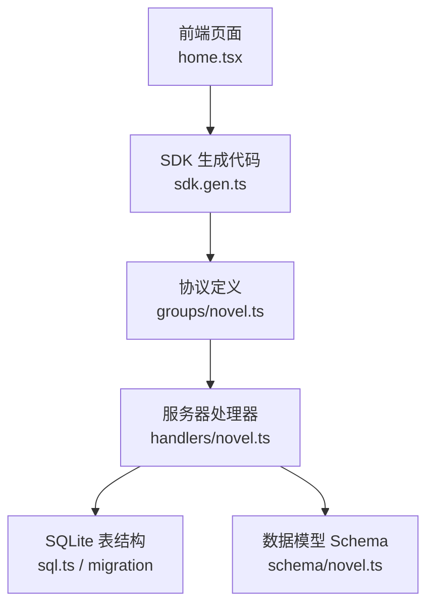
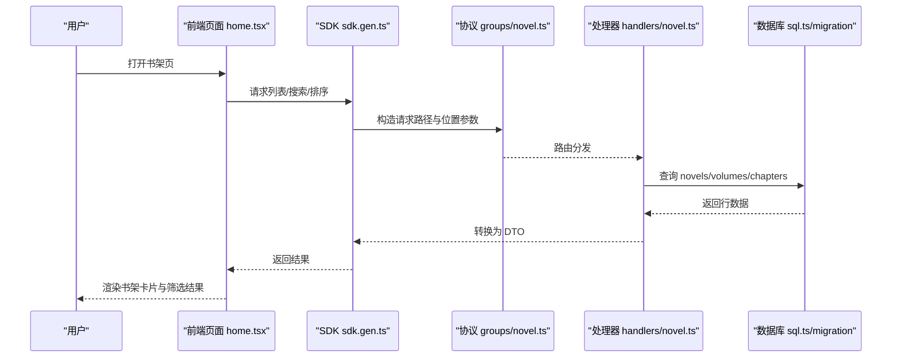
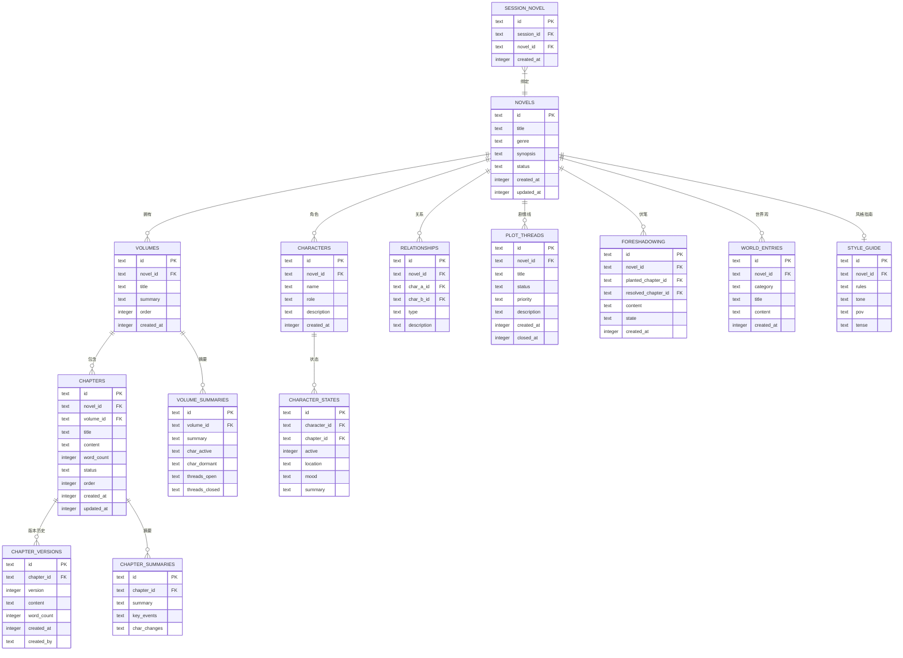
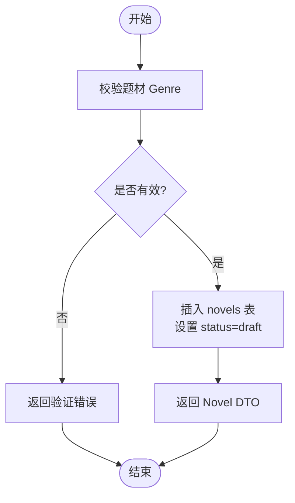
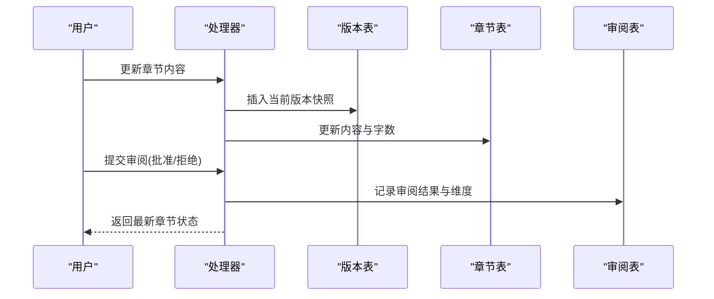
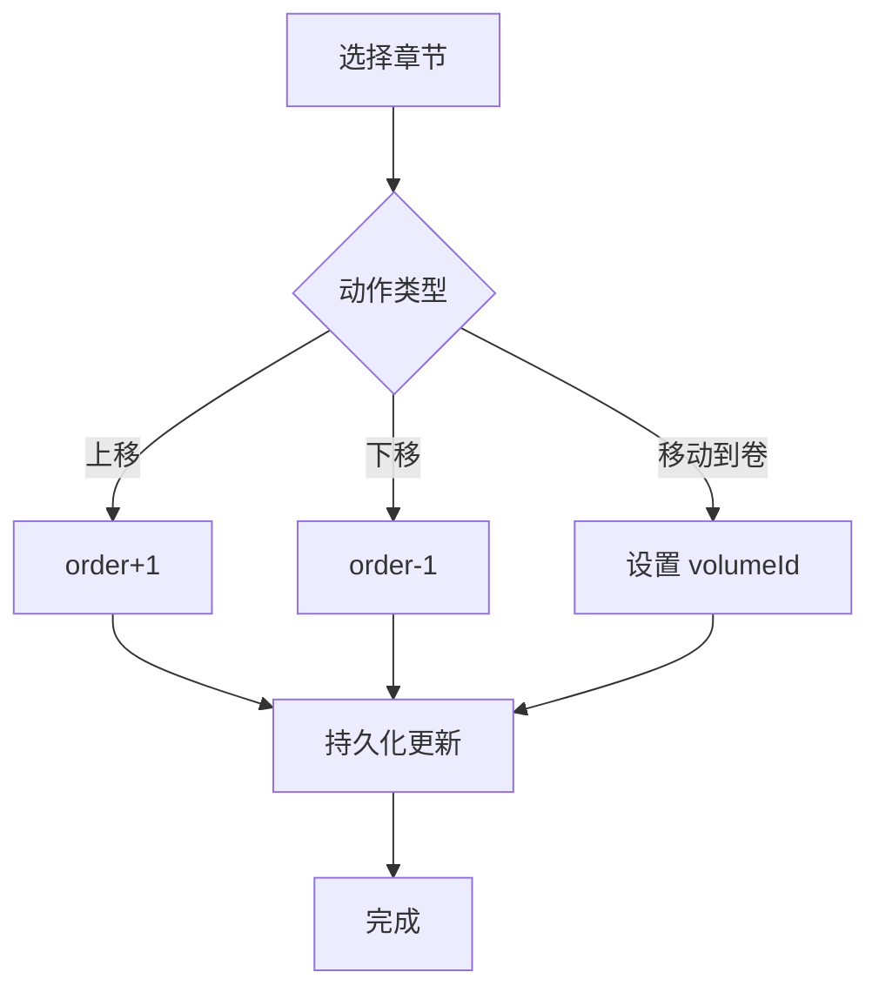
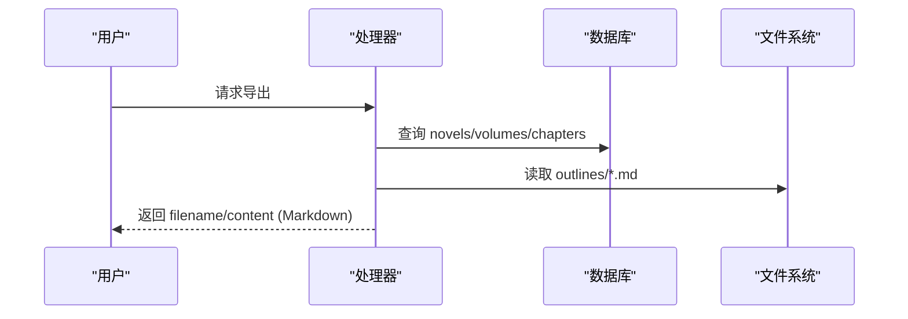
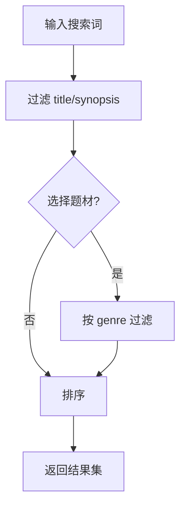
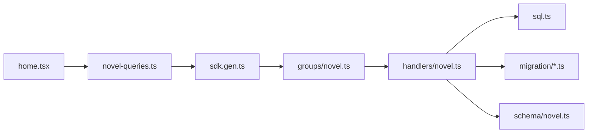

# 智能书架管理

<cite>
**本文引用的文件**   
- [packages/schema/src/novel.ts](file://packages/schema/src/novel.ts)
- [packages/core/src/database/migration/20260721152252_novel_writing_tables.ts](file://packages/core/src/database/migration/20260721152252_novel_writing_tables.ts)
- [packages/core/src/database/sql.ts](file://packages/core/src/database/sql.ts)
- [packages/server/src/handlers/novel.ts](file://packages/server/src/handlers/novel.ts)
- [packages/protocol/src/groups/novel.ts](file://packages/protocol/src/groups/novel.ts)
- [packages/app/src/pages/home.tsx](file://packages/app/src/pages/home.tsx)
- [packages/app/src/context/novel-queries.ts](file://packages/app/src/context/novel-queries.ts)
- [packages/sdks/js/src/v2/gen/sdk.gen.ts](file://packages/sdks/js/src/v2/gen/sdk.gen.ts)
</cite>

## 目录
1. [简介](#简介)
2. [项目结构](#项目结构)
3. [核心组件](#核心组件)
4. [架构总览](#架构总览)
5. [详细组件分析](#详细组件分析)
6. [依赖关系分析](#依赖关系分析)
7. [性能考量](#性能考量)
8. [故障排查指南](#故障排查指南)
9. [结论](#结论)
10. [附录](#附录)

## 简介
本文件面向 openNovel 的“智能书架管理系统”，聚焦多作品管理能力，包括：
- 作品创建、分类（类型/题材）、元数据管理（简介、状态、统计）
- 书架数据结构设计（数据库表与 Schema）
- 作品状态管理机制（草稿/发布等）
- 批量操作能力（章节移动、卷管理、版本回滚、审阅提交）
- 导入导出能力（Markdown 导出、大纲聚合）
- 搜索与过滤（标题/简介模糊匹配、按题材筛选、排序）
- 与其他模块集成（会话绑定、审阅流水线、SDK/API）

## 项目结构
书架系统由四层构成：
- 前端展示与交互层：首页书架视图、搜索/筛选/排序、删除确认、导航到作品详情
- 客户端 SDK 层：自动生成 API 调用封装，统一 location 参数传递
- 服务端处理器层：Effect 编排的业务逻辑，读写 SQLite，映射 DTO
- 数据模型与迁移层：Schema 定义 + Drizzle ORM 表结构与索引

**图表来源** 
- [packages/app/src/pages/home.tsx:1-120](file://packages/app/src/pages/home.tsx#L1-L120)
- [packages/sdks/js/src/v2/gen/sdk.gen.ts:8175-8243](file://packages/sdks/js/src/v2/gen/sdk.gen.ts#L8175-L8243)
- [packages/protocol/src/groups/novel.ts:352-392](file://packages/protocol/src/groups/novel.ts#L352-L392)
- [packages/server/src/handlers/novel.ts:340-486](file://packages/server/src/handlers/novel.ts#L340-L486)
- [packages/core/src/database/sql.ts:178-463](file://packages/core/src/database/sql.ts#L178-L463)
- [packages/schema/src/novel.ts:1-120](file://packages/schema/src/novel.ts#L1-L120)

**章节来源**
- [packages/app/src/pages/home.tsx:111-141](file://packages/app/src/pages/home.tsx#L111-L141)
- [packages/sdks/js/src/v2/gen/sdk.gen.ts:8175-8243](file://packages/sdks/js/src/v2/gen/sdk.gen.ts#L8175-L8243)
- [packages/protocol/src/groups/novel.ts:352-392](file://packages/protocol/src/groups/novel.ts#L352-L392)
- [packages/server/src/handlers/novel.ts:340-486](file://packages/server/src/handlers/novel.ts#L340-L486)
- [packages/core/src/database/sql.ts:178-463](file://packages/core/src/database/sql.ts#L178-L463)
- [packages/schema/src/novel.ts:1-120](file://packages/schema/src/novel.ts#L1-L120)

## 核心组件
- 数据模型与输入输出
  - Novel、Volume、Chapter、ChapterVersion、Character、Relationship、PlotThread、Foreshadowing、WorldEntry、StyleGuide、TensionPoint、HookRotation、OutlineNode/Bundle、ReviewDimension/ChapterReview、各类 Input/Output 结构体
- 数据库表与索引
  - novels、volumes、chapters、chapter_versions、characters、character_states、relationships、plot_threads、foreshadowing、world_entries、style_guide、session_novel、volume_summaries、chapter_summaries、novel_state_log 等，附带大量复合索引优化查询
- 服务端处理器
  - list/create/update/delete 小说、卷、章节；版本回滚；审阅提交；风格指南更新；大纲读取/更新；导出 Markdown；会话绑定
- 前端书架界面
  - 列表渲染、搜索框、题材筛选、排序、删除确认、导航到作品详情页

**章节来源**
- [packages/schema/src/novel.ts:1-441](file://packages/schema/src/novel.ts#L1-L441)
- [packages/core/src/database/sql.ts:178-463](file://packages/core/src/database/sql.ts#L178-L463)
- [packages/core/src/database/migration/20260721152252_novel_writing_tables.ts:1-223](file://packages/core/src/database/migration/20260721152252_novel_writing_tables.ts#L1-L223)
- [packages/server/src/handlers/novel.ts:340-800](file://packages/server/src/handlers/novel.ts#L340-L800)
- [packages/app/src/pages/home.tsx:111-141](file://packages/app/src/pages/home.tsx#L111-L141)

## 架构总览
书架系统采用前后端分离、协议驱动、Effect 编排的架构。前端通过 SDK 调用协议定义的 HTTP API，服务端处理器以 Effect 组合业务逻辑，访问 SQLite 并返回 DTO。Schema 保证跨层数据一致性。

**图表来源** 
- [packages/app/src/pages/home.tsx:111-141](file://packages/app/src/pages/home.tsx#L111-L141)
- [packages/sdks/js/src/v2/gen/sdk.gen.ts:8175-8243](file://packages/sdks/js/src/v2/gen/sdk.gen.ts#L8175-L8243)
- [packages/protocol/src/groups/novel.ts:352-392](file://packages/protocol/src/groups/novel.ts#L352-L392)
- [packages/server/src/handlers/novel.ts:340-486](file://packages/server/src/handlers/novel.ts#L340-L486)
- [packages/core/src/database/sql.ts:178-463](file://packages/core/src/database/sql.ts#L178-L463)

## 详细组件分析

### 书架数据模型与结构设计
- 小说主表 novels：id、title、genre、synopsis、status、created_at、updated_at，状态默认 draft
- 卷表 volumes：id、novel_id、title、summary、order、created_at，支持顺序与层级
- 章节表 chapters：id、novel_id、volume_id、title、content、word_count、status、order、时间戳
- 章节版本 chapter_versions：记录每次内容变更的版本快照
- 角色与关系：characters、character_states、relationships
- 伏笔与剧情线：foreshadowing、plot_threads
- 世界观条目：world_entries
- 风格指南：style_guide（rules/tone/pov/tense）
- 张力点：tension_points（在 schema 中定义）
- 卷摘要与章节摘要：volume_summaries、chapter_summaries（用于层级压缩与概览）
- 会话关联：session_novel（将写作会话与小说绑定）

**图表来源** 
- [packages/core/src/database/sql.ts:178-463](file://packages/core/src/database/sql.ts#L178-L463)
- [packages/core/src/database/migration/20260721152252_novel_writing_tables.ts:1-223](file://packages/core/src/database/migration/20260721152252_novel_writing_tables.ts#L1-L223)
- [packages/schema/src/novel.ts:1-260](file://packages/schema/src/novel.ts#L1-L260)

**章节来源**
- [packages/core/src/database/sql.ts:178-463](file://packages/core/src/database/sql.ts#L178-L463)
- [packages/core/src/database/migration/20260721152252_novel_writing_tables.ts:1-223](file://packages/core/src/database/migration/20260721152252_novel_writing_tables.ts#L1-L223)
- [packages/schema/src/novel.ts:1-260](file://packages/schema/src/novel.ts#L1-L260)

### 作品创建与元数据管理
- 创建作品：校验题材（Genre），写入 novels 表，设置初始状态为 draft，返回完整 DTO
- 元数据字段：title、genre、synopsis、status、时间戳
- 统计信息：章节数、卷数、角色数、字数汇总
- 风格指南：可配置 tone/pov/tense/rules，影响写作辅助与审阅

**图表来源** 
- [packages/server/src/handlers/novel.ts:347-378](file://packages/server/src/handlers/novel.ts#L347-L378)
- [packages/schema/src/novel.ts:5-17](file://packages/schema/src/novel.ts#L5-L17)

**章节来源**
- [packages/server/src/handlers/novel.ts:347-378](file://packages/server/src/handlers/novel.ts#L347-L378)
- [packages/schema/src/novel.ts:5-17](file://packages/schema/src/novel.ts#L5-L17)

### 分类与元数据维护
- 分类（题材）：限定枚举值，前端下拉选择，后端校验
- 简介与状态：支持更新 title/synopsis/genre/status
- 统计：detail 接口聚合章节/卷/角色/字数统计
- 风格指南：upsert 规则、语气、视角、时态

**章节来源**
- [packages/schema/src/novel.ts:5-38](file://packages/schema/src/novel.ts#L5-L38)
- [packages/server/src/handlers/novel.ts:398-422](file://packages/server/src/handlers/novel.ts#L398-L422)

### 进度跟踪与状态管理
- 章节状态：draft/审核中等，审阅流程支持 PASS/WARN/FAIL
- 版本历史：每次内容更新写入 chapter_versions，支持回滚到指定版本
- 审阅提交：human/deterministic/auditor 三种来源，记录维度评分与总结
- 张力点：标记关键章节的紧张度级别，辅助节奏控制

**图表来源** 
- [packages/server/src/handlers/novel.ts:572-612](file://packages/server/src/handlers/novel.ts#L572-L612)
- [packages/server/src/handlers/novel.ts:614-634](file://packages/server/src/handlers/novel.ts#L614-L634)
- [packages/schema/src/novel.ts:88-121](file://packages/schema/src/novel.ts#L88-L121)

**章节来源**
- [packages/server/src/handlers/novel.ts:572-634](file://packages/server/src/handlers/novel.ts#L572-L634)
- [packages/schema/src/novel.ts:88-121](file://packages/schema/src/novel.ts#L88-L121)

### 批量操作能力
- 章节移动：支持 up/down/to-volume，调整顺序或归属卷
- 卷管理：创建/更新/删除卷，删除后章节变为未分配
- 版本回滚：基于版本历史恢复内容并追加新快照
- 批量审阅：对章节进行 approve/reject，并记录多维评估

**图表来源** 
- [packages/schema/src/novel.ts:279-283](file://packages/schema/src/novel.ts#L279-L283)
- [packages/server/src/handlers/novel.ts:748-798](file://packages/server/src/handlers/novel.ts#L748-L798)

**章节来源**
- [packages/schema/src/novel.ts:279-283](file://packages/schema/src/novel.ts#L279-L283)
- [packages/server/src/handlers/novel.ts:748-798](file://packages/server/src/handlers/novel.ts#L748-L798)

### 导入导出功能
- 导出：将整部小说（卷与章节按序）编译为单个 Markdown 文档，包含标题、简介、卷标题与章节内容
- 大纲：读取 master/volume/chapter 的 markdown 文件，聚合为 OutlineBundle，支持更新任意部分

**图表来源** 
- [packages/server/src/handlers/novel.ts:454-486](file://packages/server/src/handlers/novel.ts#L454-L486)
- [packages/server/src/handlers/novel.ts:692-735](file://packages/server/src/handlers/novel.ts#L692-L735)
- [packages/schema/src/novel.ts:256-260](file://packages/schema/src/novel.ts#L256-L260)

**章节来源**
- [packages/server/src/handlers/novel.ts:454-486](file://packages/server/src/handlers/novel.ts#L454-L486)
- [packages/server/src/handlers/novel.ts:692-735](file://packages/server/src/handlers/novel.ts#L692-L735)
- [packages/schema/src/novel.ts:256-260](file://packages/schema/src/novel.ts#L256-L260)

### 搜索与过滤能力
- 前端实现：标题/简介模糊匹配、题材筛选、按创建时间或标题排序
- 后端扩展：可通过 like/or/inArray 构建复杂查询，结合索引提升性能

**图表来源** 
- [packages/app/src/pages/home.tsx:120-141](file://packages/app/src/pages/home.tsx#L120-L141)

**章节来源**
- [packages/app/src/pages/home.tsx:120-141](file://packages/app/src/pages/home.tsx#L120-L141)

### 与其他模块的集成方式
- 会话绑定：将 session 与 novel 关联，便于追踪写作上下文
- 审阅流水线：支持 human/deterministic/auditor 来源的审阅记录
- SDK/API：通过生成的 SDK 调用 export/outline/bind-session 等接口，统一 location 参数

**章节来源**
- [packages/server/src/handlers/novel.ts:737-746](file://packages/server/src/handlers/novel.ts#L737-L746)
- [packages/protocol/src/groups/novel.ts:352-392](file://packages/protocol/src/groups/novel.ts#L352-L392)
- [packages/sdks/js/src/v2/gen/sdk.gen.ts:8175-8243](file://packages/sdks/js/src/v2/gen/sdk.gen.ts#L8175-L8243)

## 依赖关系分析
- 前端依赖 SDK 与协议定义，确保类型一致与路径正确
- 处理器依赖 Drizzle ORM 表定义与迁移脚本，保证数据一致性
- Schema 作为契约贯穿前后端，避免字段漂移
- 索引策略优化常见查询路径（novel_id、status、order、category 等）

**图表来源** 
- [packages/app/src/pages/home.tsx:1-120](file://packages/app/src/pages/home.tsx#L1-L120)
- [packages/app/src/context/novel-queries.ts:839-880](file://packages/app/src/context/novel-queries.ts#L839-L880)
- [packages/sdks/js/src/v2/gen/sdk.gen.ts:8175-8243](file://packages/sdks/js/src/v2/gen/sdk.gen.ts#L8175-L8243)
- [packages/protocol/src/groups/novel.ts:352-392](file://packages/protocol/src/groups/novel.ts#L352-L392)
- [packages/server/src/handlers/novel.ts:340-486](file://packages/server/src/handlers/novel.ts#L340-L486)
- [packages/core/src/database/sql.ts:178-463](file://packages/core/src/database/sql.ts#L178-L463)
- [packages/core/src/database/migration/20260721152252_novel_writing_tables.ts:1-223](file://packages/core/src/database/migration/20260721152252_novel_writing_tables.ts#L1-L223)
- [packages/schema/src/novel.ts:1-120](file://packages/schema/src/novel.ts#L1-L120)

**章节来源**
- [packages/app/src/context/novel-queries.ts:839-880](file://packages/app/src/context/novel-queries.ts#L839-L880)
- [packages/sdks/js/src/v2/gen/sdk.gen.ts:8175-8243](file://packages/sdks/js/src/v2/gen/sdk.gen.ts#L8175-L8243)
- [packages/protocol/src/groups/novel.ts:352-392](file://packages/protocol/src/groups/novel.ts#L352-L392)
- [packages/server/src/handlers/novel.ts:340-486](file://packages/server/src/handlers/novel.ts#L340-L486)
- [packages/core/src/database/sql.ts:178-463](file://packages/core/src/database/sql.ts#L178-L463)
- [packages/core/src/database/migration/20260721152252_novel_writing_tables.ts:1-223](file://packages/core/src/database/migration/20260721152252_novel_writing_tables.ts#L1-L223)
- [packages/schema/src/novel.ts:1-120](file://packages/schema/src/novel.ts#L1-L120)

## 性能考量
- 索引优化：novels.status、volumes.novel_id/order、chapters.novel_id/order、foreshadowing.state/world_entries.category 等索引加速常用查询
- 分页与懒加载：前端使用资源与信号机制减少不必要渲染
- 导出与大纲：按需读取文件与聚合，避免全量扫描
- 版本历史：仅保存必要快照，控制存储增长

[本节为通用指导，不直接分析具体文件]

## 故障排查指南
- 作品不存在：检查 novelID 与目录定位是否正确，确认 novels 表存在对应记录
- 章节不存在：校验 chapterID 与 novelID 关联，查看章节表与版本表
- 题材无效：确认输入的 genre 属于枚举集合
- 导出失败：检查 outlines 目录是否存在及权限，确认章节内容非空
- 审阅失败：确认审阅来源与维度字段格式符合 Schema

**章节来源**
- [packages/server/src/handlers/novel.ts:287-310](file://packages/server/src/handlers/novel.ts#L287-L310)
- [packages/server/src/handlers/novel.ts:454-486](file://packages/server/src/handlers/novel.ts#L454-L486)
- [packages/schema/src/novel.ts:5-17](file://packages/schema/src/novel.ts#L5-L17)

## 结论
openNovel 的智能书架管理系统以清晰的层次与强一致的 Schema 为基础，提供完善的多作品管理能力。通过严谨的数据结构设计、丰富的状态管理与批处理操作、灵活的搜索过滤与导入导出能力，以及与会话和审阅流水线的深度集成，能够满足长篇创作与团队协作的需求。建议在实际使用中遵循最佳实践：合理组织卷与章节、及时更新风格指南、利用审阅流程保障质量、定期导出备份与归档。

[本节为总结性内容，不直接分析具体文件]

## 附录
- 实际使用场景
  - 新建一部玄幻小说，填写标题、题材与简介，进入草稿状态
  - 创建卷与章节，逐步填充内容，使用审阅流程推进质量
  - 通过搜索与筛选快速定位目标作品，按时间或标题排序浏览
  - 导出 Markdown 用于出版或分享，更新大纲以同步结构
  - 将写作会话与小说绑定，保持上下文连贯
- 最佳实践建议
  - 规范题材与风格指南，确保 AI 辅助一致性
  - 合理使用版本历史与审阅记录，便于回溯与协作
  - 利用索引与分页优化大数据量下的性能
  - 定期导出与备份，防止数据丢失

[本节为补充说明，不直接分析具体文件]