# 核心特性

<cite>
**本文引用的文件**   
- [README.md](file://README.md)
- [continuity-check.ts](file://packages/plugin/src/novel-writer/continuity-check.ts)
- [context.ts](file://packages/plugin/src/novel-writer/context.ts)
- [chapter-tools.ts](file://packages/plugin/src/novel-writer/chapter-tools.ts)
- [state-commit.ts](file://packages/plugin/src/novel-writer/state-commit.ts)
- [chapter-status.ts](file://packages/plugin/src/novel-writer/chapter-status.ts)
- [approval-gate.ts](file://packages/plugin/src/novel-writer/approval-gate.ts)
- [novel-queries.ts](file://packages/app/src/context/novel-queries.ts)
- [novel-approval.ts](file://packages/app/src/context/novel-approval.ts)
- [approval-bar.tsx](file://packages/app/src/pages/novel/approval-bar.tsx)
- [novel.ts（服务端处理器）](file://packages/server/src/handlers/novel.ts)
- [sdk.gen.ts（SDK 客户端）](file://packages/sdk/js/src/v2/gen/sdk.gen.ts)
</cite>

## 目录
1. [简介](#简介)
2. [项目结构](#项目结构)
3. [核心组件](#核心组件)
4. [架构总览](#架构总览)
5. [详细组件分析](#详细组件分析)
6. [依赖关系分析](#依赖关系分析)
7. [性能考量](#性能考量)
8. [故障排查指南](#故障排查指南)
9. [结论](#结论)
10. [附录](#附录)

## 简介
openNovel 是一个以 AI 驱动的长篇小说创作工作台，提供“8步写作流水线”与“37维度连续性审查”，并配套智能书架、版本控制、审批流程与全文搜索等关键能力。其目标是帮助作者系统化地规划、撰写、审校与修订长篇作品，确保角色、时间线、情节、逻辑与设定的一致性，提升创作效率与质量。

## 项目结构
- 数据层：novel-store 提供小说、章节、角色、伏笔、剧情线索、风格指南等核心表结构与访问方法。
- 协议与契约：schema + protocol 定义前后端 API 契约。
- 后端服务：opencode 提供 HTTP API 与 CLI。
- Web 前端：app 基于 SolidJS 实现书架、工作区、审批流等界面。
- 插件与流水线：plugin 包含写作工具、上下文组装、连续性审查、状态提交、审批门控等。

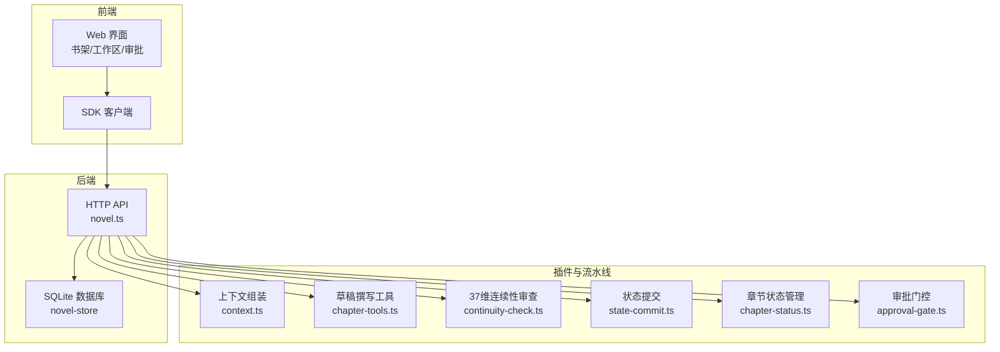

**图表来源** 
- [novel.ts（服务端处理器）](file://packages/server/src/handlers/novel.ts)
- [context.ts](file://packages/plugin/src/novel-writer/context.ts)
- [chapter-tools.ts](file://packages/plugin/src/novel-writer/chapter-tools.ts)
- [continuity-check.ts](file://packages/plugin/src/novel-writer/continuity-check.ts)
- [state-commit.ts](file://packages/plugin/src/novel-writer/state-commit.ts)
- [chapter-status.ts](file://packages/plugin/src/novel-writer/chapter-status.ts)
- [approval-gate.ts](file://packages/plugin/src/novel-writer/approval-gate.ts)

**章节来源**
- [README.md](file://README.md)

## 核心组件
- 8步写作流水线：大纲 → 上下文组装 → 草稿撰写 → 37维度连续性审查 → 修订 → 状态提取 → 提交 → 章节推进。
- 37维度连续性审查：覆盖角色、关系、时间线、地点、剧情、世界观、风格、逻辑、细节九大类，逐条给出 PASS/WARN/FAIL 及详情。
- 智能书架管理：多小说管理、题材/梗概/进度一览、向导式创建。
- 版本控制：每次修订保存历史版本，支持回滚与对比。
- 审批流程：章节进入审核队列，结构化审计结果，支持通过/驳回与评论。
- 全文搜索：按标题与内容检索章节，返回片段与定位信息。

**章节来源**
- [README.md](file://README.md)

## 架构总览
下图展示了从用户操作到数据落库的端到端调用链，以及各模块的职责边界。

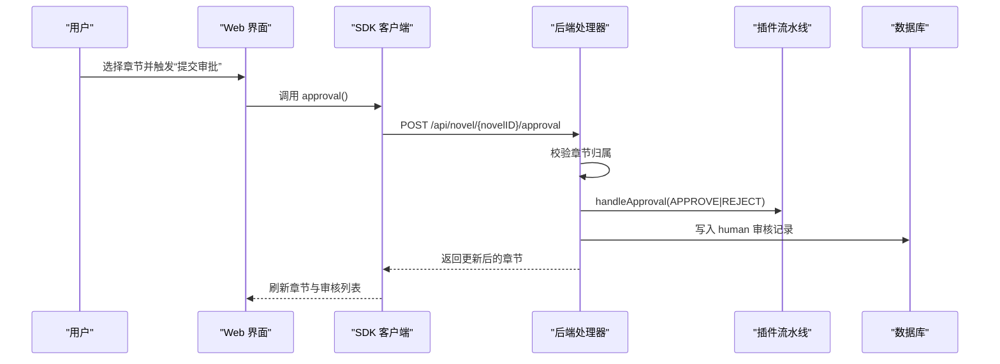

**图表来源** 
- [novel.ts（服务端处理器）](file://packages/server/src/handlers/novel.ts)
- [novel-queries.ts](file://packages/app/src/context/novel-queries.ts)
- [approval-gate.ts](file://packages/plugin/src/novel-writer/approval-gate.ts)

## 详细组件分析

### 8步写作流水线
- 步骤1 大纲：生成整体→卷→章三级大纲，明确目标、关键场景与角色出场。
- 步骤2 上下文组装：从数据库读取蓝图、活跃角色、卷摘要、最近3章摘要、线索与伏笔、风格指南与题材规则，输出 ContextPacket，保证 token 预算内。
- 步骤3 草稿撰写：使用 chapterWrite 工具写入章节正文，强制字数区间（如 2000–3000 字），状态置为 draft。
- 步骤4 37维度连续性审查：对当前章节进行全维度一致性检查，产出 overall 与各维度结果。
- 步骤5 修订：使用 chapterRevise 工具保存旧版本至 chapter_versions，再更新新内容。
- 步骤6 状态提取：commitState 将 delta 写入 append-only 日志，同步物化视图，并追加 Markdown 记录。
- 步骤7 提交：根据审查结果或人工决策，进入审批流程。
- 步骤8 章节推进：通过 updateChapterStatus 推进状态（planned→drafting→audited→revised→final）。

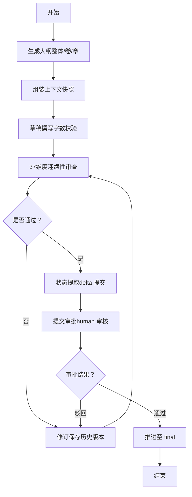

**图表来源** 
- [context.ts](file://packages/plugin/src/novel-writer/context.ts)
- [chapter-tools.ts](file://packages/plugin/src/novel-writer/chapter-tools.ts)
- [continuity-check.ts](file://packages/plugin/src/novel-writer/continuity-check.ts)
- [state-commit.ts](file://packages/plugin/src/novel-writer/state-commit.ts)
- [chapter-status.ts](file://packages/plugin/src/novel-writer/chapter-status.ts)
- [approval-gate.ts](file://packages/plugin/src/novel-writer/approval-gate.ts)

**章节来源**
- [context.ts](file://packages/plugin/src/novel-writer/context.ts)
- [chapter-tools.ts](file://packages/plugin/src/novel-writer/chapter-tools.ts)
- [continuity-check.ts](file://packages/plugin/src/novel-writer/continuity-check.ts)
- [state-commit.ts](file://packages/plugin/src/novel-writer/state-commit.ts)
- [chapter-status.ts](file://packages/plugin/src/novel-writer/chapter-status.ts)

### 37维度连续性审查系统
- 维度分类与数量：
  - 角色连续性（5维）：姓名一致性、外貌描述、性格一致、能力等级、位置连续
  - 关系连续性（4维）：关系类型一致、敌友转变有因、亲密度变化、信任度变化
  - 时间线（4维）：事件顺序、时间流逝合理、季节一致、年龄变化
  - 地点（4维）：地点描述一致、距离合理、环境细节、地图一致
  - 剧情（5维）：主线推进、伏笔回收、冲突升级、转折合理、结局呼应
  - 世界观（5维）：力量体系、规则一致、社会结构、文化细节、经济系统
  - 风格（4维）：叙事视角、语言风格、节奏一致、描写密度
  - 逻辑（3维）：因果链、动机合理、信息对称
  - 细节（3维）：物品追踪、数字一致、称呼一致
- 判定规则：任一 FAIL 则 overall=FAIL；无 FAIL 但有 WARN 则 overall=WARN；否则 PASS。
- 数据来源：角色表、角色状态、关系表、剧情线索、伏笔、章节摘要、世界观条目、风格指南等。
- 输出：overall 与各维度检查结果（status/detail）。

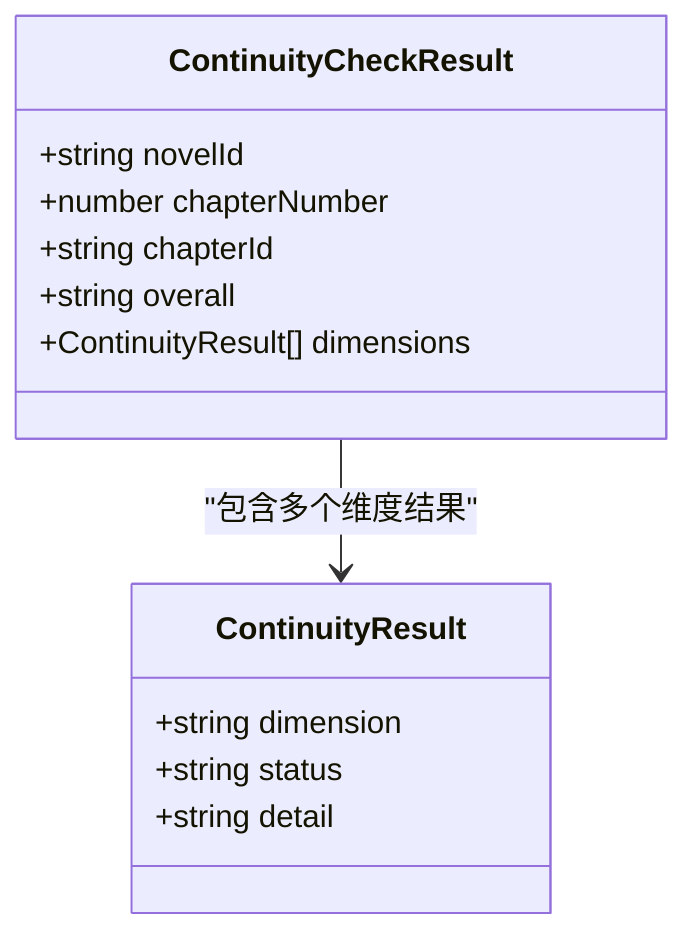

**图表来源** 
- [continuity-check.ts](file://packages/plugin/src/novel-writer/continuity-check.ts)

**章节来源**
- [continuity-check.ts](file://packages/plugin/src/novel-writer/continuity-check.ts)

### 上下文组装（Context Packet）
- 层级压缩策略：
  - P0 蓝图：小说名、题材、梗概
  - P1 活跃角色：过滤 dormant 角色，取最新状态
  - P2 卷摘要+最近3章摘要：控制上下文规模
  - P3 线索+伏笔：保持剧情连贯
  - P4 风格指南+题材规则：约束写作风格
- 附加信息：上一章结尾原文（防止重复）、目标字数下限（来自风格指南 rules.chapter_length）。

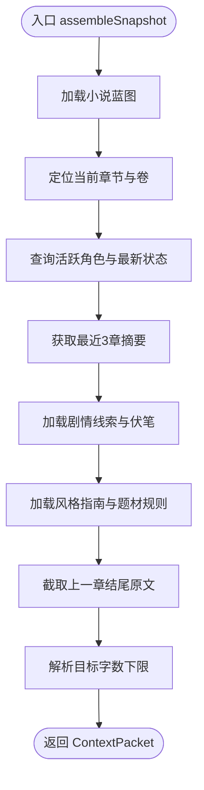

**图表来源** 
- [context.ts](file://packages/plugin/src/novel-writer/context.ts)

**章节来源**
- [context.ts](file://packages/plugin/src/novel-writer/context.ts)

### 草稿撰写与修订（版本控制）
- 草稿撰写：chapterWrite 校验字数区间后写入 chapters 表，状态置为 draft。
- 修订：chapterRevise 先保存旧版本至 chapter_versions（版本号递增），再更新新内容，形成可回溯的版本链。

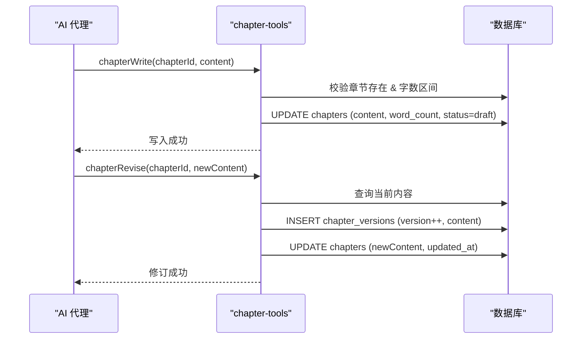

**图表来源** 
- [chapter-tools.ts](file://packages/plugin/src/novel-writer/chapter-tools.ts)

**章节来源**
- [chapter-tools.ts](file://packages/plugin/src/novel-writer/chapter-tools.ts)

### 状态提取与提交（增量审计与级联任务）
- commitState：
  - 将 delta 写入 append-only 日志（novel_state_log）
  - 清理本章快照（character_states、chapter_summaries、tension_logs）以保证幂等替换
  - 应用至物化视图（characters、relationships、plot_threads、foreshadowing、world_entries、style_guide、tension_log）
  - 同步 Markdown 记录（.novel/state-log.md）
  - 触发级联统改任务（仅 update 操作）
- 实体去重：按业务键（名称、标题、内容、分类+标题等）避免重复创建。

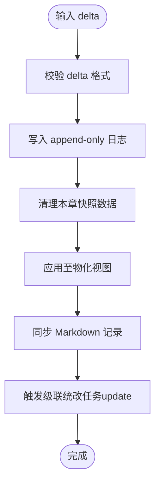

**图表来源** 
- [state-commit.ts](file://packages/plugin/src/novel-writer/state-commit.ts)

**章节来源**
- [state-commit.ts](file://packages/plugin/src/novel-writer/state-commit.ts)

### 审批流程（人类审核）
- 前端：
  - useSubmitApproval 发起审批请求（approve/reject + comment）
  - useChapterApprovalState 映射章节状态到审批态（none/pending/settled/unknown）
  - ApprovalBar 展示审核轮次、证据、人类注释，支持跳转查看会话
- 后端：
  - submitApproval 校验章节归属，调用 handleApproval，持久化 human 审核记录
- 状态流转：
  - planned/draft/outline/failed → none
  - drafting/audited/revised/pending_review → pending
  - final/rejected/published → settled

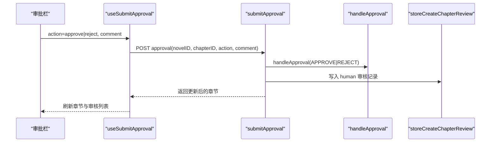

**图表来源** 
- [novel-queries.ts](file://packages/app/src/context/novel-queries.ts)
- [novel-approval.ts](file://packages/app/src/context/novel-approval.ts)
- [approval-bar.tsx](file://packages/app/src/pages/novel/approval-bar.tsx)
- [novel.ts（服务端处理器）](file://packages/server/src/handlers/novel.ts)
- [approval-gate.ts](file://packages/plugin/src/novel-writer/approval-gate.ts)

**章节来源**
- [novel-queries.ts](file://packages/app/src/context/novel-queries.ts)
- [novel-approval.ts](file://packages/app/src/context/novel-approval.ts)
- [approval-bar.tsx](file://packages/app/src/pages/novel/approval-bar.tsx)
- [novel.ts（服务端处理器）](file://packages/server/src/handlers/novel.ts)
- [approval-gate.ts](file://packages/plugin/src/novel-writer/approval-gate.ts)

### 全文搜索
- 客户端：SDK search(novelID, q) 调用 /api/novel/{novelID}/search
- 服务端：searchNovel 使用 LIKE 匹配标题与内容，返回章节 ID、标题、序号、卷 ID 与片段（snippet）

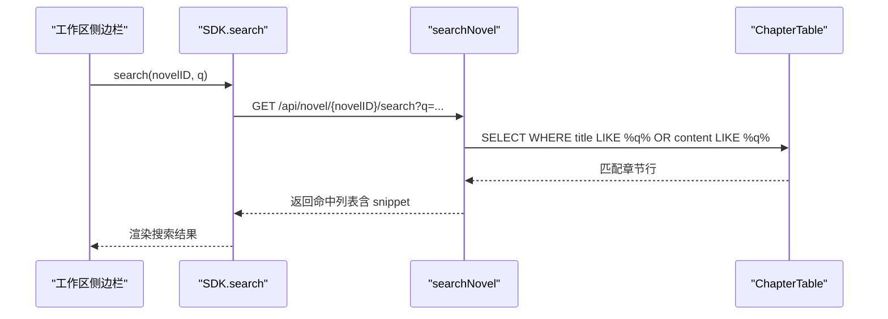

**图表来源** 
- [sdk.gen.ts（SDK 客户端）](file://packages/sdk/js/src/v2/gen/sdk.gen.ts)
- [novel.ts（服务端处理器）](file://packages/server/src/handlers/novel.ts)

**章节来源**
- [sdk.gen.ts（SDK 客户端）](file://packages/sdk/js/src/v2/gen/sdk.gen.ts)
- [novel.ts（服务端处理器）](file://packages/server/src/handlers/novel.ts)

### 章节状态推进
- 合法转换路径：planned → drafting → audited → revised → final
- 工具函数：canTransitionTo 验证转换合法性，updateChapterStatus 执行更新

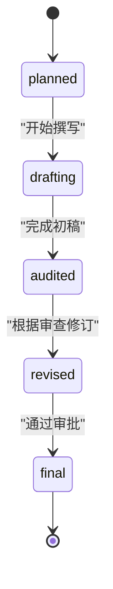

**图表来源** 
- [chapter-status.ts](file://packages/plugin/src/novel-writer/chapter-status.ts)

**章节来源**
- [chapter-status.ts](file://packages/plugin/src/novel-writer/chapter-status.ts)

## 依赖关系分析
- 前端依赖 SDK，SDK 依赖后端 API。
- 后端处理器依赖插件流水线（上下文、草稿、审查、提交、状态、审批）。
- 插件流水线依赖 novel-store 的数据表与访问方法。
- 审批流程贯穿前端、后端与插件，形成闭环。

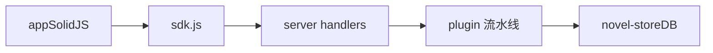

**图表来源** 
- [novel.ts（服务端处理器）](file://packages/server/src/handlers/novel.ts)
- [sdk.gen.ts（SDK 客户端）](file://packages/sdk/js/src/v2/gen/sdk.gen.ts)
- [context.ts](file://packages/plugin/src/novel-writer/context.ts)
- [chapter-tools.ts](file://packages/plugin/src/novel-writer/chapter-tools.ts)
- [continuity-check.ts](file://packages/plugin/src/novel-writer/continuity-check.ts)
- [state-commit.ts](file://packages/plugin/src/novel-writer/state-commit.ts)
- [chapter-status.ts](file://packages/plugin/src/novel-writer/chapter-status.ts)
- [approval-gate.ts](file://packages/plugin/src/novel-writer/approval-gate.ts)

**章节来源**
- [novel.ts（服务端处理器）](file://packages/server/src/handlers/novel.ts)
- [sdk.gen.ts（SDK 客户端）](file://packages/sdk/js/src/v2/gen/sdk.gen.ts)

## 性能考量
- 上下文组装采用层级压缩（P0–P4），在 ch100 时控制在约 8K tokens，降低 LLM 调用成本。
- 连续性审查并行查询多张表，减少 IO 等待。
- 提交阶段清理本章快照，保证幂等替换，避免数据膨胀。
- 全文搜索使用 LIKE 模式匹配，适合中小规模文本；若数据量增长，可考虑引入倒排索引或全文检索引擎。

[本节为通用指导，不直接分析具体文件]

## 故障排查指南
- 章节不存在或归属错误：后端会返回 ChapterNotFoundError，需核对 novelID 与 chapterID。
- 状态转换非法：updateChapterStatus 抛出异常，检查当前状态与目标状态是否在 ALLOWED_TRANSITIONS 中。
- 审批失败：确认 handleApproval 与 storeCreateChapterReview 的执行结果，检查 human 审核记录是否写入。
- 搜索无结果：确认关键词与章节标题/内容匹配，必要时放宽搜索条件或检查数据完整性。

**章节来源**
- [novel.ts（服务端处理器）](file://packages/server/src/handlers/novel.ts)
- [chapter-status.ts](file://packages/plugin/src/novel-writer/chapter-status.ts)
- [approval-gate.ts](file://packages/plugin/src/novel-writer/approval-gate.ts)

## 结论
openNovel 通过“8步写作流水线”与“37维度连续性审查”构建了严谨的创作闭环，辅以智能书架、版本控制、审批流程与全文搜索，显著提升长篇创作的效率与质量。建议在大型项目中结合全文检索优化与缓存策略，进一步提升用户体验与系统性能。

[本节为总结性内容，不直接分析具体文件]

## 附录
- 快速启动：安装依赖后运行 dev:all，打开本地端口访问 Web 界面，添加项目文件夹并创建第一部小说。
- 多语言：UI 支持英文、简体中文、繁体中文。

**章节来源**
- [README.md](file://README.md)