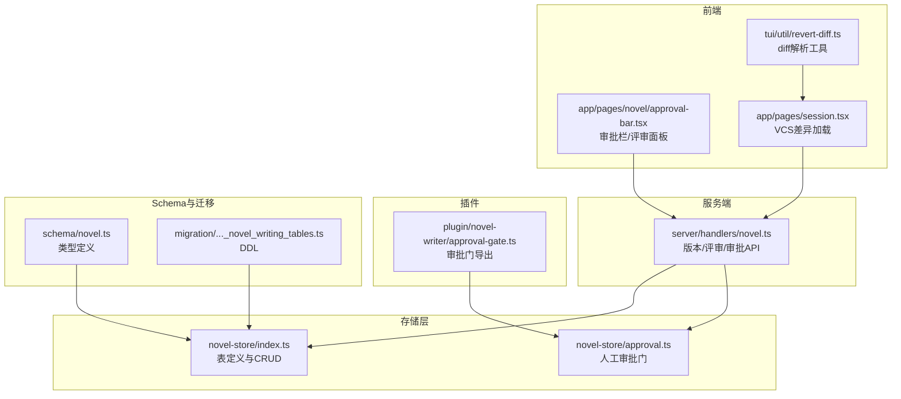
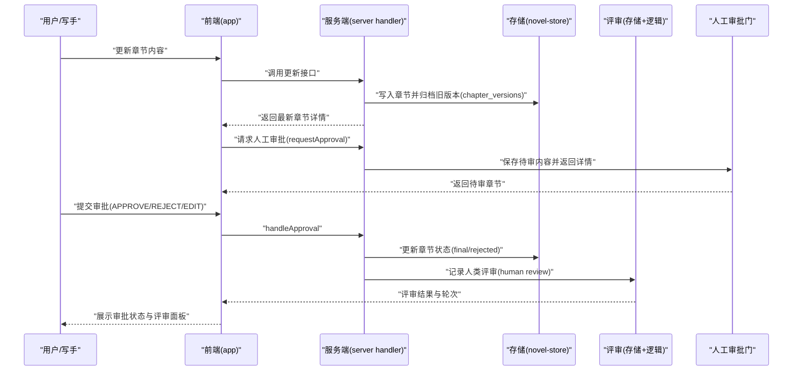
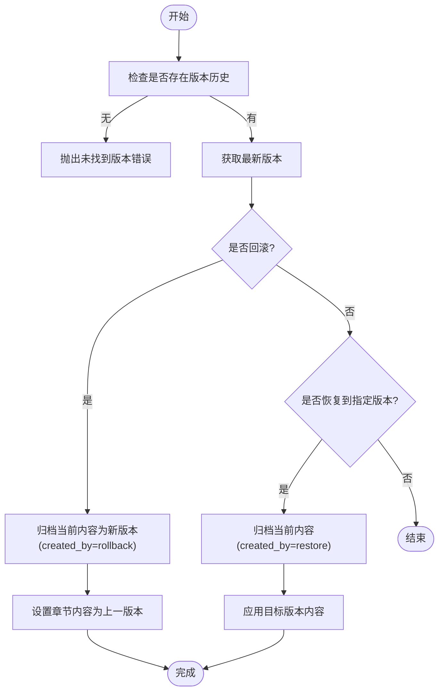
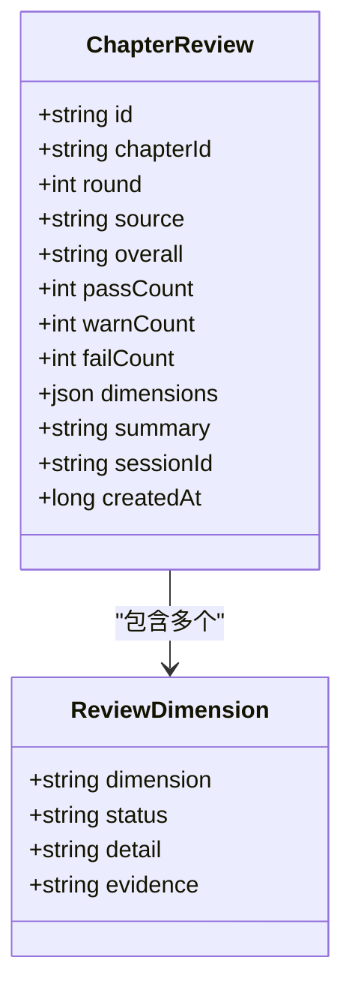
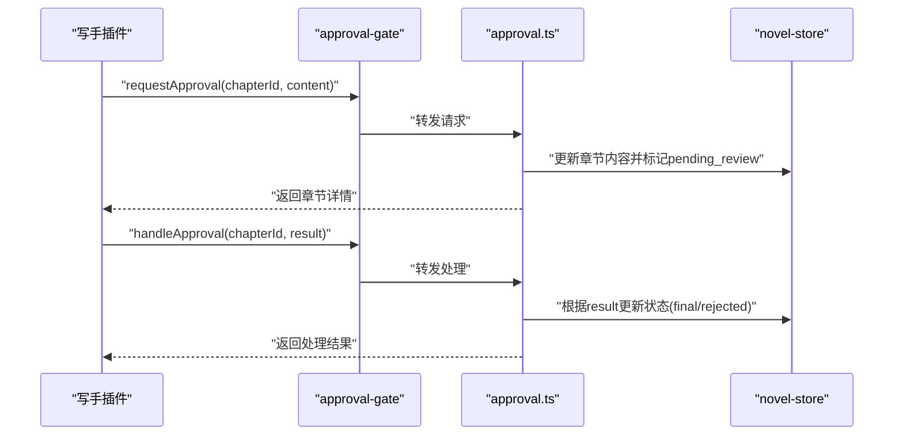
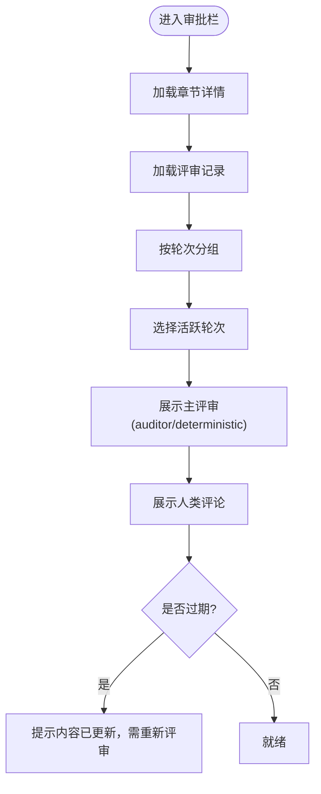
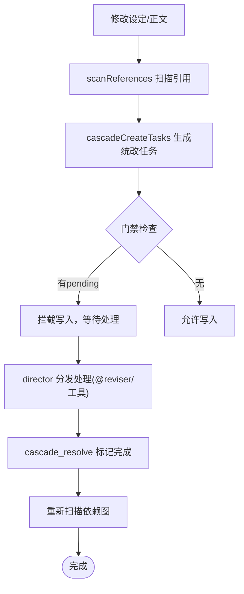
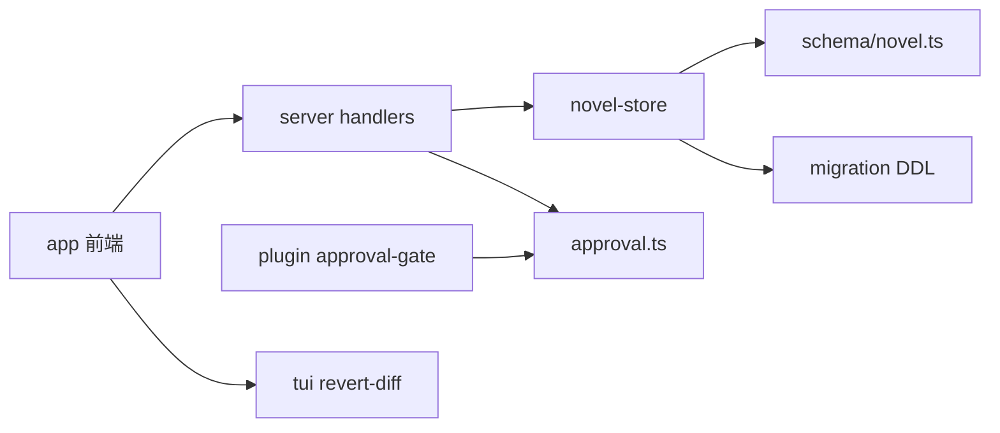

# 版本控制与审批流程

<cite>
**本文引用的文件**   
- [packages/novel-store/src/index.ts](file://packages/novel-store/src/index.ts)
- [packages/novel-store/src/approval.ts](file://packages/novel-store/src/approval.ts)
- [packages/plugin/src/novel-writer/approval-gate.ts](file://packages/plugin/src/novel-writer/approval-gate.ts)
- [packages/server/src/handlers/novel.ts](file://packages/server/src/handlers/novel.ts)
- [packages/schema/src/novel.ts](file://packages/schema/src/novel.ts)
- [packages/core/src/database/migration/20260721152252_novel_writing_tables.ts](file://packages/core/src/database/migration/20260721152252_novel_writing_tables.ts)
- [packages/tui/src/util/revert-diff.ts](file://packages/tui/src/util/revert-diff.ts)
- [packages/app/src/pages/session.tsx](file://packages/app/src/pages/session.tsx)
- [packages/app/src/pages/novel/approval-bar.tsx](file://packages/app/src/pages/novel/approval-bar.tsx)
- [packages/app/src/context/novel-queries.ts](file://packages/app/src/context/novel-queries.ts)
- [packages/plugin/test/novel-writer/review.test.ts](file://packages/plugin/test/novel-writer/review.test.ts)
- [packages/server/test/novel.test.ts](file://packages/server/test/novel.test.ts)
- [docs/cascade-consistency-design.md](file://docs/cascade-consistency-design.md)
</cite>

## 目录
1. [简介](#简介)
2. [项目结构](#项目结构)
3. [核心组件](#核心组件)
4. [架构总览](#架构总览)
5. [详细组件分析](#详细组件分析)
6. [依赖关系分析](#依赖关系分析)
7. [性能考虑](#性能考虑)
8. [故障排查指南](#故障排查指南)
9. [结论](#结论)
10. [附录](#附录)

## 简介
本文件系统性阐述 openNovel 的版本控制与审批流程，覆盖章节版本历史、差异对比、回滚与恢复、版本标签（轮次）、结构化审核队列、评论反馈、审批决策机制、冲突解决策略、协作编辑支持与审计日志记录，并提供审批流程的自定义配置与扩展方法。目标是让非技术读者也能理解整体设计，同时为开发者提供可落地的实现参考。

## 项目结构
openNovel 在“存储层—服务端处理器—前端界面”三层中分别承担数据模型与持久化、业务编排与 API 暴露、交互与展示职责：
- 存储层（novel-store）：定义表结构与基础 CRUD，维护章节版本、评审记录、状态日志等。
- 服务端（server handlers）：封装版本操作（更新、回滚、恢复）、评审与审批入口、DTO 映射。
- 前端（app/TUI）：提供差异对比、评审面板、审批栏、回滚触发与缓存失效。
- 插件层（plugin）：将人工审批门暴露给写手工作流。
- Schema 与迁移：统一类型定义与数据库初始化。

图表来源 
- [packages/novel-store/src/index.ts](file://packages/novel-store/src/index.ts)
- [packages/novel-store/src/approval.ts](file://packages/novel-store/src/approval.ts)
- [packages/server/src/handlers/novel.ts](file://packages/server/src/handlers/novel.ts)
- [packages/app/src/pages/novel/approval-bar.tsx](file://packages/app/src/pages/novel/approval-bar.tsx)
- [packages/app/src/pages/session.tsx](file://packages/app/src/pages/session.tsx)
- [packages/tui/src/util/revert-diff.ts](file://packages/tui/src/util/revert-diff.ts)
- [packages/plugin/src/novel-writer/approval-gate.ts](file://packages/plugin/src/novel-writer/approval-gate.ts)
- [packages/schema/src/novel.ts](file://packages/schema/src/novel.ts)
- [packages/core/src/database/migration/20260721152252_novel_writing_tables.ts](file://packages/core/src/database/migration/20260721152252_novel_writing_tables.ts)

章节来源
- [packages/novel-store/src/index.ts](file://packages/novel-store/src/index.ts)
- [packages/server/src/handlers/novel.ts](file://packages/server/src/handlers/novel.ts)
- [packages/app/src/pages/novel/approval-bar.tsx](file://packages/app/src/pages/novel/approval-bar.tsx)
- [packages/app/src/pages/session.tsx](file://packages/app/src/pages/session.tsx)
- [packages/tui/src/util/revert-diff.ts](file://packages/tui/src/util/revert-diff.ts)
- [packages/plugin/src/novel-writer/approval-gate.ts](file://packages/plugin/src/novel-writer/approval-gate.ts)
- [packages/schema/src/novel.ts](file://packages/schema/src/novel.ts)
- [packages/core/src/database/migration/20260721152252_novel_writing_tables.ts](file://packages/core/src/database/migration/20260721152252_novel_writing_tables.ts)

## 核心组件
- 章节版本历史
  - 通过 chapter_versions 表记录每次内容变更快照，包含版本号、内容、字数、创建时间与创建者。
  - 支持列表查询、按版本恢复、自动归档旧版本。
- 结构化评审与轮次
  - chapter_reviews 表记录每轮评审结果（PASS/WARN/FAIL）、维度明细、摘要、来源（deterministic/auditor/human）。
  - 内容未变更时多次评审合并到同一轮；内容变更后开启新轮次。
- 人工审批门
  - requestApproval 保存写手提交内容并标记 pending_review；handleApproval 根据 APPROVE/REJECT/EDIT 路由到不同分支。
- 差异对比与回滚
  - 服务端提供 rollbackChapter 与 restoreChapterVersion；前端 TUI 提供 diff 解析能力；会话页支持按需加载差异。
- 级联一致性与冲突处理
  - entity_refs + pending_updates 构成影响范围识别与统改任务；cascade 流程保证修改设定后受影响内容先被处理。
- 审计日志
  - novel_state_log 记录事实事件，支撑审计与矛盾检测。

章节来源
- [packages/novel-store/src/index.ts](file://packages/novel-store/src/index.ts)
- [packages/server/src/handlers/novel.ts](file://packages/server/src/handlers/novel.ts)
- [packages/plugin/test/novel-writer/review.test.ts](file://packages/plugin/test/novel-writer/review.test.ts)
- [packages/server/test/novel.test.ts](file://packages/server/test/novel.test.ts)
- [docs/cascade-consistency-design.md](file://docs/cascade-consistency-design.md)

## 架构总览
版本控制与审批流程的关键调用链如下：
- 写手生成/修订章节 → 存储层持久化 → 服务端处理器归档版本 → 可选进入人工审批门 → 评审系统记录轮次与维度 → 前端展示差异与审批状态 → 用户执行回滚/恢复。

图表来源 
- [packages/server/src/handlers/novel.ts](file://packages/server/src/handlers/novel.ts)
- [packages/novel-store/src/index.ts](file://packages/novel-store/src/index.ts)
- [packages/novel-store/src/approval.ts](file://packages/novel-store/src/approval.ts)
- [packages/app/src/pages/novel/approval-bar.tsx](file://packages/app/src/pages/novel/approval-bar.tsx)

## 详细组件分析

### 章节版本历史与差异对比
- 版本归档与列表
  - 更新章节内容时，服务端会先归档当前内容为新版本，再写入新内容；支持按章节列出所有版本。
- 差异对比
  - TUI 提供 diff 解析工具，用于统计新增/删除行数与文件清单；会话页支持按模式与上下文拉取差异。
- 回滚与恢复
  - rollbackChapter：以最新版本为基准，回退到上一个版本并归档一次“rollback”动作。
  - restoreChapterVersion：恢复到指定版本，并将当前内容归档为新版本，随后设置目标版本内容。

图表来源 
- [packages/server/src/handlers/novel.ts](file://packages/server/src/handlers/novel.ts)
- [packages/tui/src/util/revert-diff.ts](file://packages/tui/src/util/revert-diff.ts)
- [packages/app/src/pages/session.tsx](file://packages/app/src/pages/session.tsx)

章节来源
- [packages/server/src/handlers/novel.ts](file://packages/server/src/handlers/novel.ts)
- [packages/tui/src/util/revert-diff.ts](file://packages/tui/src/util/revert-diff.ts)
- [packages/app/src/pages/session.tsx](file://packages/app/src/pages/session.tsx)
- [packages/server/test/novel.test.ts](file://packages/server/test/novel.test.ts)

### 结构化评审与轮次管理
- 评审数据结构
  - 每轮评审包含 overall(PASS/WARN/FAIL)、dimensions(多维评估)、summary(摘要)、source(来源)。
- 轮次规则
  - 首次评审 round=1；内容未变更时再次评审并入同一轮；内容变更后开启新轮次。
- 人类评审
  - 人工审批（如 reject）会记录 human 来源的评审条目，并携带摘要作为反馈。

图表来源 
- [packages/schema/src/novel.ts](file://packages/schema/src/novel.ts)
- [packages/novel-store/src/index.ts](file://packages/novel-store/src/index.ts)

章节来源
- [packages/plugin/test/novel-writer/review.test.ts](file://packages/plugin/test/novel-writer/review.test.ts)
- [packages/server/test/novel.test.ts](file://packages/server/test/novel.test.ts)
- [packages/schema/src/novel.ts](file://packages/schema/src/novel.ts)
- [packages/novel-store/src/index.ts](file://packages/novel-store/src/index.ts)

### 人工审批门与审批决策
- 请求审批
  - requestApproval 将写手提交的内容写入章节并标记 pending_review，返回章节详情供审核。
- 处理审批
  - handleApproval 根据结果路由：
    - APPROVE：章节状态设为 final。
    - REJECT：章节状态设为 rejected，并返回原因。
    - EDIT：返回当前内容以便人工编辑。
- 插件集成
  - approval-gate 将审批门函数与类型重新导出，便于写手插件调用。

图表来源 
- [packages/plugin/src/novel-writer/approval-gate.ts](file://packages/plugin/src/novel-writer/approval-gate.ts)
- [packages/novel-store/src/approval.ts](file://packages/novel-store/src/approval.ts)
- [packages/novel-store/src/index.ts](file://packages/novel-store/src/index.ts)

章节来源
- [packages/novel-store/src/approval.ts](file://packages/novel-store/src/approval.ts)
- [packages/plugin/src/novel-writer/approval-gate.ts](file://packages/plugin/src/novel-writer/approval-gate.ts)

### 前端审批栏与评审面板
- 审批栏
  - 显示章节状态标签、展开/收起评审详情、提交评论确认等。
- 评审面板
  - 按轮次聚合评审记录，优先展示 auditor/deterministic 主评审，human 评论单独列出；支持 stale 检测（章节更新时间晚于评审时间）。

图表来源 
- [packages/app/src/pages/novel/approval-bar.tsx](file://packages/app/src/pages/novel/approval-bar.tsx)

章节来源
- [packages/app/src/pages/novel/approval-bar.tsx](file://packages/app/src/pages/novel/approval-bar.tsx)

### 级联一致性、冲突解决与协作编辑
- 影响范围识别
  - entity_refs 表记录实体间引用关系，写入或更新后自动扫描建立。
- 统改任务
  - pending_updates 表承载统改任务，包含触发信息、旧值/新值、优先级与状态。
- 门禁机制
  - 写/修订前检查 pending_updates，若存在未完成任务则拦截写入，确保设定变更先被处理。
- 协作编辑
  - 多 Agent/用户并发编辑通过 VCS 差异与权限校验协同；edit 工具支持精确编辑与外部目录审批。

图表来源 
- [docs/cascade-consistency-design.md](file://docs/cascade-consistency-design.md)
- [packages/core/src/tool/edit.ts](file://packages/core/src/tool/edit.ts)

章节来源
- [docs/cascade-consistency-design.md](file://docs/cascade-consistency-design.md)
- [packages/core/src/tool/edit.ts](file://packages/core/src/tool/edit.ts)

### 审计日志与矛盾检测
- 审计日志
  - novel_state_log 记录事实事件（fact_type/fact_data），支撑审计与回溯。
- 矛盾检测
  - 测试用例展示了大规模数据下对地点矛盾、高优先级线索关闭等矛盾的捕获。

章节来源
- [packages/novel-store/src/index.ts](file://packages/novel-store/src/index.ts)
- [packages/plugin/test/novel-writer/scale.test.ts](file://packages/plugin/test/novel-writer/scale.test.ts)

## 依赖关系分析
- 模块耦合
  - server handlers 依赖 novel-store 的表与函数；approval-gate 重导出 approval 模块；前端通过 SDK/客户端调用服务端 API。
- 外部依赖
  - Drizzle ORM 用于表定义与查询；Effect 用于异步编排；diff 库用于差异解析。
- 潜在循环
  - 当前分层清晰，未见直接循环依赖；前端与服务端通过 API 解耦。

图表来源 
- [packages/server/src/handlers/novel.ts](file://packages/server/src/handlers/novel.ts)
- [packages/novel-store/src/index.ts](file://packages/novel-store/src/index.ts)
- [packages/novel-store/src/approval.ts](file://packages/novel-store/src/approval.ts)
- [packages/plugin/src/novel-writer/approval-gate.ts](file://packages/plugin/src/novel-writer/approval-gate.ts)
- [packages/schema/src/novel.ts](file://packages/schema/src/novel.ts)
- [packages/core/src/database/migration/20260721152252_novel_writing_tables.ts](file://packages/core/src/database/migration/20260721152252_novel_writing_tables.ts)
- [packages/tui/src/util/revert-diff.ts](file://packages/tui/src/util/revert-diff.ts)

章节来源
- [packages/server/src/handlers/novel.ts](file://packages/server/src/handlers/novel.ts)
- [packages/novel-store/src/index.ts](file://packages/novel-store/src/index.ts)
- [packages/novel-store/src/approval.ts](file://packages/novel-store/src/approval.ts)
- [packages/plugin/src/novel-writer/approval-gate.ts](file://packages/plugin/src/novel-writer/approval-gate.ts)
- [packages/schema/src/novel.ts](file://packages/schema/src/novel.ts)
- [packages/core/src/database/migration/20260721152252_novel_writing_tables.ts](file://packages/core/src/database/migration/20260721152252_novel_writing_tables.ts)
- [packages/tui/src/util/revert-diff.ts](file://packages/tui/src/util/revert-diff.ts)

## 性能考虑
- 版本归档与查询
  - 版本表按 chapter_id 索引，列表查询按 version 降序排序；建议避免全表扫描，使用分页与过滤。
- 差异加载
  - 会话页按需拉取差异，staleTime 设置为无限以减少重复请求；TUI diff 解析轻量高效。
- 评审聚合
  - 按轮次分组与主评审优先展示，减少渲染开销；stale 检测仅在必要时触发。
- 级联任务
  - pending_updates 批量处理，避免频繁 LLM 调用；director 分发按优先级顺序执行。

[本节为通用指导，不直接分析具体文件]

## 故障排查指南
- 版本回滚失败
  - 现象：rollback 抛出未找到版本错误。
  - 排查：确认 chapter_versions 是否存在该章节的历史版本；检查 novelID/chapterID 匹配。
- 恢复版本失败
  - 现象：restore 找不到目标版本。
  - 排查：确认 input.version 存在于版本列表中；检查章节归属 novelID。
- 审批状态异常
  - 现象：审批后状态未更新或评审未记录。
  - 排查：检查 handleApproval 分支是否正确执行；确认 human 评审是否写入 chapter_reviews。
- 评审轮次异常
  - 现象：内容未变更却开启新轮次。
  - 排查：确认内容哈希/长度是否变化；检查评审创建逻辑中的 round 计算。
- 级联门禁拦截
  - 现象：写/修订被拦截。
  - 排查：查看 pending_updates 是否有未完成任务；先执行 cascade_execute 解除门禁。

章节来源
- [packages/server/test/novel.test.ts](file://packages/server/test/novel.test.ts)
- [packages/plugin/test/novel-writer/review.test.ts](file://packages/plugin/test/novel-writer/review.test.ts)
- [docs/cascade-consistency-design.md](file://docs/cascade-consistency-design.md)

## 结论
openNovel 的版本控制与审批流程以清晰的层次与强约束的数据模型为基础，实现了可靠的版本历史、灵活的评审轮次、严谨的人工审批门与可扩展的级联一致性机制。通过差异对比、回滚/恢复、审计日志与门禁策略，系统在协作编辑与质量保障方面具备良好工程实践。后续可在版本标签、审批策略配置与扩展点方面进一步增强灵活性。

[本节为总结性内容，不直接分析具体文件]

## 附录
- 版本标签与轮次
  - 版本：chapter_versions.version 递增，created_by 标识来源（如 rollback/restore）。
  - 轮次：chapter_reviews.round 按内容变更与评审行为决定。
- 自定义审批流程
  - 通过 approval-gate 导出 requestApproval/handleApproval，可在插件中扩展审批策略（如多级审批、条件路由）。
- 扩展点
  - 评审维度（ReviewDimension）可自定义字段；pending_updates 支持扩展 trigger_type/source_type。
  - 审计日志（novel_state_log）可按 fact_type 扩展事件类型。

[本节为补充说明，不直接分析具体文件]