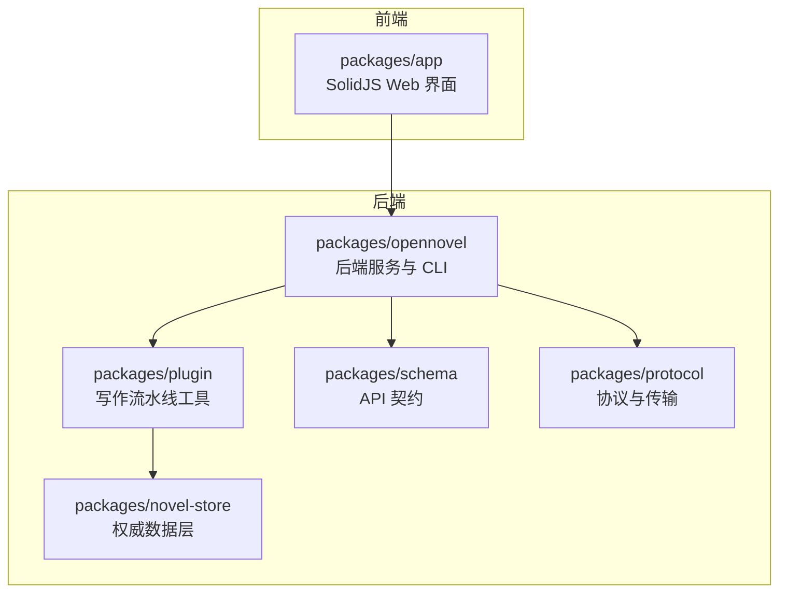
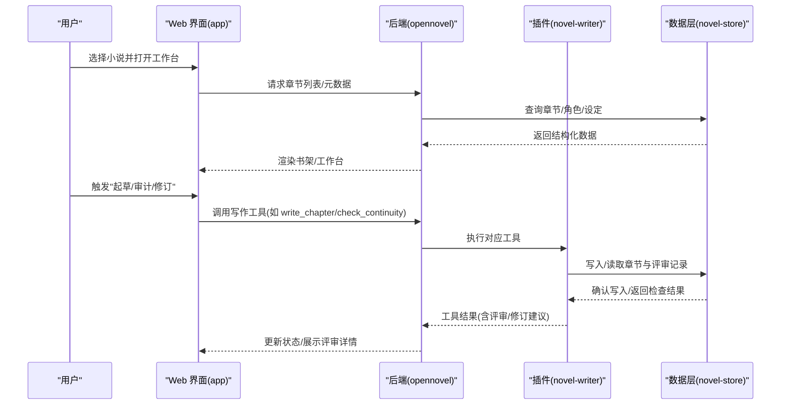
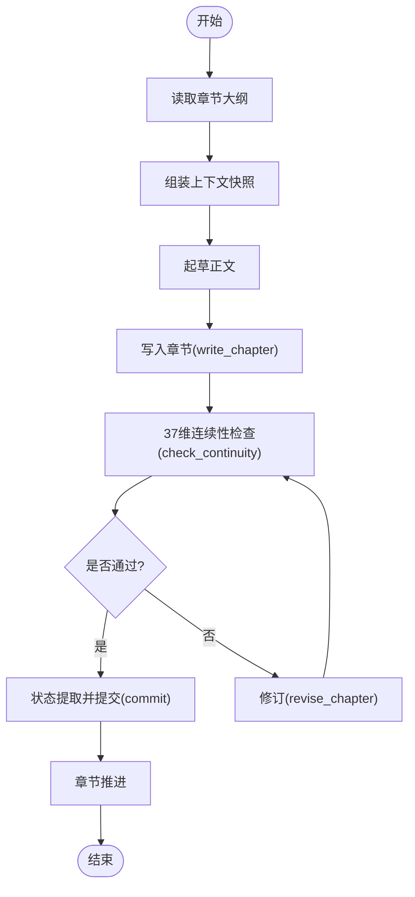
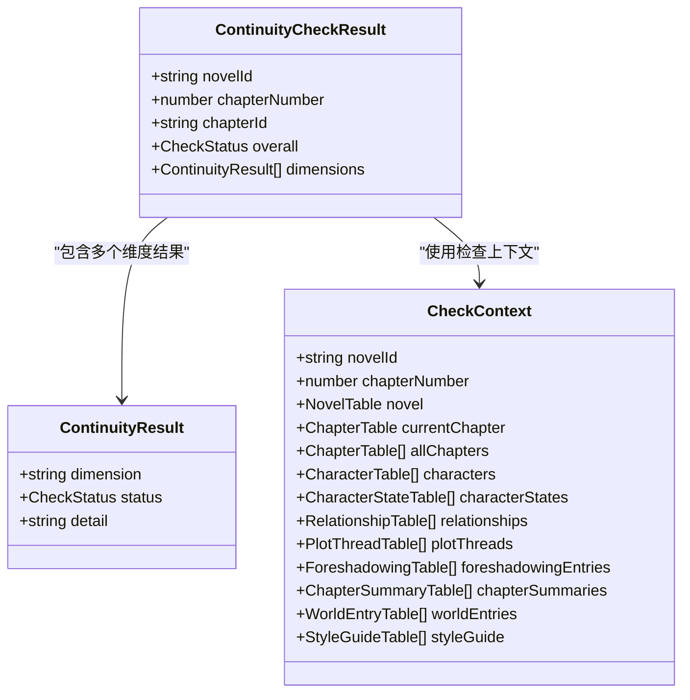
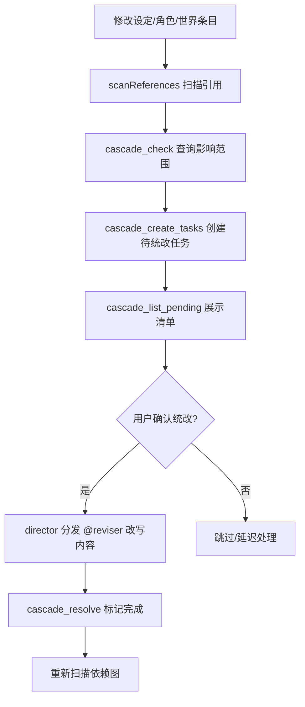
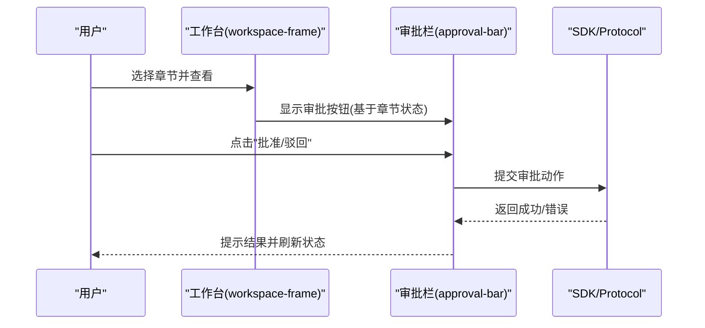
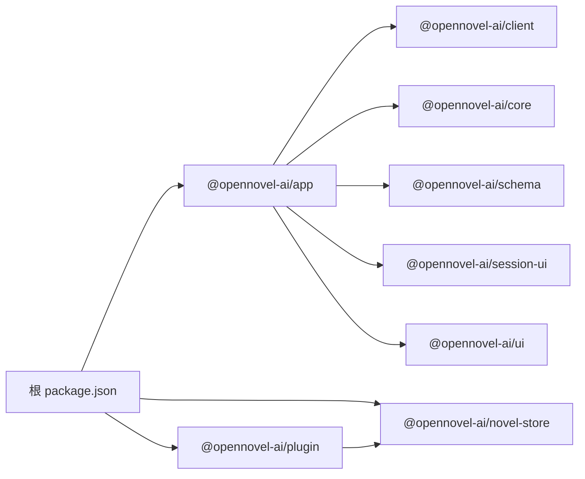

# 项目介绍

<cite>
**本文引用的文件**   
- [README.md](file://README.md)
- [README.zh.md](file://README.zh.md)
- [CONTEXT.md](file://CONTEXT.md)
- [package.json](file://package.json)
- [packages/novel-store/package.json](file://packages/novel-store/package.json)
- [packages/plugin/package.json](file://packages/plugin/package.json)
- [packages/app/package.json](file://packages/app/package.json)
- [packages/opennovel/package.json](file://packages/opennovel/package.json)
- [packages/plugin/src/novel-writer.ts](file://packages/plugin/src/novel-writer.ts)
- [packages/plugin/src/novel-writer/continuity-check.ts](file://packages/plugin/src/novel-writer/continuity-check.ts)
- [docs/cascade-consistency-design.md](file://docs/cascade-consistency-design.md)
- [packages/app/e2e/novel.spec.ts](file://packages/app/e2e/novel.spec.ts)
- [packages/app/src/pages/novel/workspace-frame.tsx](file://packages/app/src/pages/novel/workspace-frame.tsx)
- [packages/app/src/pages/novel/approval-bar.tsx](file://packages/app/src/pages/novel/approval-bar.tsx)
</cite>

## 更新摘要
**所做更改**   
- 更新了包引用和品牌标识，从 opencode 品牌全面迁移到 openNovel 品牌
- 修正了所有 @opencode-ai 包引用为 @opennovel-ai
- 更新了项目描述和架构说明以反映新的品牌定位
- 保持了原有的技术架构和功能特性描述

## 目录
1. [引言](#引言)
2. [项目结构](#项目结构)
3. [核心组件](#核心组件)
4. [架构总览](#架构总览)
5. [详细组件分析](#详细组件分析)
6. [依赖分析](#依赖分析)
7. [性能考量](#性能考量)
8. [故障排查指南](#故障排查指南)
9. [结论](#结论)
10. [附录](#附录)

## 引言
openNovel 是一款 AI 驱动的小说创作工作台，面向长篇小说创作者，提供"AI 驱动的 8 步写作流水线"和"37 维度连续性审查"，并内置智能书架管理与审批流等能力。其核心价值在于：
- 以 AI agent 驱动从大纲、上下文组装、起草、审计、修订到提交与章节推进的完整流程，显著提升长篇创作的连贯性与效率。
- 通过 37 维确定性审查（角色、关系、时间线、地点、剧情、世界观、风格、逻辑、细节）在每章生成后自动校验一致性，减少人脑记忆负担与前后矛盾风险。
- 以智能书架、创建向导、工作台、版本历史、审批流与导出能力，形成端到端的创作体验闭环。

技术背景方面，openNovel 是 opennovel 的分支，专注于 AI 辅助小说写作，复用 opennovel 的会话运行时、系统上下文与工具生态，将通用 AI 编程 agent 的能力迁移至文学创作领域。整体定位为"面向创作者的 AI 写作平台"，目标用户包括网络小说作者、传统出版作者、剧本写作者以及需要长篇内容生产力的团队。

**章节来源**
- [README.md:23-32](file://README.md#L23-L32)
- [README.zh.md:23-32](file://README.zh.md#L23-L32)
- [README.md:60-72](file://README.md#L60-L72)
- [README.zh.md:56-68](file://README.zh.md#L56-L68)

## 项目结构
openNovel 采用 Bun monorepo 组织，核心包职责清晰：
- packages/novel-store：权威数据层，定义小说、章节、角色、评审等实体与数据库访问。
- packages/schema + packages/protocol：服务端与客户端共享的 API 契约与类型。
- packages/opennovel：后端服务与 CLI，承载会话、模型调用与工具执行。
- packages/app：SolidJS Web UI，包含书架、工作台、阅读器、审批流等界面。
- packages/plugin：写作流水线工具集，涵盖起草、连续性审计、评审提交、级联一致性等。

**图示来源**
- [README.md:60-68](file://README.md#L60-L68)
- [README.zh.md:56-64](file://README.zh.md#L56-64)

**章节来源**
- [README.md:60-68](file://README.md#L60-L68)
- [README.zh.md:56-64](file://README.zh.md#L56-64)

## 核心组件
- 8 步写作流水线：由 AI agent 驱动，覆盖大纲 → 上下文组装 → 起草 → 37 维连续性审计 → 修订 → 状态提取 → 提交 → 章节推进。
- 37 维连续性审查：对角色、关系、时间线、地点、剧情、世界观、风格、逻辑、细节进行确定性检查，结果持久化为评审记录。
- 智能书架与管理：多小说管理、类型/简介/进度一览；创建向导引导设定类型、世界观、角色与分卷结构。
- 工作台与阅读器：章节树、阅读器、角色/大纲/节奏面板与全文搜索一体化。
- 版本历史与审批流：每次修订存档，支持对比与回滚；章节进入审批队列，可批准、带批注驳回或直达证据。
- 导出：稿件就绪后可导出。

这些能力由 plugin 中的 NovelWriterPlugin 统一暴露为工具与 hooks，并在 app 中提供交互入口。

**章节来源**
- [README.md:23-32](file://README.md#L23-L32)
- [README.zh.md:23-32](file://README.zh.md#L23-L32)
- [packages/plugin/src/novel-writer.ts:94-191](file://packages/plugin/src/novel-writer.ts#L94-L191)

## 架构总览
openNovel 的整体架构围绕"会话运行时 + 插件工具 + 数据层 + Web 界面"展开：
- 会话运行时（OpenNovel Session Runtime）负责系统上下文装配、会话历史压缩、安全边界与工具输出管理等。
- 插件层（novel-writer）注册 hooks 与工具，注入小说写作上下文，执笔、审计、修订与级联一致性处理。
- 数据层（novel-store）维护小说蓝图、章节、角色、伏笔、线索、风格指南等结构化数据。
- Web 界面（app）提供书架、工作台、阅读器、审批栏等交互，并通过 SDK/Protocol 与后端通信。

**图示来源**
- [CONTEXT.md:1-120](file://CONTEXT.md#L1-L120)
- [packages/plugin/src/novel-writer.ts:241-329](file://packages/plugin/src/novel-writer.ts#L241-L329)
- [packages/plugin/src/novel-writer/continuity-check.ts:149-191](file://packages/plugin/src/novel-writer/continuity-check.ts#L149-L191)

## 详细组件分析

### 写作流水线与工具（novel-writer）
- 系统提示注入：在系统上下文中注入小说蓝图、活跃角色、最近章节摘要、剧情线索、伏笔、风格指南等，确保 agent 具备全局一致性信息。
- 会话压缩：保留关键上下文（蓝图、角色、卷摘要），降低上下文膨胀。
- 写作工具：
  - write_chapter：字数校验、重复度检测、归档历史版本、扫描引用、门禁拦截（待统改任务未处理时拒绝写入）。
  - revise_chapter：修订前归档、字数与重复度校验、扫描引用。
  - manage_characters：新增/更新角色，合并重复，描述长度保护，自动触发级联任务。
  - 大纲生成：generate_master_outline/generate_volume_outline/generate_chapter_outline，支持模板与实际内容。
  - 上下文组装：assemble_context_snapshot，聚合蓝图、角色、摘要、线索、伏笔、风格、目标字数、上一章结尾等。
  - 连续性检查：check_continuity，37 维确定性检查并持久化评审记录。

**图示来源**
- [packages/plugin/src/novel-writer.ts:628-694](file://packages/plugin/src/novel-writer.ts#L628-L694)
- [packages/plugin/src/novel-writer.ts:695-762](file://packages/plugin/src/novel-writer.ts#L695-L762)
- [packages/plugin/src/novel-writer.ts:763-800](file://packages/plugin/src/novel-writer.ts#L763-L800)

**章节来源**
- [packages/plugin/src/novel-writer.ts:94-191](file://packages/plugin/src/novel-writer.ts#L94-L191)
- [packages/plugin/src/novel-writer.ts:241-329](file://packages/plugin/src/novel-writer.ts#L241-L329)
- [packages/plugin/src/novel-writer.ts:330-416](file://packages/plugin/src/novel-writer.ts#L330-L416)
- [packages/plugin/src/novel-writer.ts:417-540](file://packages/plugin/src/novel-writer.ts#L417-L540)
- [packages/plugin/src/novel-writer.ts:541-627](file://packages/plugin/src/novel-writer.ts#L541-L627)
- [packages/plugin/src/novel-writer.ts:628-694](file://packages/plugin/src/novel-writer.ts#L628-L694)
- [packages/plugin/src/novel-writer.ts:695-762](file://packages/plugin/src/novel-writer.ts#L695-L762)
- [packages/plugin/src/novel-writer.ts:763-800](file://packages/plugin/src/novel-writer.ts#L763-L800)

### 37 维连续性审查（continuity-check）
- 维度分类：角色连续性（姓名、外貌、性格、能力等级、位置）、关系连续性（类型一致、敌友转变有因、亲密度/信任度变化）、时间线（事件顺序、时间流逝合理、季节一致、年龄变化）、地点（描述一致、距离合理、环境细节、地图一致）、剧情（主线推进、伏笔回收、冲突升级、转折合理、结局呼应）、世界观（力量体系、规则一致、社会结构、文化细节、经济系统）、风格（叙事视角、语言风格、节奏一致、描写密度）、逻辑（因果链、动机合理、信息对称）、细节（物品追踪、数字一致、称呼一致）。
- 实现要点：并行查询所有相关表，构建检查上下文，按维度逐一判定 PASS/WARN/FAIL，汇总整体结果并持久化评审记录。

**图示来源**
- [packages/plugin/src/novel-writer/continuity-check.ts:32-130](file://packages/plugin/src/novel-writer/continuity-check.ts#L32-L130)
- [packages/plugin/src/novel-writer/continuity-check.ts:149-191](file://packages/plugin/src/novel-writer/continuity-check.ts#L149-L191)

**章节来源**
- [packages/plugin/src/novel-writer/continuity-check.ts:64-111](file://packages/plugin/src/novel-writer/continuity-check.ts#L64-L111)
- [packages/plugin/src/novel-writer/continuity-check.ts:149-191](file://packages/plugin/src/novel-writer/continuity-check.ts#L149-L191)

### 级联一致性方案（cascade-consistency）
- 设计原则：识别影响范围与生成统改任务零 LLM 依赖；审批由人确认；执行内容改写由 LLM 辅助但"改什么"已由 DB 确定。
- 核心机制：
  - entity_refs：记录"谁引用了谁"，写入时自动扫描建立。
  - pending_updates：当实体被修改时，为每个受影响方创建任务。
  - 门禁机制：write_chapter/revise_chapter 在有 pending 任务时拦截写入，必须先 cascade_execute 解除门禁。
  - 优先级规则：根据变更类型计算 high/medium/low 优先级。
  - Saga 持久化：cascade_execute 创建 saga_sessions 记录，逐步执行并持久化进度。

**图示来源**
- [docs/cascade-consistency-design.md:77-128](file://docs/cascade-consistency-design.md#L77-L128)
- [docs/cascade-consistency-design.md:222-254](file://docs/cascade-consistency-design.md#L222-L254)

**章节来源**
- [docs/cascade-consistency-design.md:1-308](file://docs/cascade-consistency-design.md#L1-L308)

### Web 界面与工作流（app）
- 工作台框架：阅读/写作/关系/地图等标签页，集成章节树、阅读器、审批栏、角色/大纲/节奏面板。
- 审批栏：支持批准、带批注驳回、直达评审证据，并与会话绑定导航。
- E2E 测试：覆盖书架→向导→工作台→阅读器→审批→编辑器→面板的全链路流程。

**图示来源**
- [packages/app/src/pages/novel/workspace-frame.tsx:32-466](file://packages/app/src/pages/novel/workspace-frame.tsx#L32-L466)
- [packages/app/src/pages/novel/approval-bar.tsx:243-286](file://packages/app/src/pages/novel/approval-bar.tsx#L243-L286)
- [packages/app/e2e/novel.spec.ts:149-176](file://packages/app/e2e/novel.spec.ts#L149-L176)

**章节来源**
- [packages/app/src/pages/novel/workspace-frame.tsx:32-466](file://packages/app/src/pages/novel/workspace-frame.tsx#L32-L466)
- [packages/app/src/pages/novel/approval-bar.tsx:243-286](file://packages/app/src/pages/novel/approval-bar.tsx#L243-L286)
- [packages/app/e2e/novel.spec.ts:149-176](file://packages/app/e2e/novel.spec.ts#L149-L176)

## 依赖分析
- 包依赖关系：
  - plugin 依赖 novel-store、sdk、effect、zod 等。
  - app 依赖 client、core、schema、session-ui、ui 等。
  - root package.json 统一管理工作区与 catalog 依赖。
- 运行时依赖：
  - OpenNovel 会话运行时提供系统上下文、会话历史、工具输出管理等。
  - Drizzle ORM 用于数据库访问。
  - SolidJS/Vite 用于前端构建与运行。

**已更新** 包引用已从 @opencode-ai 品牌全面迁移到 @opennovel-ai 品牌

**图示来源**
- [package.json:26-96](file://package.json#L26-L96)
- [packages/plugin/package.json:27-34](file://packages/plugin/package.json#L27-L34)
- [packages/app/package.json:49-95](file://packages/app/package.json#L49-L95)

**章节来源**
- [package.json:26-96](file://package.json#L26-L96)
- [packages/plugin/package.json:27-34](file://packages/plugin/package.json#L27-L34)
- [packages/app/package.json:49-95](file://packages/app/package.json#L49-L95)

## 性能考量
- 并行查询：连续性检查中对多表进行 Promise.all 并行查询，减少 I/O 等待。
- 上下文压缩：会话压缩保留关键上下文，避免上下文膨胀导致 token 压力与响应延迟。
- 工具输出限制：对超大文本输出进行截断与托管存储，保证会话历史可回放且不过载。
- 门禁机制：通过 pending_updates 门禁避免不一致状态下继续写入，减少后续修复成本。

[本节为通用指导，不直接分析具体文件]

## 故障排查指南
- 常见问题定位：
  - 写入被拦截：检查是否有 pending_updates 任务未处理，先执行 cascade_execute 或手动处理。
  - 字数不达标/超限：write_chapter/revise_chapter 会拒绝不符合字数要求的正文，需调整后再提交。
  - 与前文重复：检测到高重复率或开头相似会被拒绝，需重写以避免重复已写内容。
  - 连续性失败：查看 37 维检查结果中的 FAIL/WARN 维度，针对性修订。
- 调试建议：
  - 使用 E2E 测试用例验证全流程（书架→向导→工作台→阅读器→审批→编辑器→面板）。
  - 通过审阅评审记录与证据跳转快速定位问题。

**章节来源**
- [packages/plugin/src/novel-writer.ts:241-329](file://packages/plugin/src/novel-writer.ts#L241-L329)
- [packages/plugin/src/novel-writer.ts:330-416](file://packages/plugin/src/novel-writer.ts#L330-L416)
- [packages/app/e2e/novel.spec.ts:149-176](file://packages/app/e2e/novel.spec.ts#L149-L176)

## 结论
openNovel 将 AI 能力深度融入长篇小说创作全流程，通过 8 步流水线与 37 维连续性审查，系统性解决创作中的连贯性问题与效率瓶颈。其基于 opennovel 的技术底座，结合 novel-store 的数据治理与 app 的友好交互，为创作者提供了从构思到成稿的一站式解决方案。未来可在语义级引用检测、间接依赖追踪与冲突合并策略上持续演进，进一步提升自动化与智能化水平。

[本节为总结性内容，不直接分析具体文件]

## 附录
- 快速开始：使用 Bun 安装依赖，启动后端与 Web 界面，从书架创建第一部小说。
- 多语言支持：界面支持 English、简体中文与繁體中文。
- 许可证：MIT，保留 opennovel 原始版权声明。

**章节来源**
- [README.md:34-58](file://README.md#L34-L58)
- [README.zh.md:34-54](file://README.zh.md#L34-L54)
- [README.md:74-77](file://README.md#L74-L77)
- [README.zh.md:70-73](file://README.zh.md#L70-L73)