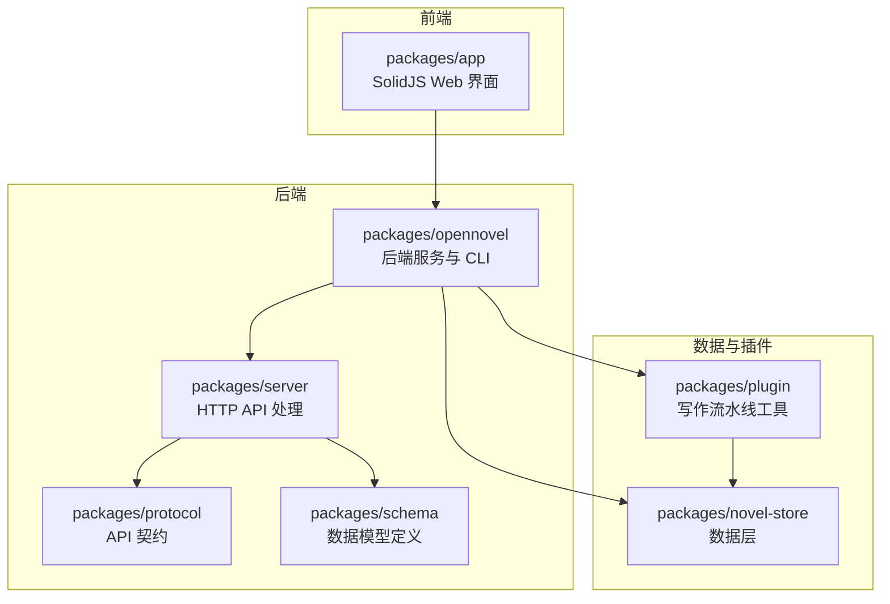
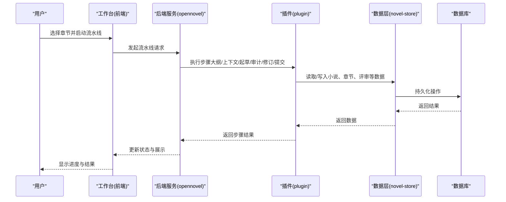
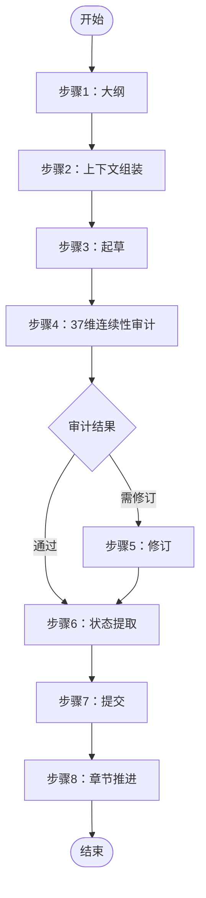
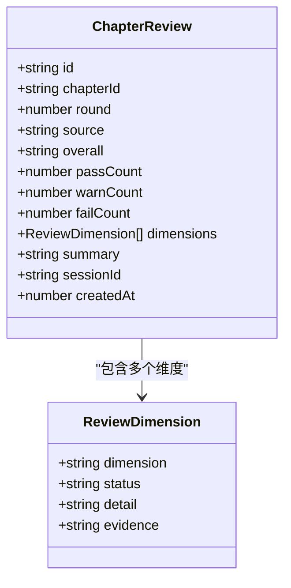
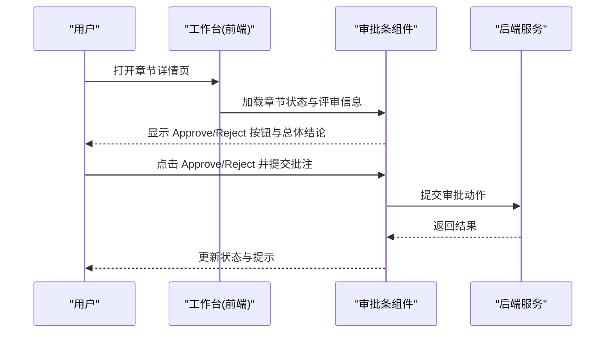
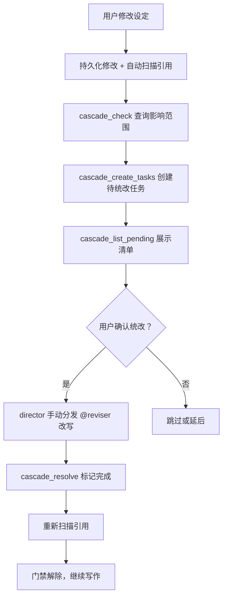
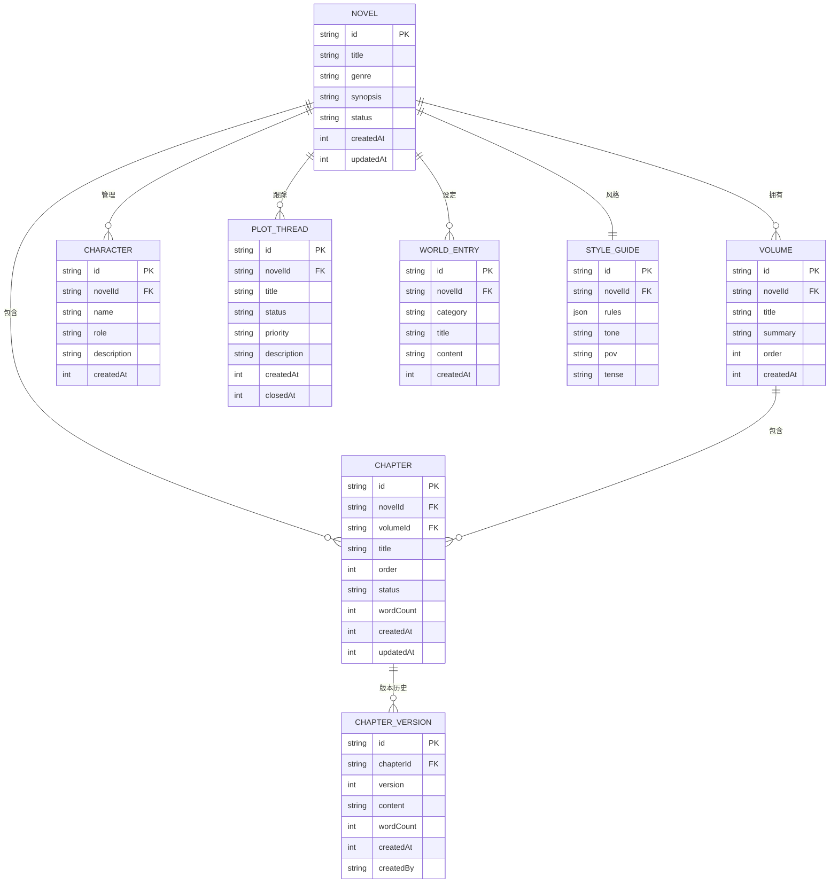
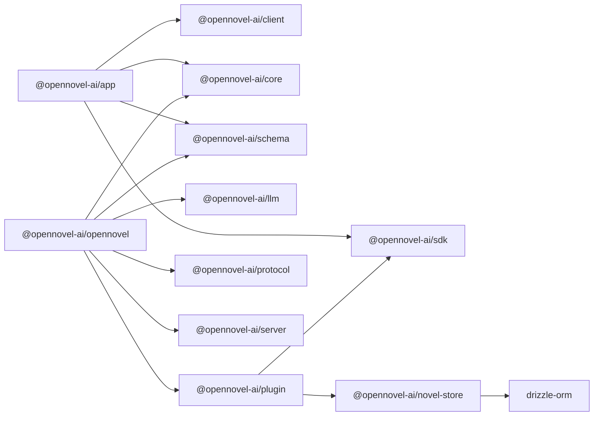
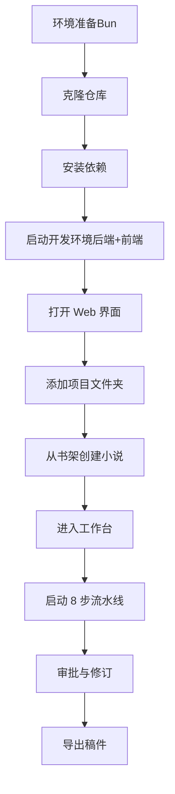

# 项目概述

<cite>
**本文引用的文件**   
- [README.md](file://README.md)
- [README.zh.md](file://README.zh.md)
- [package.json](file://package.json)
- [packages/opennovel/package.json](file://packages/opennovel/package.json)
- [packages/app/package.json](file://packages/app/package.json)
- [packages/novel-store/package.json](file://packages/novel-store/package.json)
- [packages/plugin/package.json](file://packages/plugin/package.json)
- [packages/schema/src/novel.ts](file://packages/schema/src/novel.ts)
- [packages/server/test/novel.test.ts](file://packages/server/test/novel.test.ts)
- [packages/plugin/test/novel-writer/review.test.ts](file://packages/plugin/test/novel-writer/review.test.ts)
- [packages/plugin/test/novel-writer/runtime-assembly.test.ts](file://packages/plugin/test/novel-writer/runtime-assembly.test.ts)
- [packages/plugin/test/novel-writer/e2e.test.ts](file://packages/plugin/test/novel-writer/e2e.test.ts)
- [packages/codemode/test/fixtures/opencode-v2-openapi.json](file://packages/codemode/test/fixtures/opencode-v2-openapi.json)
- [packages/core/src/session/runner/max-steps.ts](file://packages/core/src/session/runner/max-steps.ts)
- [packages/app/src/pages/novel/approval-bar.tsx](file://packages/app/src/pages/novel/approval-bar.tsx)
- [packages/app/src/pages/novel/workspace-frame.tsx](file://packages/app/src/pages/novel/workspace-frame.tsx)
- [docs/cascade-consistency-design.md](file://docs/cascade-consistency-design.md)
</cite>

## 更新摘要
**所做更改**   
- 更新了包结构重命名：从 `packages/opencode` 重命名为 `packages/opennovel`
- 更新了所有相关的依赖引用和路径
- 保持了相同的功能和品牌一致性
- 更新了架构图和相关文档以反映新的包名称

## 目录
1. [简介](#简介)
2. [项目结构](#项目结构)
3. [核心组件](#核心组件)
4. [架构总览](#架构总览)
5. [详细组件分析](#详细组件分析)
6. [依赖关系分析](#依赖关系分析)
7. [性能考量](#性能考量)
8. [故障排查指南](#故障排查指南)
9. [结论](#结论)
10. [附录：快速开始与使用示例](#附录快速开始与使用示例)

## 简介
openNovel 是一款 AI 驱动的小说创作工作台，围绕"8 步写作流水线"和"37 维度连续性审查"构建，帮助创作者完成从规划、起草、审计到修订、提交与章节推进的全流程。它提供智能书架管理、版本历史、审批流与导出能力，并以 Bun monorepo 形式组织前后端与插件体系，便于扩展与集成。

- 核心价值主张
  - 以 AI agent 驱动的标准化流水线提升长篇小说创作效率与一致性
  - 通过多维度连续性审计降低设定/剧情/时间线等不一致风险
  - 以书架与工作区一体化体验，覆盖多小说管理与协作审批

- 主要功能特性
  - 8 步写作流水线：大纲 → 上下文组装 → 起草 → 37 维连续性审计 → 修订 → 状态提取 → 提交 → 章节推进
  - 37 维连续性审计：角色、时间线、剧情、逻辑、设定等多维度评审，证据与建议按轮次持久化
  - 智能书架：类型、简介、进度一览管理
  - 创建向导：引导式设定类型、世界观、角色与分卷结构
  - 工作台：章节树、阅读器、角色/大纲/节奏面板与全文搜索
  - 版本历史：每次修订存档，支持对比与回滚
  - 审批流：结构化评审详情，批准/驳回并附批注，直达证据
  - 导出：稿件就绪即可导出

**章节来源**
- [README.md:23-32](file://README.md#L23-L32)
- [README.zh.md:23-32](file://README.zh.md#L23-L32)

## 项目结构
openNovel 采用 Bun monorepo，核心包职责清晰：
- packages/novel-store：小说数据层（小说、章节、角色、评审等）
- packages/schema + packages/protocol：服务端与客户端共享的 API 契约
- packages/opennovel：后端服务与 CLI（原 opencode 包已重命名）
- packages/app：SolidJS Web 界面（书架、工作台、审批流）
- packages/plugin：写作流水线工具（起草、连续性审计、评审提交）

**图表来源**
- [README.zh.md:56-64](file://README.zh.md#L56-L64)
- [packages/opennovel/package.json:1-159](file://packages/opennovel/package.json#L1-L159)
- [packages/app/package.json:1-97](file://packages/app/package.json#L1-L97)
- [packages/novel-store/package.json:1-34](file://packages/novel-store/package.json#L1-L34)
- [packages/plugin/package.json:1-61](file://packages/plugin/package.json#L1-L61)

**章节来源**
- [README.zh.md:56-64](file://README.zh.md#L56-L64)
- [package.json:1-162](file://package.json#L1-L162)

## 核心组件
- 数据模型与契约（schema）
  - 小说、卷、章节、版本、角色、关系、剧情线索、伏笔、世界设定、风格指南、张力点、钩子轮换、大纲节点/包、导出、各类输入输出等
  - 评审维度与评审记录：包含 PASS/WARN/FAIL 状态、计数、证据、摘要与轮次
- 后端服务（opennovel）
  - 暴露 HTTP API，承载会话、工具调用、流水线编排与存储访问
- 前端应用（app）
  - 书架、工作台、审批条、编辑器、阅读器、搜索等
- 插件（plugin）
  - 写作流水线工具：起草、上下文组装、连续性审计、评审提交、级联一致性工具等
- 数据层（novel-store）
  - Drizzle ORM 抽象，跨环境驱动（Bun/Node），统一读写接口

**章节来源**
- [packages/schema/src/novel.ts:1-441](file://packages/schema/src/novel.ts#L1-L441)
- [packages/opennovel/package.json:1-159](file://packages/opennovel/package.json#L1-L159)
- [packages/app/package.json:1-97](file://packages/app/package.json#L1-L97)
- [packages/plugin/package.json:1-61](file://packages/plugin/package.json#L1-L61)
- [packages/novel-store/package.json:1-34](file://packages/novel-store/package.json#L1-L34)

## 架构总览
系统由前端 UI、后端服务、数据层与插件组成，API 契约贯穿前后端。AI agent 在插件中驱动流水线步骤，结合 schema 定义的强类型模型进行校验与持久化。

**图表来源**
- [packages/app/src/pages/novel/workspace-frame.tsx:297-323](file://packages/app/src/pages/novel/workspace-frame.tsx#L297-L323)
- [packages/opennovel/package.json:1-159](file://packages/opennovel/package.json#L1-L159)
- [packages/plugin/package.json:1-61](file://packages/plugin/package.json#L1-L61)
- [packages/novel-store/package.json:1-34](file://packages/novel-store/package.json#L1-L34)

## 详细组件分析

### 8 步写作流水线
- 步骤说明
  - 大纲：生成或编辑章节大纲
  - 上下文组装：聚合角色、时间线、剧情线索、伏笔、风格指南等上下文快照
  - 起草：AI 基于上下文生成章节内容
  - 37 维连续性审计：对角色、时间线、剧情、逻辑、设定等进行多维检查，产出证据与建议
  - 修订：根据审计结果修改内容
  - 状态提取：更新角色状态、剧情线索、伏笔等
  - 提交：将修订归档为版本，进入审批队列
  - 章节推进：标记章节状态，准备下一章节
- 关键实现要点
  - 插件中的工具链负责各步骤的数据获取与写入
  - 评审记录按轮次持久化，支持 PASS/WARN/FAIL 统计与证据定位
  - 工作区 UI 实时显示流水线状态与取消操作

**图表来源**
- [packages/plugin/test/novel-writer/e2e.test.ts:444-510](file://packages/plugin/test/novel-writer/e2e.test.ts#L444-L510)
- [packages/plugin/test/novel-writer/review.test.ts:67-98](file://packages/plugin/test/novel-writer/review.test.ts#L67-L98)
- [packages/app/src/pages/novel/workspace-frame.tsx:297-323](file://packages/app/src/pages/novel/workspace-frame.tsx#L297-L323)

**章节来源**
- [README.zh.md:23-32](file://README.zh.md#L23-L32)
- [packages/plugin/test/novel-writer/e2e.test.ts:444-510](file://packages/plugin/test/novel-writer/e2e.test.ts#L444-L510)
- [packages/plugin/test/novel-writer/review.test.ts:67-98](file://packages/plugin/test/novel-writer/review.test.ts#L67-L98)

### 37 维度连续性审查
- 维度范围
  - 角色一致性（姓名、性格、动机）、时间线、剧情线索、逻辑自洽、设定一致性等共 37 项
- 评审记录
  - 每轮评审包含总体结论（PASS/WARN/FAIL）、各维度状态、证据片段、摘要与轮次
  - 同一章节多次评审且内容未变更时合并至同一轮
- 测试验证
  - 首次评审 round=1，计数按维度状态统计
  - 再次评审并入同一轮，source 可区分（deterministic/auditor/human）

**图表来源**
- [packages/schema/src/novel.ts:99-121](file://packages/schema/src/novel.ts#L99-L121)
- [packages/server/test/novel.test.ts:229-266](file://packages/server/test/novel.test.ts#L229-L266)
- [packages/plugin/test/novel-writer/review.test.ts:67-98](file://packages/plugin/test/novel-writer/review.test.ts#L67-L98)

**章节来源**
- [packages/schema/src/novel.ts:99-121](file://packages/schema/src/novel.ts#L99-L121)
- [packages/server/test/novel.test.ts:229-266](file://packages/server/test/novel.test.ts#L229-L266)
- [packages/plugin/test/novel-writer/review.test.ts:67-98](file://packages/plugin/test/novel-writer/review.test.ts#L67-L98)

### 审批流与工作台
- 审批条
  - 显示章节状态与总体评审结论，支持批准/驳回并附批注
  - 状态映射：planned/draft/outline/failed/drafting/audited/revised/pending_review/final/rejected/published
- 工作台
  - 显示流水线状态栏，支持取消生成
  - 集成编辑器、阅读器、角色/大纲/节奏面板与全文搜索

**图表来源**
- [packages/app/src/pages/novel/approval-bar.tsx:1-39](file://packages/app/src/pages/novel/approval-bar.tsx#L1-L39)
- [packages/app/src/pages/novel/workspace-frame.tsx:297-323](file://packages/app/src/pages/novel/workspace-frame.tsx#L297-L323)

**章节来源**
- [packages/app/src/pages/novel/approval-bar.tsx:1-39](file://packages/app/src/pages/novel/approval-bar.tsx#L1-L39)
- [packages/app/src/pages/novel/workspace-frame.tsx:297-323](file://packages/app/src/pages/novel/workspace-frame.tsx#L297-L323)

### 级联一致性方案（统查统改）
- 目标
  - 当实体（角色、世界设定、风格指南等）被修改时，自动识别受影响的内容并生成统改任务，确保全局一致性
- 核心机制
  - entity_refs：记录实体间的引用关系
  - pending_updates：待统改任务表，记录触发源、旧值/新值、优先级与状态
  - 扫描与门禁：写入时自动扫描引用；有 pending 任务时拦截写入，必须先处理
- 工具与流程
  - cascade_check / cascade_create_tasks / cascade_list_pending / cascade_resolve / cascade_rebuild_refs / cascade_execute（Saga）
  - 6 步流程：持久化修改 → 确定性影响查询 → 创建任务 → 展示清单 → 人工确认 → LLM 辅助改写 → 重新扫描

**图表来源**
- [docs/cascade-consistency-design.md:1-308](file://docs/cascade-consistency-design.md#L1-L308)

**章节来源**
- [docs/cascade-consistency-design.md:1-308](file://docs/cascade-consistency-design.md#L1-L308)

### 数据模型与 API 契约
- 数据模型
  - Novel、Volume、Chapter、ChapterVersion、Character、Relationship、PlotThread、Foreshadowing、WorldEntry、StyleGuide、TensionPoint、HookRotation、OutlineNode/Bundle、各类输入输出
- API 契约
  - 前后端共享 schema，保证类型安全与一致性
  - OpenAPI 规范用于代码生成与文档

**图表来源**
- [packages/schema/src/novel.ts:1-441](file://packages/schema/src/novel.ts#L1-L441)
- [packages/codemode/test/fixtures/opencode-v2-openapi.json:6173-6221](file://packages/codemode/test/fixtures/opencode-v2-openapi.json#L6173-L6221)

**章节来源**
- [packages/schema/src/novel.ts:1-441](file://packages/schema/src/novel.ts#L1-L441)
- [packages/codemode/test/fixtures/opencode-v2-openapi.json:6173-6221](file://packages/codemode/test/fixtures/opencode-v2-openapi.json#L6173-L6221)

## 依赖关系分析
- 包间依赖
  - app 依赖 client/core/schema/sdk/session-ui/ui 等
  - opennovel 依赖 core/llm/plugin/protocol/schema/server/tui 等（原 opencode 包已重命名为 opennovel）
  - plugin 依赖 sdk/novel-store/drizzle/effect/zod
  - novel-store 依赖 drizzle-orm，并提供 bun/node 驱动
- 外部依赖
  - AI SDK 提供商（OpenAI、Anthropic、Google、Azure 等）
  - Effect、Hono、Drizzle、Zod、SolidJS、Vite 等

**图表来源**
- [packages/app/package.json:1-97](file://packages/app/package.json#L1-L97)
- [packages/opennovel/package.json:1-159](file://packages/opennovel/package.json#L1-L159)
- [packages/plugin/package.json:1-61](file://packages/plugin/package.json#L1-L61)
- [packages/novel-store/package.json:1-34](file://packages/novel-store/package.json#L1-L34)

**章节来源**
- [packages/app/package.json:1-97](file://packages/app/package.json#L1-L97)
- [packages/opennovel/package.json:1-159](file://packages/opennovel/package.json#L1-L159)
- [packages/plugin/package.json:1-61](file://packages/plugin/package.json#L1-L61)
- [packages/novel-store/package.json:1-34](file://packages/novel-store/package.json#L1-L34)

## 性能考量
- 流水线步骤优化
  - 上下文组装应缓存常用实体（角色、世界设定、风格指南），减少重复 IO
  - 审计阶段批量处理维度检查，避免频繁往返
- 数据存储
  - 使用 Drizzle ORM 的批量插入/更新，减少事务开销
  - 评审记录按轮次合并，避免碎片化
- 前端渲染
  - 虚拟列表与分页加载章节树与搜索结果
  - 状态更新采用细粒度信号，避免全量重渲染

[本节为通用指导，不直接分析具体文件]

## 故障排查指南
- 常见问题
  - 最大步骤限制：当达到最大步骤数时，工具将被禁用，仅允许文本响应总结进展
  - 审批状态异常：检查章节状态映射与评审记录是否完整
  - 级联门禁阻断：存在 pending 任务时写入被拦截，需先执行统改流程
- 调试建议
  - 查看评审记录与维度证据，定位不一致来源
  - 使用 cascade_list_pending 查看待统改清单，按优先级处理
  - 检查工作区状态栏与取消生成按钮，确认流水线是否卡住

**章节来源**
- [packages/core/src/session/runner/max-steps.ts:1-16](file://packages/core/src/session/runner/max-steps.ts#L1-L16)
- [packages/app/src/pages/novel/approval-bar.tsx:1-39](file://packages/app/src/pages/novel/approval-bar.tsx#L1-L39)
- [docs/cascade-consistency-design.md:1-308](file://docs/cascade-consistency-design.md#L1-L308)

## 结论
openNovel 以 AI 驱动的 8 步流水线与 37 维连续性审计为核心，结合智能书架、版本历史与审批流，为小说创作者提供高效、一致、可协作的创作体验。其 monorepo 架构与清晰的包职责使得扩展与维护更加便捷，适合个人与团队使用。

[本节为总结性内容，不直接分析具体文件]

## 附录：快速开始与使用示例
- 环境要求
  - 需要 Bun 运行时
- 安装步骤
  - 克隆仓库并安装依赖
  - 启动后端与 Web 界面（单命令或双终端）
- 基本使用方法
  - 打开本地地址，添加项目文件夹，从书架创建第一部小说
  - 在工作台中选择章节，启动流水线，查看状态与结果
  - 使用审批条进行批准/驳回，查看评审证据

**图表来源**
- [README.zh.md:34-54](file://README.zh.md#L34-L54)
- [package.json:1-162](file://package.json#L1-L162)

**章节来源**
- [README.zh.md:34-54](file://README.zh.md#L34-L54)
- [package.json:1-162](file://package.json#L1-L162)