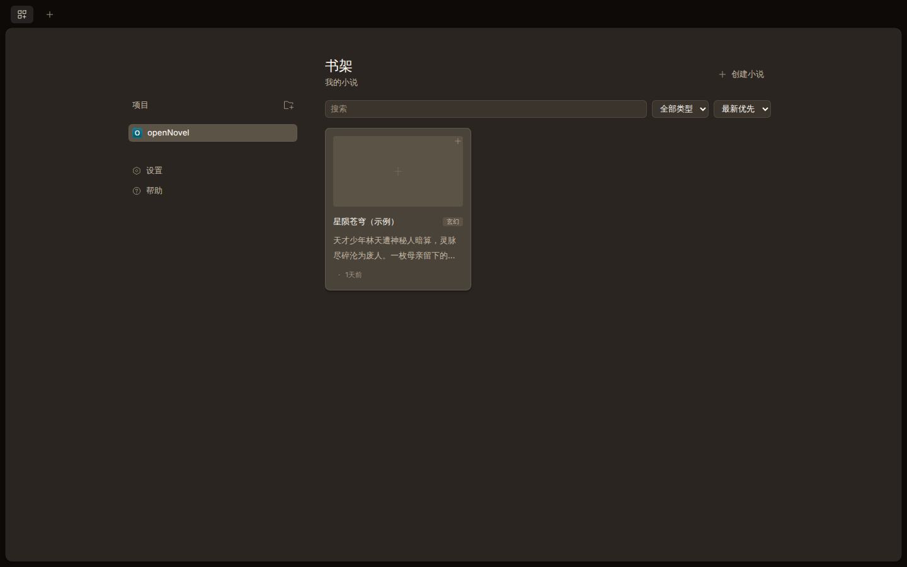
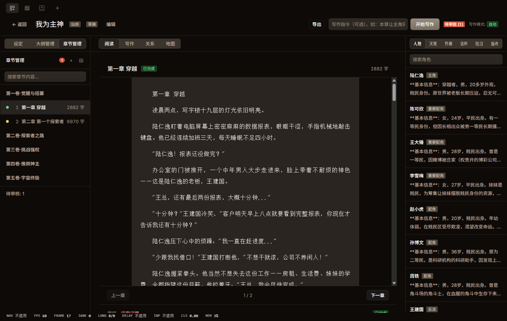
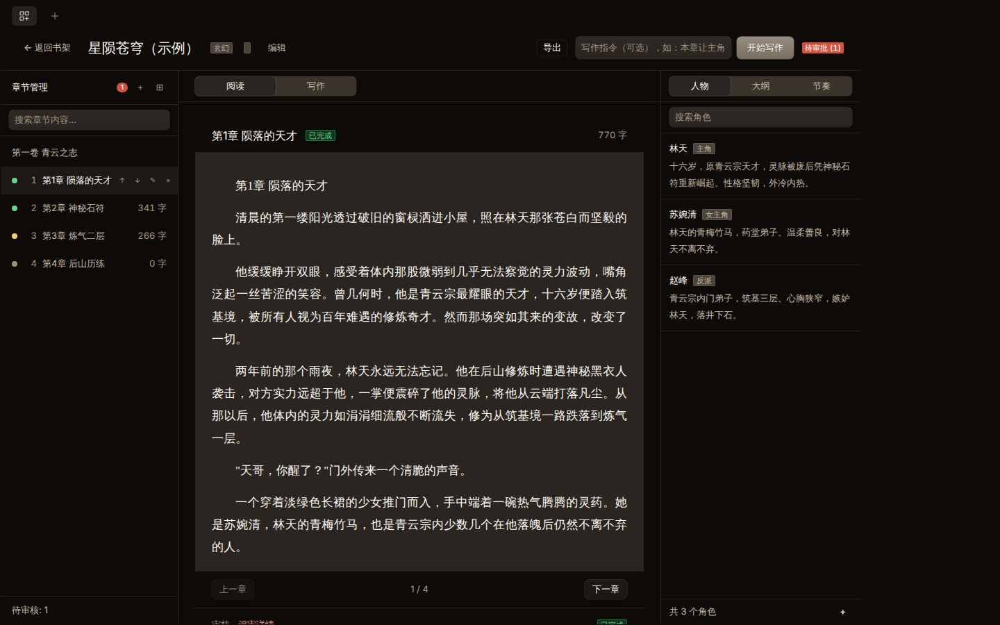
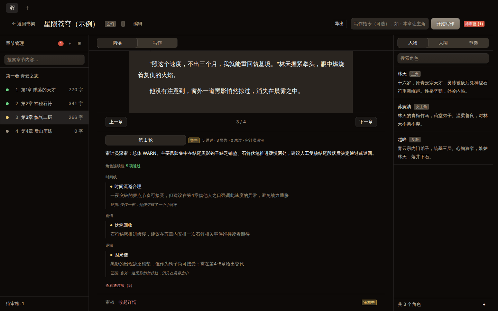

# openNovel

**AI-powered novel writing workbench** — plan, draft, audit, and revise long-form fiction with an 8-step writing pipeline and 37-dimension continuity auditing.

<p>
  <a href="README.en.md">English</a> |
  <a href="README.md">简体中文</a> |
  <a href="README.zht.md">繁體中文</a>
</p>


## Screenshots

| Bookshelf                                    | Workspace                                    |
| -------------------------------------------- | -------------------------------------------- |
|  |  |

| Reader                                 | Approval & Review                                          |
| -------------------------------------- | ---------------------------------------------------------- |
|  |  |

## Features

- **8-step writing pipeline** — outline → context assembly → drafting → 37-dimension continuity audit → revision → state extraction → commit → chapter advancement, driven by an AI agent
- **37-dimension continuity audit** — every chapter is reviewed across character, timeline, plot, logic, and setting dimensions, with evidence and suggestions persisted per review round
- **Bookshelf** — manage multiple novels with genre, synopsis, and progress at a glance
- **Creation wizard** — guided setup for genre, worldview, characters, and volume structure
- **Workspace** — chapter tree, reader, character/outline/pacing panels, and full-text search in one place
- **Version history** — every chapter revision is stored; diff and roll back at any time
- **Approval flow** — chapters land in a review queue with structured audit details; approve, reject with comments, or jump straight to the evidence
- **Export** — export your manuscript when it's ready

## Quickstart (from source)

Requires [Bun](https://bun.sh).

```bash
git clone https://github.com/MarsQiu007/openNovel.git
cd openNovel
bun install

# Recommended: launch as a desktop app (Electron, auto-starts the backend — no separate run needed)
bun run dev:desktop
```

You can also run it in the browser as a web app:

```bash
# One command — backend (port 4096) and web UI (port 4444) together
bun run dev:all
# Open http://localhost:4444
```

Open the app, add the project folder, and create your first novel from the bookshelf.

The UI is available in 简体中文, English, and 繁體中文.

## Architecture

openNovel is a Bun monorepo:

- `packages/novel-store` — canonical data layer (novels, chapters, characters, chapter reviews)
- `packages/schema` + `packages/protocol` — shared API contract between server and clients
- `packages/desktop` — Electron desktop app (auto-starts the backend)
- `packages/opennovel` — backend server and CLI
- `packages/app` — SolidJS web UI (bookshelf, workspace, approval flow)
- `packages/plugin` — writing pipeline tools (drafting, continuity audit, review submission)

## Attribution

openNovel is a fork of [opennovel](https://github.com/anomalyco/opennovel), the open source AI coding agent, focused on AI-assisted novel writing. It is not affiliated with the opennovel team.

## License

MIT — see [LICENSE](LICENSE). Original opennovel copyright retained; openNovel contributions copyright their respective authors.